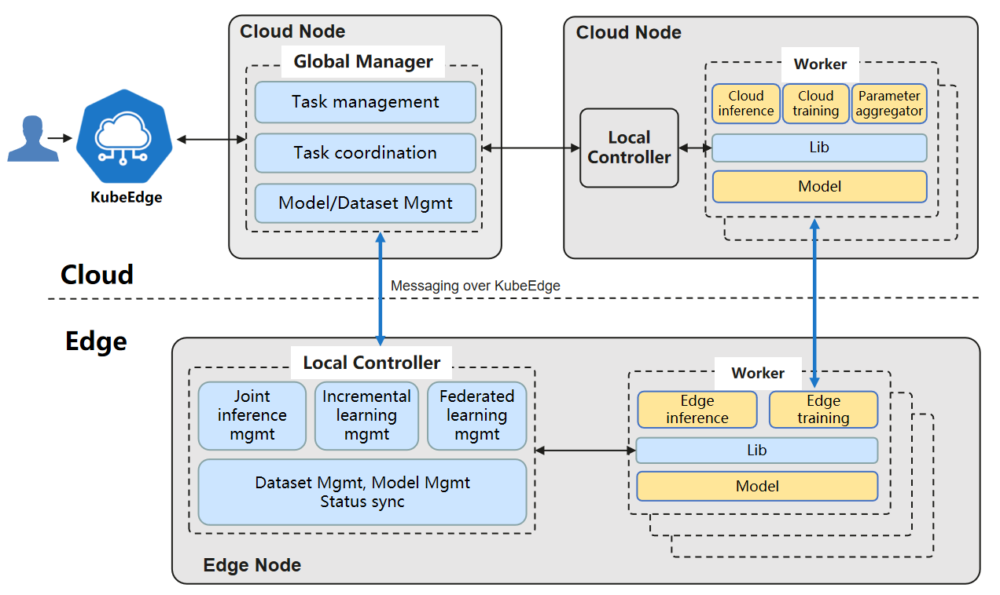

English | [简体中文](./README_zh.md)
# Sedna

## What is Sedna?

Sedna is an edge-cloud synergy AI project incubated in KubeEdge SIG AI. Benefiting from the edge-cloud synergy capabilities provided by KubeEdge, Sedna can implement across edge-cloud collaborative training and collaborative inference capabilities, such as joint inference, incremental learning, federated learning, and lifelong learning. Sedna supports popular AI frameworks, such as TensorFlow, Pytorch, PaddlePaddle, MindSpore. 

Sedna can simply enable edge-cloud synergy capabilities to existing training and inference scripts, bringing the benefits of reducing costs, improving model performance, and protecting data privacy.

## Features
    
Sedna has the following features：  
 
* Provide the edge-cloud synergy AI framework.
    * Provide dataset and model management across edge-cloud, helping developers quickly implement synergy AI applications.
    
* Provide edge-cloud synergy training and inference frameworks.
    * Joint inference: under the condition of limited resources on the edge, difficult inference tasks are offloaded to the cloud to improve the overall performance, keeping the throughput.
    * Incremental training: For small samples and non-iid data on the edge, models can be adaptively optimized over time on the cloud or edge. 
    * Federated learning: For those scenarios that the data being too large, or unwilling to migrate raw data to the cloud, or high privacy protection requirements, models are trained at the edge and parameters are aggregated on the cloud to resolve data silos effectively.
    * Lifelong learning: Confronted with the challenge of heterogeneous data distributions in complex scenarios and small samples on the edge, the edge-cloud synergy lifelong learning: 
      * leverages the cloud knowledge base which empowers the scheme with memory ability, which helps to continuously learn and accumulate historical knowledge to overcome the catastrophic forgetting challenge. 
      * is essentially the combination of another two learning schemes, i.e., multi-task learning and incremental learning, so that it can learn unseen tasks with shared knowledge among various scenarios over time.
    * etc..
    
* Compatibility
    * Compatible with mainstream AI frameworks such as TensorFlow, Pytorch, PaddlePaddle, and MindSpore.
    * Provides extended interfaces for developers to quickly integrate third-party algorithms, and some necessary algorithms for edge-cloud synergy have been preset, such as hard sample discovering, aggregation algorithm. 

## Architecture
#### Sedna's edge-cloud synergy is implemented based on the following capabilities provided by KubeEdge:
* Unified orchestration of across edge-cloud applications.
* Router: across edge-cloud message channel in management plane.
* EdgeMesh: across edge-cloud microservice discovery and traffic governance in data plane.

### Component
Sedna consists of the following components：

#### GlobalManager
* Unified edge-cloud synergy AI task management
* Cross edge-cloud synergy management and collaboration
* Central Configuration Management

#### LocalController
* Local process control of edge-cloud synergy AI tasks
* Local general management: model, dataset, and status synchronization

#### Worker
* Do inference or training, based on existing ML framework.
* Launch on demand, imagine they are docker containers.
* Different workers for different features.
* Could run on edge or cloud.

#### Lib
* Expose the Edge AI features to applications, i.e. training or inference programs.

## Guides

### Documents

Documentation is located on [readthedoc.io](https://sedna.readthedocs.io/). These documents can help you understand Sedna better.

### Installation
Follow the [Sedna installation document](docs/setup/quick-start.md) to install Sedna.

### Examples
Example1：[Using Joint Inference Service in Helmet Detection Scenario](/examples/joint_inference/helmet_detection_inference/README.md).  
Example2：[Using Incremental Learning Job in Helmet Detection Scenario](/examples/incremental_learning/helmet_detection/README.md).  
Example3：[Using Federated Learning Job in Surface Defect Detection Scenario](/examples/federated_learning/surface_defect_detection/README.md).  
Example4：[Using Federated Learning Job in YoLov5-based Object Detection](/examples/federated_learning/yolov5_coco128_mistnet/README.md).  
Example5：[Using Lifelong Learning Job in Thermal Comfort Prediction Scenario](/examples/lifelong_learning/atcii/README.md).  
Example6：[Using MultiEdge Inference Service to Track an Infected COVID-19 Carrier in Pandemic Scenarios](/examples/multiedgeinference/pedestrian_tracking/README.md).

## Roadmap

* [2021 Q1 Roadmap](./docs/roadmap.md#2021-q1-roadmap)

## Meeting

Regular Community Meeting:
- Pacific Time: **Thursday at 10:00-11:00 Beijing Time** (weekly, starting from Nov. 12th 2020).
([Convert to your timezone](https://www.thetimezoneconverter.com/?t=10%3A00&tz=GMT%2B8&))

Resources:
- [Meeting notes and agenda](https://docs.google.com/document/d/12n3kGUWTkAH4q2Wv5iCVGPTA_KRWav_eakbFrF9iAww/edit)
- [Meeting recordings](https://www.youtube.com/playlist?list=PLQtlO1kVWGXkRGkjSrLGEPJODoPb8s5FM)
- [Meeting link](https://zoom.us/j/4167237304)
- [Meeting Calendar](https://calendar.google.com/calendar/u/0/r?cid=Y19nODluOXAwOG05MzFiYWM3NmZsajgwZzEwOEBncm91cC5jYWxlbmRhci5nb29nbGUuY29t) | [Subscribe](https://calendar.google.com/calendar/u/0/r?cid=OHJqazhvNTE2dmZ0ZTIxcWlidmxhZTNsajRAZ3JvdXAuY2FsZW5kYXIuZ29vZ2xlLmNvbQ)

## Contact

<!--
If you need support, start with the [troubleshooting guide](./docs/troubleshooting.md), and work your way through the process that we've outlined.
-->

If you have questions, feel free to reach out to us in the following ways:
- [slack channel](https://app.slack.com/client/TDZ5TGXQW/C01EG84REVB/details)

## Contributing

If you're interested in being a contributor and want to get involved in developing the Sedna code, please see [CONTRIBUTING](CONTRIBUTING.md) for details on submitting patches and the contribution workflow.

## License

Sedna is under the Apache 2.0 license. See the [LICENSE](LICENSE) file for details.

