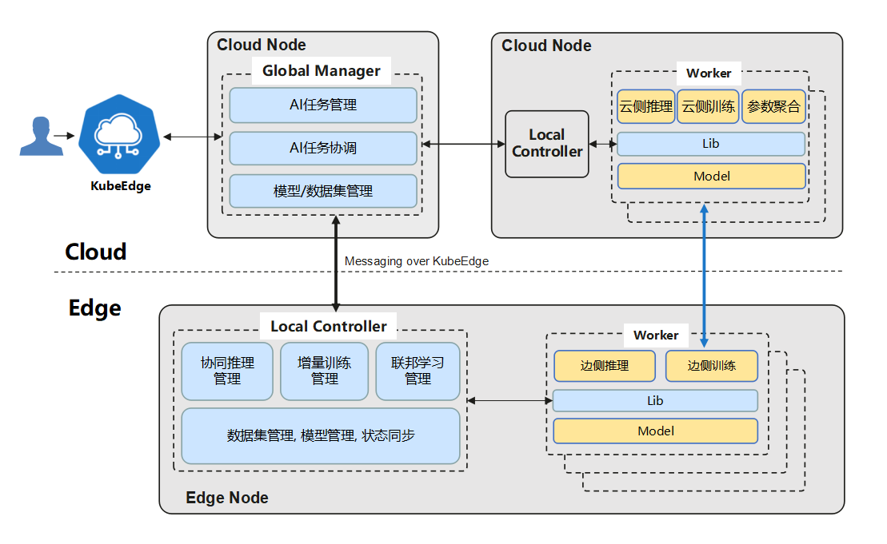

简体中文 | [English](./README.md)
# Sedna

## 什么是Sedna?
Sedna是在KubeEdge SIG AI中孵化的一个边云协同AI项目。得益于KubeEdge提供的边云协同能力，Sedna可以实现跨边云的协同训练和协同推理能力，如联合推理、增量学习、联邦学习等。Sedna支持目前广泛使用的AI框架，如TensorFlow/Pytorch/PaddlePaddle/MindSpore等，现有AI类应用可以无缝迁移到Sedna, 快速实现边云协同的训练和推理，可在降低成本、提升模型性能、保护数据隐私等方面获得提升。

**目前项目处于preview状态，正在推动进入KubeEdge社区**

## 项目特性
Sedna具有如下特性：
* 提供边云协同AI基础框架
    * 提供基础的边云协同数据集管理、模型管理，方便开发者快速开发边云协同AI应用
* 提供边云协同训练和推理框架
    * 联合推理: 针对边缘资源需求大，或边侧资源受限条件下，基于边云协同的能力，将推理任务卸载到云端，提升系统整体的推理性能
    * 增量训练: 针对小样本和边缘数据异构的问题，模型可以在云端或边缘进行自适应优化，边用边学，越用越聪明
    * 联邦学习: 针对数据大，原始数据不出边缘，隐私要求高等场景，模型在边缘训练，参数云上聚合，可有效解决数据孤岛的问题
    * more
* 兼容性
    * 兼容主流AI框架TensorFlow、Pytorch、PaddlePaddle、MindSpore等
    * 针对云边协同训练和推理，预置难例判别、参数聚合算法，同时提供可扩展接口，方便第三方算法快速集成

## 架构
Sedna的边云协同基于KubeEdge提供的如下能力实现
* 跨边云应用统一编排
* Router: 管理面云边高可靠消息通道
* EdgeMesh: 数据面跨边云微服务发现和流量治理

### 组件
Sedna由以下组件构建：

#### GlobalManager
* 统一边云协同AI任务管理
* 跨边云协同管理与协同
* 中心配置管理

#### LocalController
* 边云协同AI任务的本地流程控制
* 本地通用管理: 模型, 数据集，状态同步等

#### Worker
* 执行训练或推理任务, 基于现有AI框架开发的训练/推理程序
* 不同特性对应不同的worker组, worker可部署在边上或云上, 并进行协同

#### Lib
* 面向AI开发者和应用开发者, 暴露边云协同AI功能给应用

## 文档
### 安装
Sedna的安装文档请参考[这里](/docs/setup/install.md)。

### 样例
样例1：[大小模型协同推理](/examples/joint_inference/helmet_detection_inference/README.md)。

## 路标

* [2021 Q1 Roadmap](./docs/roadmap.md#2021-q1-roadmap)

## 社区例会

例会时间：
- 太平洋时间：**北京时间 周四 10:00-11:00** (每周一次，从2020年11月12日开始)。
([查询本地时间](https://www.thetimezoneconverter.com/?t=10%3A00&tz=GMT%2B8&))

会议资源：
- [会议纪要和议程](https://docs.google.com/document/d/12n3kGUWTkAH4q2Wv5iCVGPTA_KRWav_eakbFrF9iAww/edit)
- [会议视频记录](https://www.youtube.com/playlist?list=PLQtlO1kVWGXkRGkjSrLGEPJODoPb8s5FM)
- [会议链接](https://zoom.us/j/4167237304)
- [会议日历](https://calendar.google.com/calendar/u/0/r?cid=Y19nODluOXAwOG05MzFiYWM3NmZsajgwZzEwOEBncm91cC5jYWxlbmRhci5nb29nbGUuY29t) | [订阅日历](https://calendar.google.com/calendar/u/0/r?cid=OHJqazhvNTE2dmZ0ZTIxcWlidmxhZTNsajRAZ3JvdXAuY2FsZW5kYXIuZ29vZ2xlLmNvbQ)

## 支持
<!--
如果您需要支持，请从 [故障排除指南](./docs/troubleshooting.md) 开始，然后按照我们概述的流程进行操作。
-->

如果您有任何疑问，请以下方式与我们联系：
- [slack channel](https://app.slack.com/client/TDZ5TGXQW/C01EG84REVB/details)

<!--
## 贡献

如果您有兴趣成为一个贡献者，也想参与到Sedna的代码开发中，
请查看[CONTRIBUTING](CONTRIBUTING.md)获取更多关于如何提交Patch和贡献的流程。
-->

## 许可证

Sedna基于Apache 2.0许可证，查看[LICENSE](LICENSE)获取更多信息。
