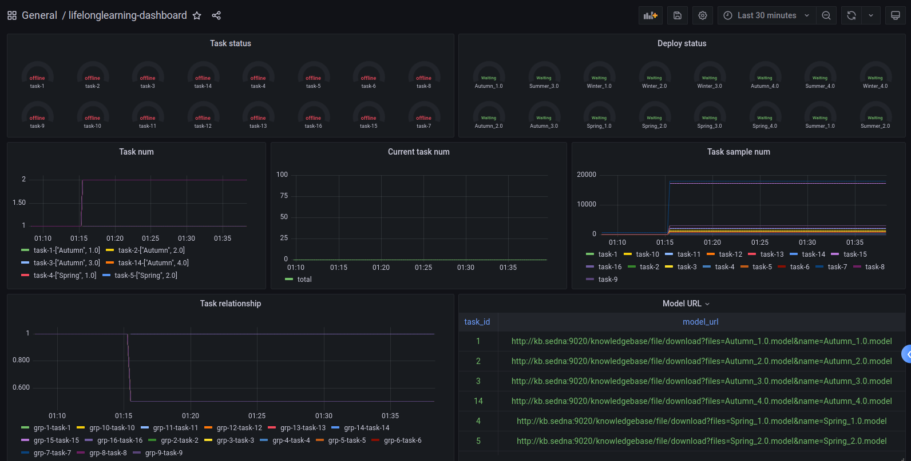
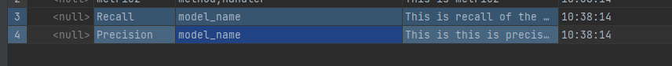
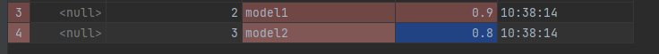
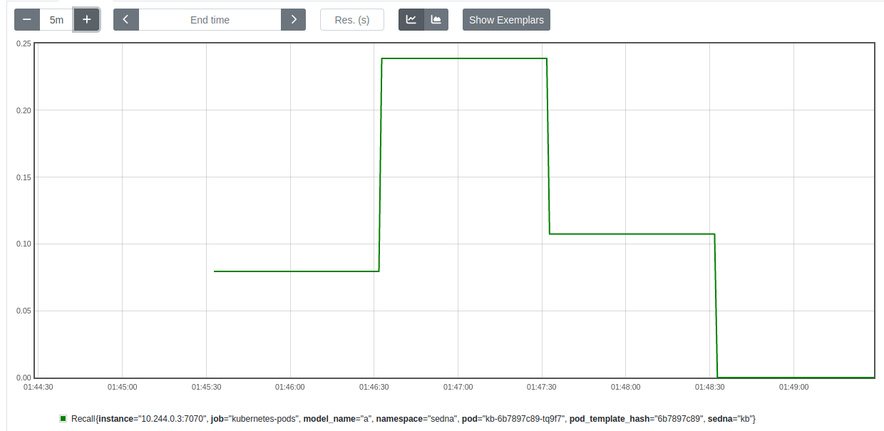
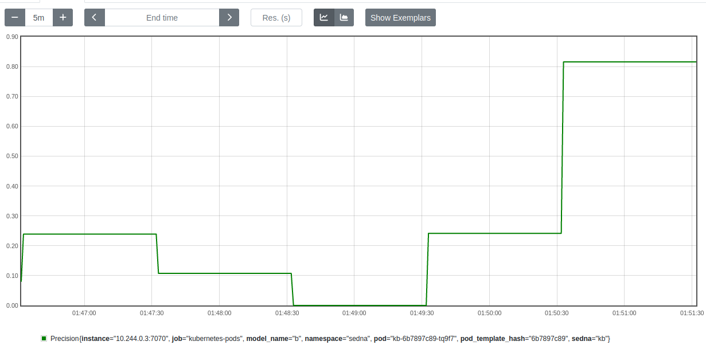
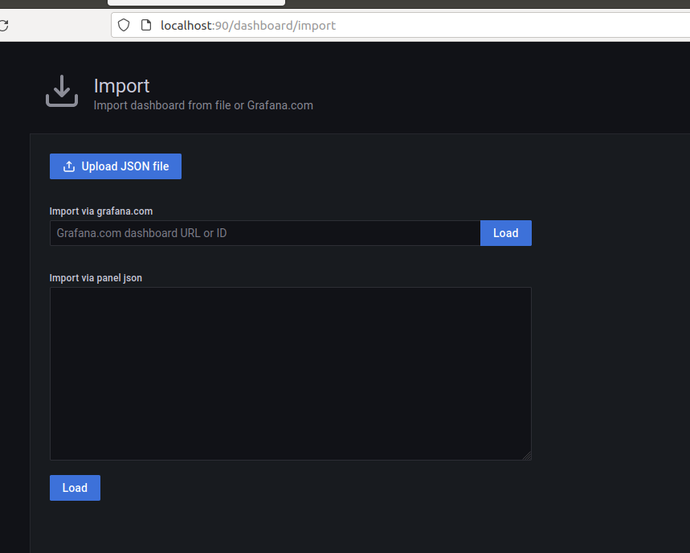

### User Guide for Lifelonglearning exporter
This guide is complementary to Observation-Management on LifelongLearning and covers how to install lifelonglearning exporter on an existing Sedna environment.  

### What you can get
#### 1. The dashboard about lifelonglearning job
After installation, you can see UI of Grafana on http://{The node you labeled for deployment}:31000  
You can get your 'admin' user password by running:

```
kubectl get secret --namespace default grafana -o jsonpath="{.data.admin-password}" | base64 --decode ; echo
```
After login, you can see some dashboards designed for LifelongLearning.

### 2. Set custom metrics what you need
After installation, you can see the  tables {metric and metric_value} in the knowledge base which is in the svc/kb.  
You can set the required metrics in both tables by following these steps, not just those related to lifelong learning.
1. Add the metrics name, metrics label, and other information to the metrics table.
2. Add metric values and labels to metrics_value at runtime.

For example, As shown in the image below, I have metrics in the Metric table: Recall, Precision.

  

Then Exporter periodically scans the metrics in the Metric_value table and classifies them according to the labels and you can see the metrics in the prometheus:




### How to Install
#### Prerequisites
- Sedna
- Grafana
- Prometheus

If you don't have an existing Sedna or KubeEdge environment, you can follow the [Sedna Installation Document](https://github.com/kubeedge/sedna/blob/main/docs/setup/install.md) to install what you need.  
If you don't have an existing Grafana or Prometheus environment, you can follow the [Observation-Management Document](../README.md) to install what you need.
#### Install KB_exporter
You should use the following command to compile the kb_exproter:
```shell
go build main.go
```
Then you can use the following command to depoly:
```shell
# Move the installtion package to the specified dirctory
kubectl cp $EXPORTER kb:/db/ -n sedna

# Enter the kb
kubectl exec -it kb -n sedna

# Start the exporter
./main

# You can use the following command to ask for help
./main -h
```

#### Expose ports
After the exporter is installed, you need to modify the following exposed ports so that Prometheus can automatically find target metrics.


```yaml 
# You should add the following configuration to svc/kb to expose the corresponding port.
name: tcp-1  
port: 7070  
protocol: TCP  
targetPort: 7070
```
``` yaml
# You should add the following configuration to pod/kb to notify Prometheus that the following ports require periodic scanning.
metadata: 
  annotations:  
    prometheus.io/path: /metrics
    prometheus.io/port: "7070"
    prometheus.io/scrape: "true"
```

#### Import dashboard
There is a dashboard files in lifelonglearning_exporter/dashboard.

You can go to Grafana and select Import JSON files.



After the above steps, you can see the lifelong learning panel, of course, you can also manually add new metrics
