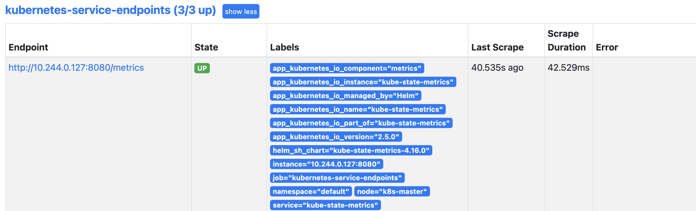
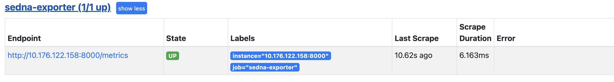
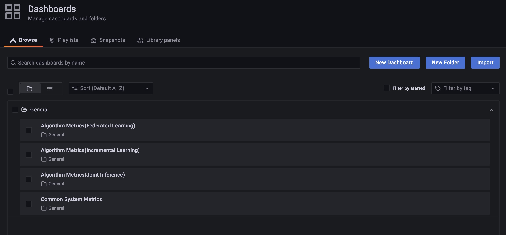
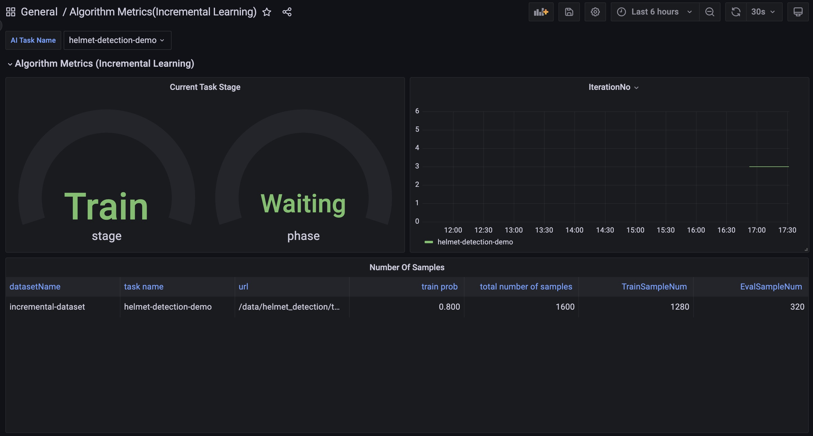

# User Guide for Observability Management
This guide covers how to install Observability Management on an existing Sedna environment.

If you don't have an existing Sedna or KubeEdge environment, you can follow the [Sedna Installation Document](https://github.com/kubeedge/sedna/blob/main/docs/setup/install.md) to install what you need.

## Get Helm Repos Info
This project is based on Grafana and Prometheus community, so you need to get helm repos firstly.

```
helm repo add grafana https://grafana.github.io/helm-charts
helm repo add prometheus-community https://prometheus-community.github.io/helm-charts
helm repo update
```

## Configs

### Node Selector
You should label one node, so that you can deploy components like Grafana, Prometheus and Loki on this node.

Cloud node is recommended to be chosen for deploying the components needed on Observability Management.

```
# If sedna-mini-control-plane is the node you chose for deployment.
kubectl label nodes sedna-mini-control-plane labelName=master
```

## Installation

### Kube-state-metrics
```
cd sedna/components/dashboard/kube-state-metrics
helm install kube-state-metrics prometheus-community/kube-state-metrics -f values.yaml
```
After Installation, you can curl the url kube-state-metrics exposed to check whether the metrics can be collected.

If pod IP of Kube-state-metrics is 10.244.0.127, the url is 10.244.0.127:8080/metrics

### Exporter (Optional)
Currently, the exporter is only used for collecting inference counts and numbers of hard samples.
These metrics are not shown in the running yamls, so kube-state-metrics can not collect these custom metrics.
```
cd sedna/components/dashboard/exporter/incremental_learning/hardSamplesExporter.py
cd sedna/components/dashboard/exporter/joint_inference/hardSamplesExporter.py
```
1. Edit the exporter if needed. (The current paths are for demo test cases.)
2. Run the exporter on the node which is producing hard samples.

### Prometheus
```
cd sedna/components/dashboard/prometheus
```
If you run the exporters before, you need to edit **values.yaml** of Prometheus.
```yaml
serverFiles:
  prometheus.yml:
    scrape_configs:
      ...
      - job_name: "sedna-exporter"
        static_configs:
        - targets:
          - ${The node IP you run the exporter}:${Port(Default as 8000)}
```
Install Prometheus
```
helm install prometheus prometheus-community/prometheus -f values.yaml
```
If the installation is successful, you can see UI of Prometheus on http://{The node you labeled for deployment}:30003
At **Targets** view of Prometheus UI, the states of kube-state-metrics and sedna_exporter(Optional) are **UP**.



### Loki
```
cd sedna/components/dashboardloki-stack
helm install loki grafana/loki-stack -f values.yaml
```
Because there are no kubelets on edge nodes, some problems like this [issue](https://github.com/kubeedge/kubeedge/issues/4170) make promtail on edge node can not collect logs.

### Grafana
There are several dashboard files in `sedna/components/dashboard/grafana/dashboards`.

To automatically load these files, you need to download files of [Grafana-Chart](https://github.com/grafana/helm-charts/tree/main/charts/grafana) to directory `sedna/components/dashboard/grafana` firstly.
Then replace the original directory `dashboards` and original values.yaml with ours.

```
cd sedna/components/dashboard/grafana
helm install grafana . -f values.yaml
```
After installation, you can see UI of Grafana on http://{The node you labeled for deployment}:31000
You can get your 'admin' user password by running:
```
kubectl get secret --namespace default grafana -o jsonpath="{.data.admin-password}" | base64 --decode ; echo
```
When you log in, you can see some dashboards designed for Sedna.


