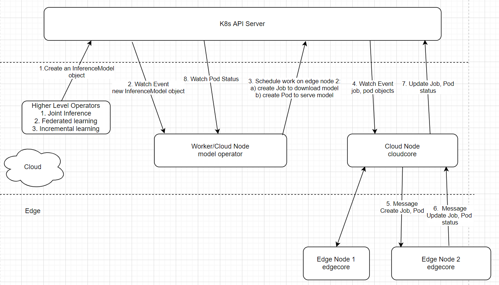

# Model Operator
The model operator launches machine learning inference and training services, either on the cloud or on the edge nodes, depending on the corresponding CRD specs. 

It is supposed to run as a separate binary, fully decoupled from the KubeEdge platform code. It leverages the KubeEdge platform to schedule work on the edge nodes. 

## Documentation
[Model Operator Design](docs/model.md)



## Quick start
As of now (2021/02), the model operator only supports model inference on the edge nodes. 

Ideally it should be deployed as a Kubernetes Deployment, running on the cloud, and inside a separate namespace within the cluster. 

For now, the following steps just run it as a binary, wherever the kubeconfig is available.

### Prerequisites
* Provision a KubeEdge cluster with at least one edge node
* An HTTP server from where Tensorflow models can be downloaded. (S3 will be supported soon)

### Steps
Note:
* The following steps can be run on any machine (bare metal or VM) with kubeconfig
* You need to modify the inferencemodel.yaml according to where your model files are located
1. Clone repo
```bash
$ git clone https://github.com/kubeedge/sedna.git $GOPATH/src/github.com/kubeedge/sedna
```
2. Create the model CRD and configmap
```bash
cd $GOPATH/src/github.com/kubeedge/sedna/components/modeloperator
kubectl apply -f config/crd/bases/sedna.io_inferencemodels.yaml
kubectl create configmap sedna-downloadmodelfile --from-file=scripts/downloadModelFile.sh
```
3. Build and run the model operator
```bash
make
bin/manager
```
4. Open another terminal and create an inferencemodel instance
```bash
kubectl apply -f config/samples/inferencemodel.yaml
```