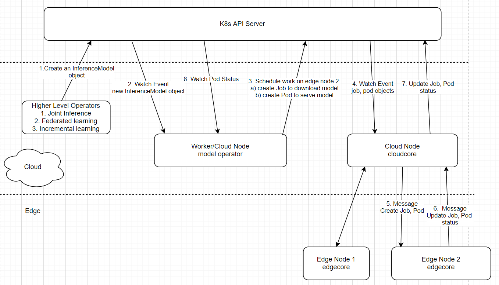

# Model Operator Design Document

The model operator is supposed to run as a separate binary, fully decoupled from the KubeEdge platform code. It leverages the KubeEdge platform to schedule work on edge nodes. Here is the high level design diagram for the work flow:



There are generally two phases for machine learning model development, i.e. training and inference. Model behaviors are quite different depending on whether it is used for training or for inference. So we might as well define two different types of model CRDs: 

* InferenceModel
* TrainingModel

Also the whole system will run in a hybrid mode. By hybrid, we mean the KubeEdge cluster will manage worker nodes in both the cloud and the edge. For the cloud running components, we can leverage the full power of standard K8s, i.e. pods, deployments, services, ingress/egress, loadbalancer etc. This means cloud components will be deployed in a way exactly the same as done in a standard Kubernetes cluster. On the other hand, edge components leverage the KubeEdge framework. 

## InferenceModel CRD
### InferenceModel CRD
```go
// InferenceModelSpec defines the desired state of an InferenceModel.
// Two ways of deployment are provided. The first is through a docker image.
// The second is through a data store, with a manifest of model files.
// If image is provided, manifest and targetVersion will be ignored.
type InferenceModelSpec struct {
    ModelName     string `json:"modelName"`
    DeployToLayer string `json:"deployToLayer"`
    FrameworkType string `json:"frameworkType"`
 
    // +optional
    NodeSelector map[string]string `json:"nodeSelector,omitempty"`
 
    // +optional
    NodeName string `json:"nodeName,omitempty"`
 
    // +optional
    Image string `json:"image,omitempty"`
 
    // +optional
    Manifest []InferenceModelFile `json:"manifest,omitempty"`
 
    // +optional
    TargetVersion string `json:"targetVersion,omitempty"`
 
    // +optional
    // +kubebuilder:validation:Minimum=0
    ServingPort int32 `json:"servingPort"`
 
    // +optional
    // +kubebuilder:validation:Minimum=0
    Replicas *int32 `json:"replicas,omitempty"`
}
 
// InferenceModelFile defines an archive file for a single version of the model
type InferenceModelFile struct {
    Version     string `json:"version,omitempty"`
    DownloadURL string `json:"downloadURL,omitempty"`
    Sha256sum   string `json:"sha256sum,omitempty"`
}
 
// InferenceModelStatus defines the observed state of InferenceModel
type InferenceModelStatus struct {
    URL            string `json:"url,omitempty"`
    ServingVersion string `json:"servingVersion,omitempty"`
}
```

### Sample inferencemodel instance
```yaml
apiVersion: sedna.io/v1alpha1
kind: InferenceModel
metadata:
  name: facialexpression
spec:
  modelName: facialexpression
  deployToLayer: edge
  frameworkType: tensorflow
  image: ''
  nodeSelector:
    kubernetes.io/hostname: precision-5820
  nodeName: precision-5820
  manifest:
    - version: '3'
      downloadURL: http://192.168.1.15/model_emotion_3.tar.gz
      sha256sum: dec87e2f3c06e60e554acac0b2b80e394c616b0ecdf878fab7f04fd414a66eff
    - version: '4'
      downloadURL: http://192.168.1.15/model_emotion_4.tar.gz
      sha256sum: 108a433a941411217e5d4bf9f43a262d0247a14c35ccbf677f63ba3b46ae6285
  targetVersion: '4'
  servingPort: 8501
  replicas: 1
```
An instance of the InferenceModel specifies a single serving service for the provided model.

Two scenarios:

* DeployToLayer == cloud, the controller will create a deployment with specified replicas, and a service to expose the deployment to outside world.
* DeployToLayer == edge, the controller will create a single pod running on the specified edge node (through NodeSelector)


## How can the InferenceModel CRD be used?
### Simple machine learning offloading to edge
Just create an instance of InferenceModel with "DeployToLayer == edge"

### Joint Inference by edge and cloud
Create three resources:
* An instance of InferenceModel to the cloud
* An instance of InferenceModel to the edge
* A pod running on the edge for serving customer traffic. It contains the logic for deciding whether or not to call cloud model serving API
