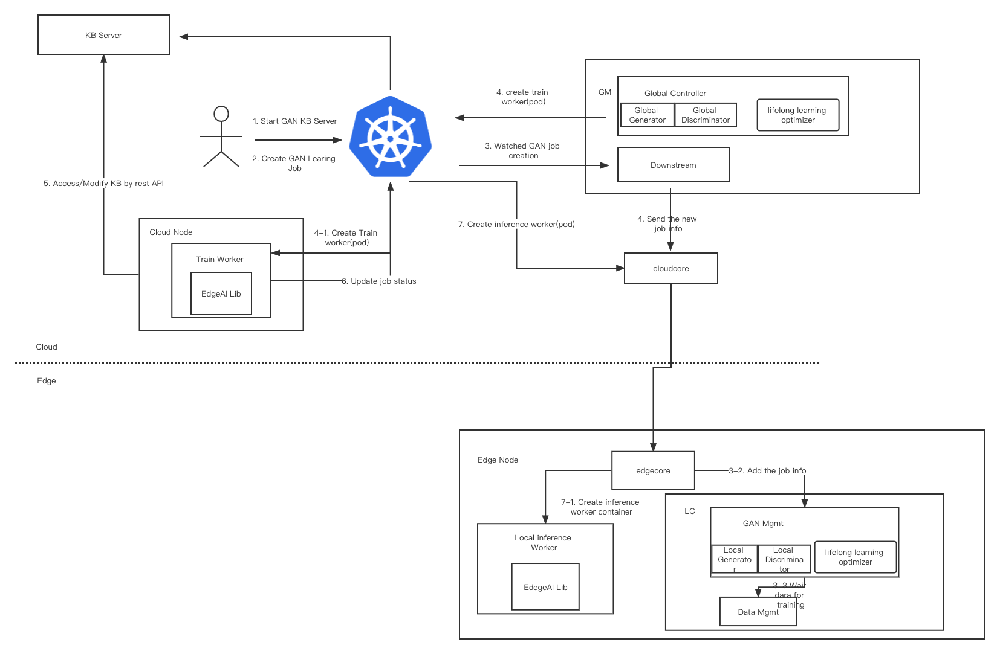
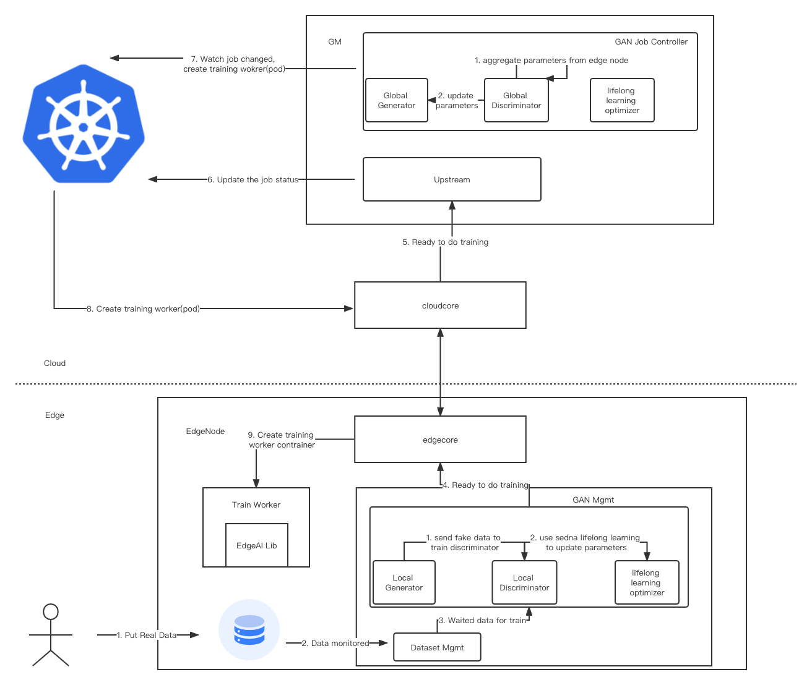
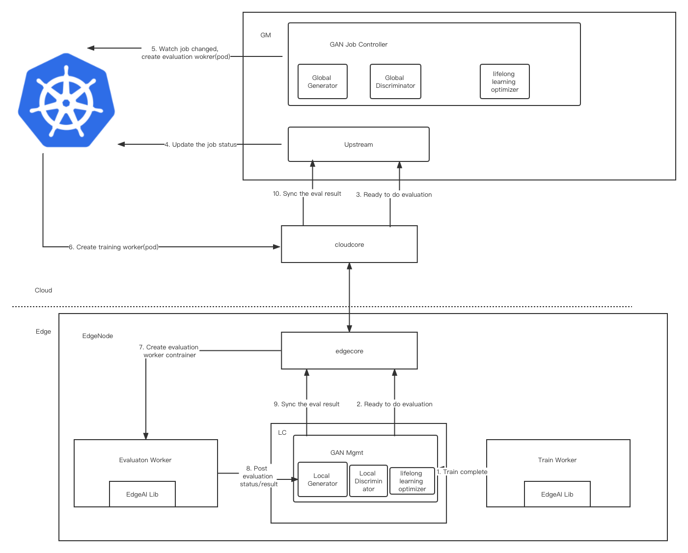

# Design and Implement of GAN based on Sedna Lifelong Learning
## Motivation

At present, robot collision detection requires a large number of images of multiple types as training data. However, to my best knowledge, even the most prevalent and largest public dataset([the cityscapes dataset](https://www.cityscapes-dataset.com/) and [the synthia dataset](https://synthia-dataset.net/)) cannot satisfy it.    
Generate Adversarial Networks(GAN) is the start-of-art generative model and GAN can generate fake data according to the distribution of the real data. Naturally, GAN is used to learn the distribution of the current data, thereby generating more data to train the robot collision detection. Nevertheless, GAN is hard to train and converge. At the same time, GAN that can generate multiple types of data is needed, because of the characteristic of robot collision detection.    
Therefore, we design a GAN framework based on sedna lifelong learning due to the ingenious design of Sedna. We call it EntGAN.
### Goals

* edge-cloud collaborative GAN.
* GAN training accelerating based on deploying a single GAN to every edge node.
* generate multi types of data based on sedna lifelong learning.

## Proposal
EntGAN use the sedna lifelong learning and draw lessons from its design.    

## Design Details
There are two stages in a lifelong learning job: train/eval    

Each stage contains these below states:
1. Waiting: wait to trigger satisfied, i.e. wait to train/eval/deploy
2. Ready: the corresponding trigger satisfied, now ready to train/eval/deploy
3. Starting: the corresponding stage is starting
4. Running: the corresponding stage is running
5. Failed: the corresponding stage failed
6. Completed: the corresponding stage completed

## Enhanced Design for GAN 
We deploy global generator and global discriminator on Global Controller and edge generator and edge discriminator on Local Controller. After updating local dicriminator, we use sedna lifelong learning to again update and enhance its parameter.

### The flows of GAN job
- Flow of the job creation:

- Flow of the `train` stage:

- Flow of the `eval` stage:

