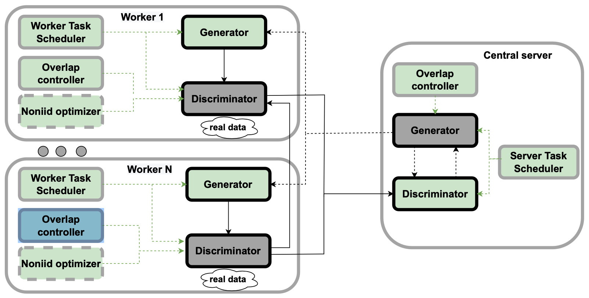

# EntGAN: A Distributed GAN Framework Based on Multi-task
## Motivation

Generative adversarial networks (GAN) has been widely used to solve the challenges of small samples and heterogeneous data. In recent years, distributed GAN has expanded and accelerated the training of GAN. The existing distributed GANs aim to train a certain class of discriminators to generate a single class of fake data. However, in real life, there are applications that need to train many kinds of discriminators at the same time, such as image conversion and robot inspection.     

Therefore, we propose a enhanced GAN framework to help sole **multi-task** and **memory usage** problem. We call the framework EntGAN.     

### Goals

* The framework implement the configuration of global generator and global discriminator on the server side, and configure different local generators and local discriminators on different edge nodes
* The framework can reduce the overall training time by at least 10% and the server memory occupation by at least 15% compared to the state-of-the-art distributed GAN.
* The framework has a set of simple APIs convenient for users to use.

## Proposal
We propose a enhanced GAN framework to help sole **multi-task** and **memory usage** problem. We call the framework EntGAN.     

We will explain our ideas on system architecture and learning process.

### System Architecture
As shown in the figure below, EntGAN has a set of execution modules and a set of control modules. The execution module performs GAN training tasks, including local generators and local discriminators on each worker, as well as global generator and global discriminator on the server.    

     

The edge generator generates fake data based on random noise signals. The edge discriminator takes the local real data and the fake data generated by the edge generator as the input, and trains the edge discriminator to distinguish the fake data from the real data. The global discriminator aggregates and averages the parameters of all local discriminators to calculate the true probability of fake data from the global generator. The global generator generates fake data for the global discriminator, and updates the generator with the true probability of the fake data from the global discriminator.   

The control module of EntGAN controls the execution module of how to execute training tasks, including the server task scheduler on the server, the worker task scheduler and nonidd optimizer on each worker, and the overlapping controller on the server and worker. The server task scheduler and worker task scheduler run the task scheduling algorithm to schedule when and how to execute the training tasks of the generator and discriminator. The noniid optimizer runs an algorithm based on continuous learning to learn the probability distribution of data to reduce the impact of non IID data sets on training performance. The overlap controller overlaps computation and communication during training to reduce the overall training time.     

### Learning Process
The learning process is divided into initialization stage and iterative training stage. During initialization, the global generator and global discriminator initialize the generator parameters and discriminator parameters, which are synchronized with all edge generators and edge discriminators respectively. Then, it starts the following iterative training until the global generator converges:    

1. The worker task scheduler runs the work task scheduling algorithm to calculate when to execute the edge generator. Then, the edge generator generates a set of fake data according to the results of task scheduling.
2. The edge discriminator updates the parameters according to the generated fake data. Then, the noniid optimizer transmits the updated edge discriminator parameters to other workers. The noniid optimizer controls the edge discriminator to use the received parameters and local fake data to update the edge discriminator parameters through continuous learning method. In this update process, the overlapping controller overlaps the calculation and communication of training through the calculation communication overlapping algorithm.
3. The server updates the parameters of the global discriminator by averaging the edge discriminator parameters received from each worker.
4. The server task scheduler controls the global discriminator to train the global generator. The global generator updates its parameters through multiple iterations of reverse calculation. Then, the overlap controller on the server broadcasts the updated parameters layer by layer to all workers to update the edge generator.

## Roadmap
Upon the release of EntGAN, the roadmap would be as follows:    
* AUG 2022: Release the implementation of EntGAN
* SEP 2022: Realize EntGAN with Sedna
* SEP 2022: Release the fianl review report 