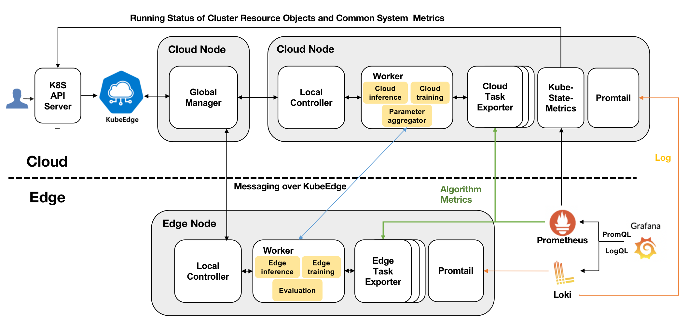
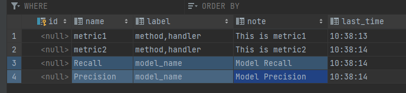
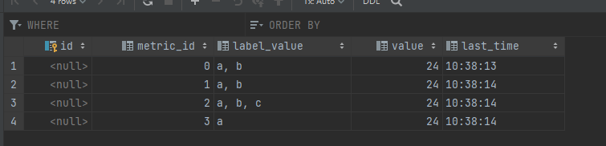
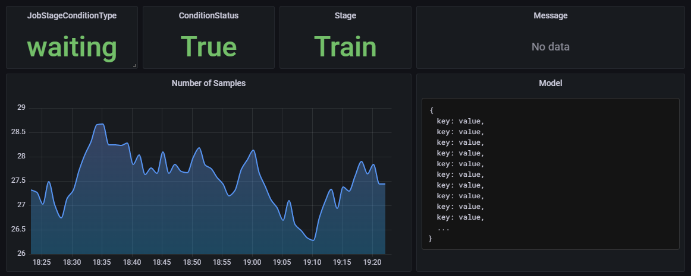
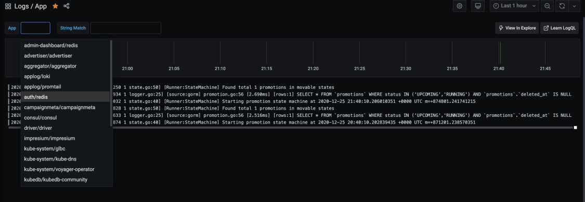

- [Operation and maintenance UI development](#Operation-and-maintenance-UI-development)
    - [Motivation](#motivation)
        - [Goals](#goals)
    - [Proposal](#proposal)
        - [Use Cases](#use-cases)
    - [Design Details](#design-details)
        - [Log](#Log)
        - [Metric](#Metric)
        - [Visualization](#Visualization)
    - [NetWork](#NetWork)
      - [Cache](#Cache)
    - [Install](#install)

# Operation and maintenance UI development
## Motivation
At present, Users can only access information about lifelong learning through the command line, including logs, status, and metrics.It is inconvenient and unfriendly for users. This proposal will provide a UI for metrics, log collection, status monitoring and management based on grafana. This allows the user to get the information by the graphical interface
### Goals

- Supports metrics collection and visualization in lifelong learning
- Support unified management and search of application logs
- Support the management and status monitoring of lifelong learning in dashboard
## Proposal
We propose using grafana,loki and prometheus to display the metric,log and statues about the lifelong learning job. The Prometheus is used to collect the metric and status and the loki is used to collect logs.
### Use cases

- Users can search log by specifying pod and keywords in the log control panel
- User can view the history state or the metric of any component in a sequence diagram
- Users can view the status of any CRD (Model, DataSet, Lifelonglearningjob) by specifying the name
## Design details
### Architecture

1. Log
In Daemonset mode, Promtail will be deployed on each node (Cloud, Edge), and will monitor the log storage directory on the node (eg: /var/logs/contains).
If there is a log update, in Loki's next pull, the updated log will be pulled.
It is the same way as "Kubectl logs" to get logs.  
Loki is deployed on Cloud nodes and persistently stores the pulled logs
2. Metric
kube-state-metrics is about generating metrics from Kubernetes API objects without modification. This ensures that features provided by kube-state-metrics have the same grade of stability as the Kubernetes API objects themselves.  
In Kubeedge, it is the same way as "Kubectl get" to get component information. When using Kubectl to obtain information from edge nodes, Kube-State-Metrics can also.  
Both Prometheus and Kube-State-Server are deployed on Cloud nodes.Prometheus will pull the metrics in Kube-state-server and store the metrics persistently.
3. Visualization
Grafana is deployed on the Cloud node, and it visualizes based on the persisted data in Prometheus and Loki that are also located on the Cloud node.
### Log
At present, the log file is under the directory /var/log/contains.
There are two types of Promtail collection modes. The following table shows the feature comparison:

|                            | Daemonset                 | SideCar                                   |
|----------------------------|---------------------------|-------------------------------------------|
| Source                     | Sysout + Part file        | File                                      |
| Log classification storage | Mapped by container/path  | Pod can be separately                     |
| Multi-tenant isolation     | Isolated by configuration | Isolated by Pod                           |
| Resource occupancy         | Low                       | High                                      |
| Customizability            | Low                       | High, each Pod is configured individually |
| Applicable scene           | Applicable scene          | Large, mixed cluster                      |

### Metric
#### CRD metric

1. LLJob Status

| **Metric**           | **Description**                                                            |
|----------------------|----------------------------------------------------------------------------|
| JobStatus            | Status of each job,Enum(True, False, Unknown)                              |  
| StageConditionStatus | Status of each stage,Enum(Waiting,Ready,Starting,Running,Completed,Failed) |  
| LearningStage        | Stages of lifelong learning,Enum(Train, Eval, Deploy )                     |  

2. Dataset status

| **Metric**       | **Description**                     |
|------------------|-------------------------------------|
| NumberOfSamples  | The number of samples               |
| StageTrainNumber | The number of samples used by train |
| StageEvalNumber  | The number of samples used by eval  |

3. Model

| **Metric** | **Description**                           |
|------------|-------------------------------------------|
| Key        | The value corresponding to the custom Key |

4. Task

| **Metric**        | **Description**                                                                                                                                                                                       |
|-------------------|-------------------------------------------------------------------------------------------------------------------------------------------------------------------------------------------------------|
| ActiveTasksNumber | The number of running tasks                                                                                                                                                                           |
| TotalTasksNumber  | The number of total tasks                                                                                                                                                                             |
| TasksInfo         | Tasks Info<br/>{ <br/>location: "edge &#124; cloud",<br/>work: "training &#124; infering",<br/>startTime: "xxxx-xx-xx xx:xx:xx",<br/>duration: "xxxx s/min/h",<br/>status: "active &#124; dead"<br/>} |

5. Worker

| **Metric**          | **Description**                                                                                           |
|---------------------|-----------------------------------------------------------------------------------------------------------|
| ActiveWorkersNumber | The number of running worker                                                                              |
| TotalWorkerNumber   | The number of total worker                                                                                |
| WorkersInfo         | Workers Info<br/>{<br/>location: "edge &#124;cloud",<br/>status: "waiting &#124;active &#124; dead"<br/>} |

6. Number of samples for inference (known tasks, unknown tasks)

| **Metric**           | **Description**                                        |
|----------------------|--------------------------------------------------------|
| InferenceDoneNumber  | The number of samples for which inference is completed |
| InferenceReadyNumber | The number of samples ready for inference              |
| InferenceErrorNumber | The number of samples with inference errors            |
| InferenceRate        | Inference completion percentage：0-100（%）               |

7. Knowledge base

| **Metric** | **Description**                                                      |
|------------|----------------------------------------------------------------------|
| KBServerIP | The server IP where the knowledge base is located                    |
| KBNodeType | The type of the node where the knowledge base is located(Cloud,Edge) |
| KBNodeName | The name of the node where the knowledge base is located             |

8. Training stage

| **Metric**             | **Description**                                           |
|------------------------|-----------------------------------------------------------|
| KnowTaskNum            | Number of known tasks in the knowledge base               |
| TaskGroupModelFile     | The model file that Task needs to load                    |
| TaskSampleNum          | The number of samples used at training stage              |
| TaskSampleDir          | The path to the sample for the subtask                    |
| TaskModelSavePath      | The path where the task model is saved                    |
| TaskModelBaseModelPath | The path where the base task model is saved               |
| TaskRelationship       | Migration relationship between tasks                      |
| TaskProperties         | Basic properties of subtasks                              |
| KnowledgeBase          | For indicators related to the knowledge base, see Table 7 |


9. Evaluation stage  

| **Metric**     | **Description**                                           |
|----------------|-----------------------------------------------------------|
| EvalSampleNum  | The number of samples used at eval stage                  |
| EvalModelUrl   | The url of model at eval stage                            |
| TaskScore      | Score for the task to be eval                             |
| TaskEvalResult | Results of Model Evaluation                               |
| TaskStatus     | Whether the Task can be deployed                          |
| KnowledgeBase  | For indicators related to the knowledge base, see Table 7 |

10. Deploy stage

| **Metric**     | **Description**             |
|----------------|-----------------------------|
| DeployStatus   | Enum(Waiting,Ok,NotOk)      |
| DeployModelUrl | The url for deploying model |


#### Custom metric
Now, the metrics that come with lifelonglearning may not meet your needs, so here is a way for users to expand metrics.  
You can register your own indicators in the Metic table,as shown in the table below:

I added precision and recall to the table,Of course, you can also add any other metrics you want.

After this, when you want to add an metric of the same id to the Metric_value table, multiple metrics will be generated according to the different labels.


And, both Metric and Metric_value tables are located in the KB database.  
Therefore, you can manipulate these two tables just like any other table in the KB.


#### Example

```
kind: CustomResourceStateMetrics
spec:
  resources:
    -
      groupVersionKind:
        group: myteam.io
        kind: "Foo"
        version: "v1"
      labelsFromPath:
        name: [ metadata, name ]
      metrics:
        - name: "active_count"
          help: "Number Foo Bars active"
          each:
            path: [status, active]
            labelFromKey: type
            labelsFromPath:
              bar: [bar]
            value: [count]
          commonLabels:
            custom_metric: "yes"

          labelsFromPath:
            "*": [metadata, labels]  # copy all labels from CR labels
            foo: [metadata, labels, foo]  # copy a single label (overrides *)

        - name: "other_count"
          each:
            path: [status, other]
          errorLogV: 5
```
### Visualization
Grafana can be used to visualize the monitoring data of Sedna. The visualization in Grafana contains 2 parts: `metrics` and `logs`.

- Visualization of metrics:



- Visualization of logs:



## Install
Using helm, modified based on the Loki-Stack.
```yaml
loki:
  enabled: true
  persistence:
    enabled: true
    accessModes:
      - ReadWriteOnce
    size: 10Gi

promtail:
  enabled: true
  config:
    lokiAddress: http://{{ .Release.Name }}:3100/loki/api/v1/push

grafana:
  enabled: true

prometheus:
  enabled: true
  isDefault: false
  nodeExporter:
    enabled: true
  kubeStateMetrics:
    enabled: true
```

There will also be related json files for the Grafana dashboard.
The corresponding dashboards can be imported according to user needs