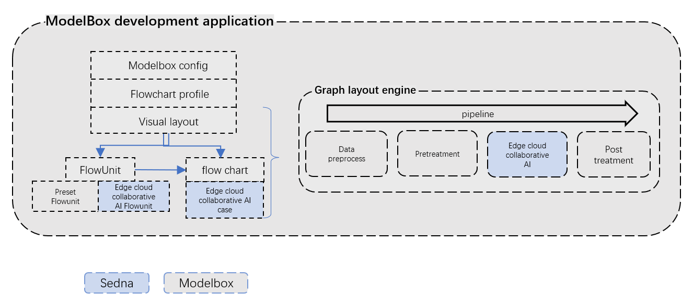
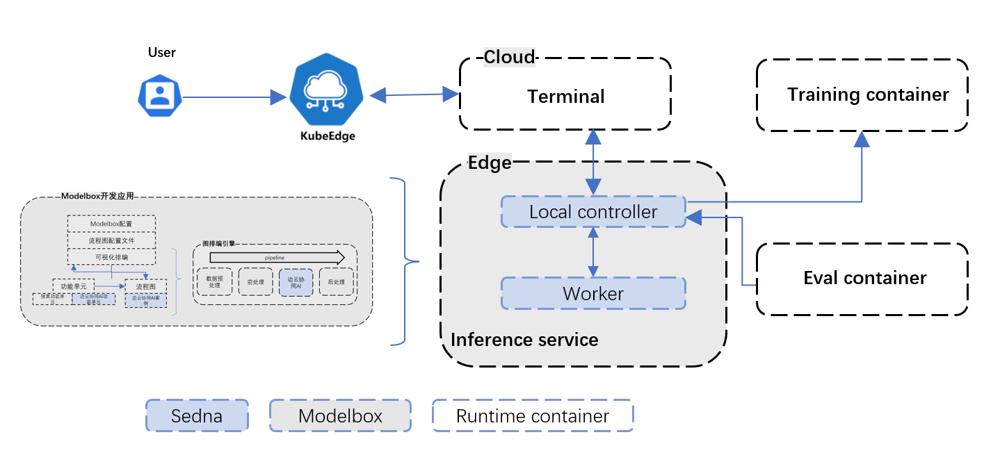
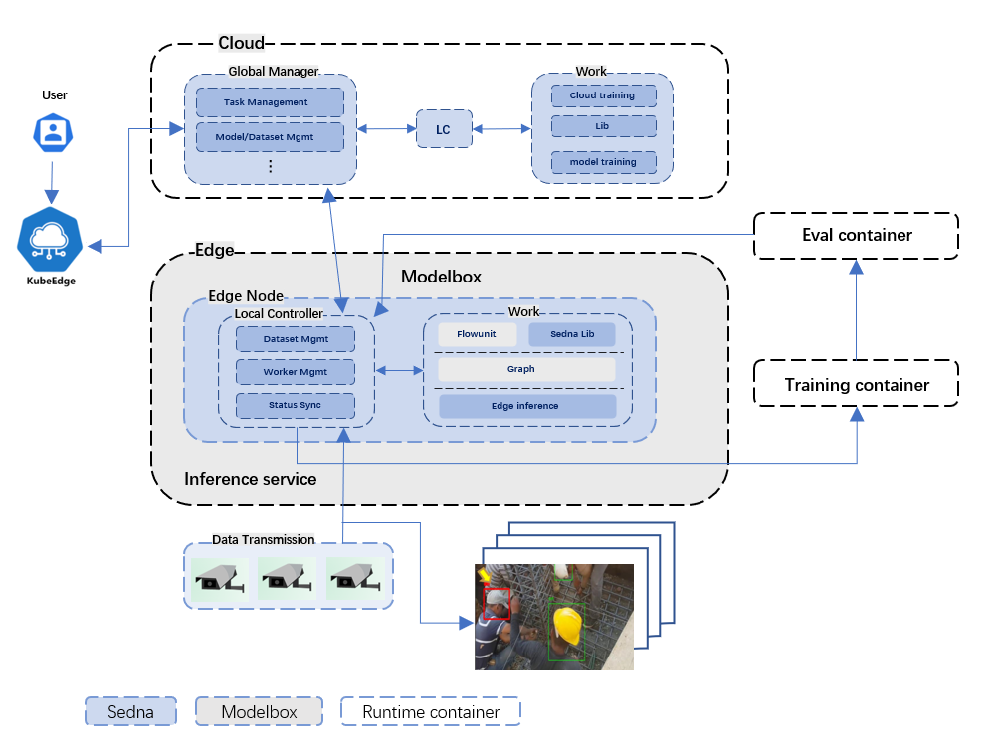

- [The proposal about building a high frequency Sedna based end to end use case in ModelBox format](#The-proposal-about-building-a-high-frequency-Sedna-based-end-to-end-use-case-in-ModelBox-format)
  - [Background](#Background)
  - [Motivation](#Motivation)
    - [Goals](#Goals)
  - [Proposal](#Proposal)
  - [Design Details](#Design-Details)
    - [Flow chart of ModelBox integrated Sedna edge-cloud collaboration function](#Flow-chart-of-ModelBox-integrated-Sedna-edge-cloud-collaboration-function)
    - [Developer Components](#Developer-Components)
  - [Road Map](#Road-Map)

# The proposal about building a high frequency Sedna based end to end use case in ModelBox format

## Background

> Sedna is an edge cloud collaborative AI project at KubeEdge SIG AI. Benefiting from the edge-cloud collaboration capabilities provided by KubeEdge, Sedna can realize cross-edge-cloud collaborative training and collaborative reasoning capabilities, and Sedna supports a variety of popular AI frameworks. **Sedna can simply enable edge-cloud synergy for existing training and inference scripts**, bringing the benefits of lower costs, improved model performance, and data privacy. **The goal of ModelBox is to solve the programming complexity of AI developers when developing AI applications**, reduce the development difficulty of AI applications, and hand over complex data processing to ModelBox. Developers mainly focus on the business logic itself, not the software details. While improving the efficiency of AI inference development, it ensures the performance, reliability, security and other attributes of the software, **so as to better enable Sedna developers to manage and use the Sedna framework**.

## Motivation

### Goals

- Sedna supports the visual layout function to help developers improve the programming complexity when developing edge cloud collaborative AI.
- Sedna supports multiple hardware devices and software frameworks, and shields hardware and software heterogeneity.
- Sedna supports a higher performance scheduling engine to help developers solve the commercial performance problems of AI applications.

## Proposal

- Make use of the extensible function of ModelBox, use Python to develop functional units, and package Sedna library and related codes in ModelBox. Use the visual layout function of ModelBox container to call Sedna API to realize the collaborative application development of edge cloud.

  **use case**

- Carry out the collaborative development of edge clouds on ModelBox, and use helmet detection incremental learning training samples. Start the ModelBox reasoning service, and the helmet detection video stream data is reasoned on the side. When encountering difficulties, it is uploaded to the cloud side. After the incremental sample conditions are met, the training container starts the incremental training model, puts the model in the evaluation container for evaluation, and finally starts the side reasoning service.

- **View [official website document for details]( https://modelbox-ai.com/ )**

  

  

## Design Details

### Flow chart of ModelBox integrated Sedna edge-cloud collaboration function

<<<<<<< HEAD
Use **ModelBox** visual development function to integrate **Sedna** related functional units. Use the **k8s** service to schedule and manage end-to-end cloud clusters. First start the **ModelBox side ** inference container. The side **Sedna LC** controls the acquisition of data, and upload the cloud to enable the side **Sedna worker **to create inference services. After normal sample inference, output the results. After encountering difficult cases, the **LC trigger** monitors that the incremental samples meet the retraining requirements, and automatically triggers the training container to start and complete the model training. After training, the model is placed in the **Evaluation container** for evaluation. Finally, after the evaluation pod is finished, the reasoning container of the side **ModelBox** is started, and then the reasoning result is output.
=======
Use **ModelBox** visual development function to integrate **Sedna** related functional units. Use the **k8s** service to schedule and manage end-to-end cloud clusters. First start the **ModelBox side** inference container. The side **Sedna LC** controls the acquisition of data, and upload the cloud to enable the side **Sedna worker** to create inference services. After normal sample inference, output the results. After encountering difficult cases, the **LC trigger** monitors that the incremental samples meet the retraining requirements, and automatically triggers the training container to start and complete the model training. After training, the model is placed in the **Evaluation container** for evaluation. Finally, after the evaluation pod is finished, the reasoning container of the side **ModelBox** is started, and then the reasoning result is output.
>>>>>>> 61fe4aea922794131d53633e69bf21ee21eb0b03




### Developer Components

**1. Specific development process of functional unit of ModelBox**

- Function unit creation

 The directory structure of the created **C++** functional unit is as follows:

```
[flowunit-name]
     |---CMakeList.txt           # For cpack packaging
     |---[flowunit-name].toml    # Configuration file for webui display
     |---[flowunit-name].py      # Interface implementation file
```

- Function unit attribute configuration
- Logical realization of functional unit
- Function unit compilation and operation


**2. The ModelBox framework Python project is compiled. The functional units created through the command line or visual UI contain file by default. The main functions are as follows:**

- Set function unit name
- Header files required for linking functional units
- Libraries required for linking functional units
- Set compilation target to dynamic library
- Specify the function unit installation directory

**View [official website document for details]( https://modelbox-ai.com/ )**


**3. Application case of encapsulated Sedna**

- Create incremental learning
- Start incremental training

**View [use incremental learning in helmet detection scenario for specific details](https://github.com/kubeedge/sedna/blob/main/examples/incremental_learning/helmet_detection/README.md)**


## Road Map

**2022.07.01 - 2022.08.15**

​	**1. Installation and construction of ModelBox environment**

​	**2. Understand the development tasks of ModelBox functional units**

**2022.08.16 - 2022.09.30**

​	**1. Complete Sedna function module**

​	**2. Complete helmet detection incremental training application case**

<<<<<<< HEAD
​	**3. Topic summary and document arrangement**
=======
​	**3. Topic summary and document arrangement**
>>>>>>> 61fe4aea922794131d53633e69bf21ee21eb0b03
