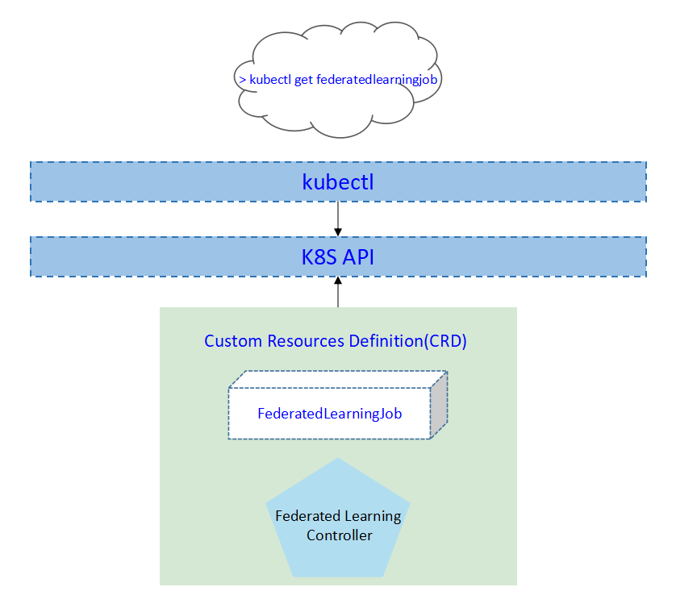
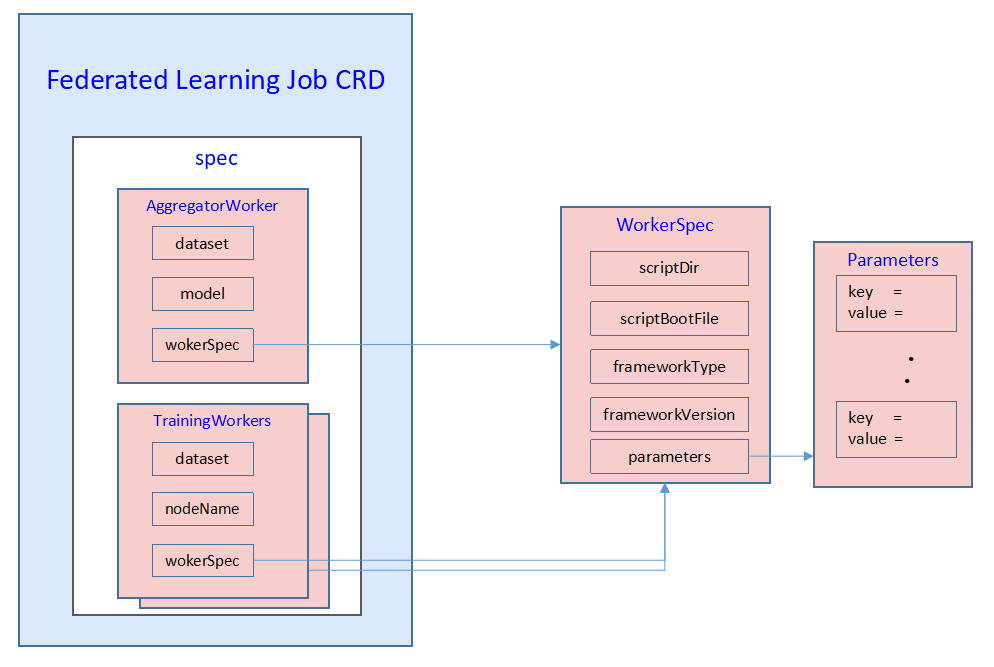
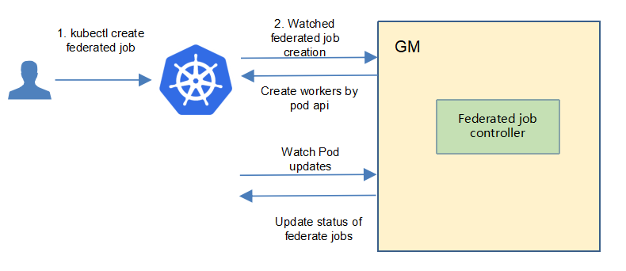
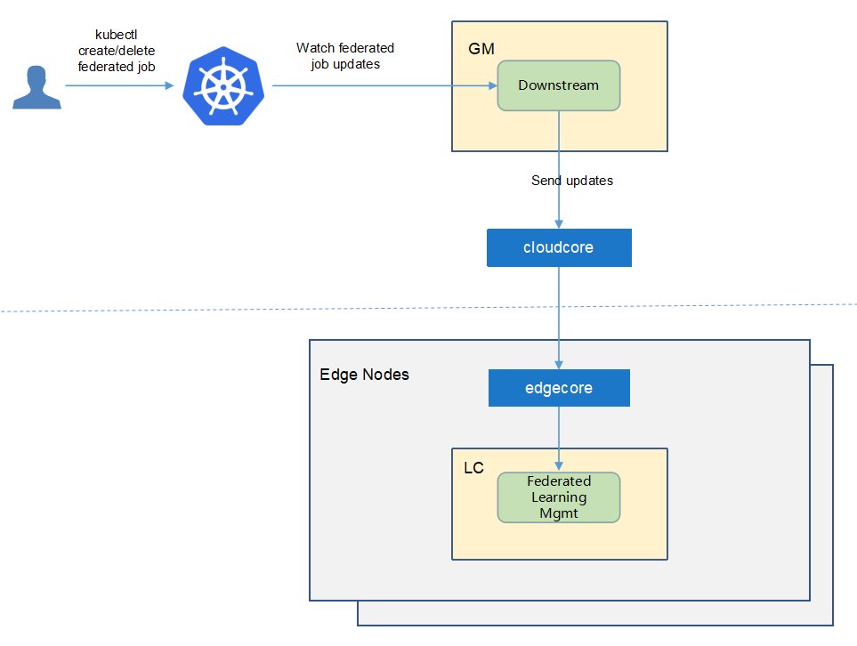
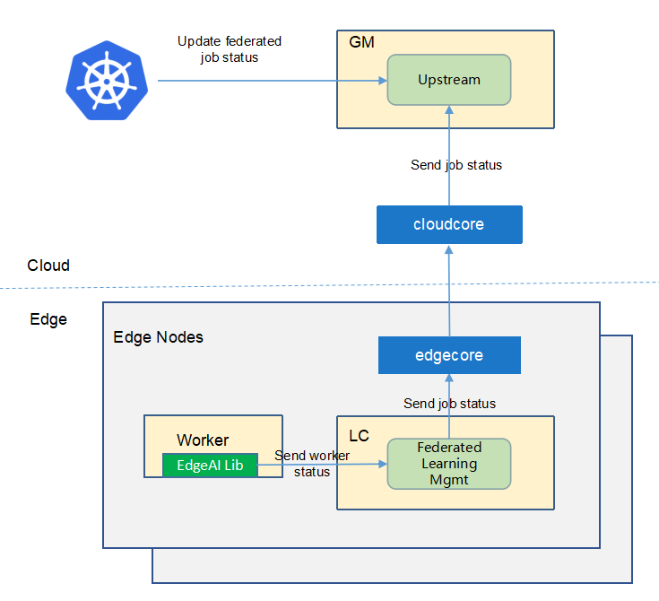
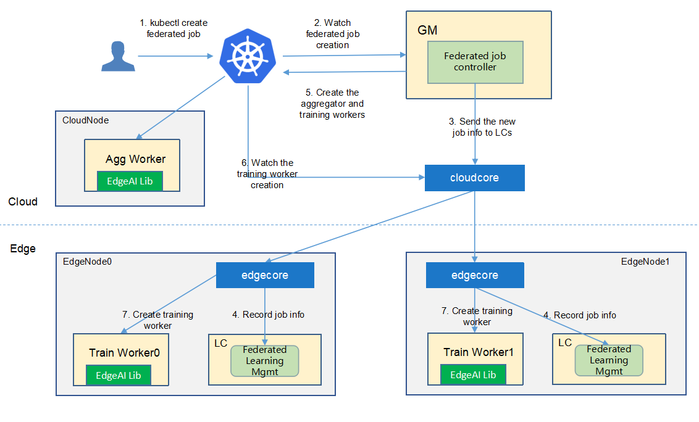
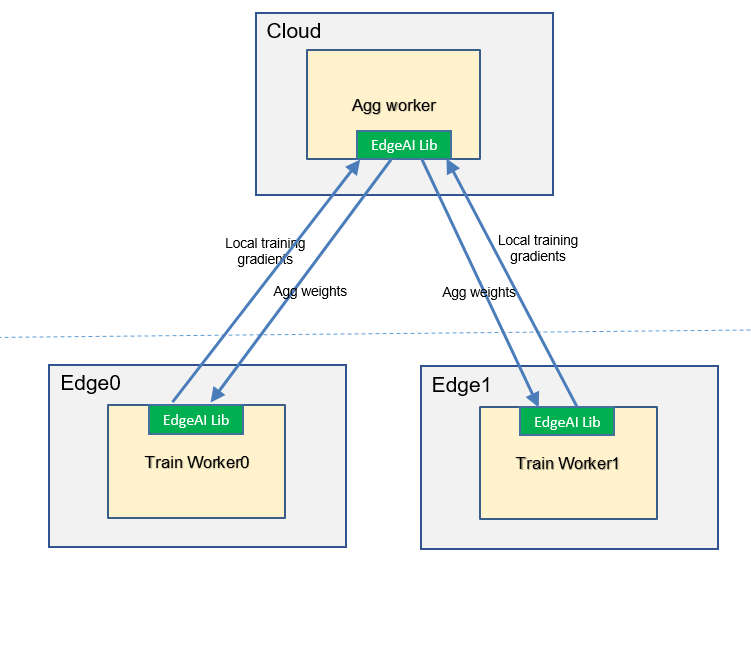

* [Federated Learning](#federated-learning)
   * [Motivation](#motivation)
     * [Goals](#goals)
     * [Non\-goals](#non-goals)
   * [Proposal](#proposal)
     * [Use Cases](#use-cases)
   * [Design Details](#design-details)
     * [CRD API Group and Version](#crd-api-group-and-version)
     * [Federated learning CRD](#federated-learning-crd)
     * [Federated learning type definition](#federated-learning-type-definition)
     * [Federated learning sample](#federated-learning-sample)
     * [Validation](#validation)
   * [Controller Design](#controller-design)
     * [Federated Learning Controller](#federated-learning-controller)
     * [Downstream Controller](#downstream-controller)
     * [Upstream Controller](#upstream-controller)
     * [Details of api between GM(cloud) and LC(edge)](#details-of-api-between-gmcloud-and-lcedge)
   * [Workers Communication](#workers-communication)
   
# Federated Learning
## Motivation

For edge AI, data is naturally generated at the edge. based on these assumptions:
* Users are unwilling to upload raw data to the cloud because of data privacy.
* Users do not want to purchase new devices for centralized training at the edge. 
* The sample size at the edge is usually small, and it is often difficult to train a good model at a single edge node.

Therefore, we propose a edge cloud federated learning framework to help to train a model **without uploading raw data**, and **higher precision** and **less convergence time** are also benefits.


### Goals

* The framework can combine data on multiple edge nodes to complete training.
* The framework provides the functions of querying the training status and result.
* The framework integrates some common aggregation algorithms, FedAvg and so on.
* The framework integrates some common weight/gradient compression algorithm to reduce the cloud-edge traffic required for aggregation operations.
* The framework integrates some common multi-job migration algorithms to resolve the problem of low precision caused by small size samples.


## Proposal
We propose using Kubernetes Custom Resource Definitions (CRDs) to describe 
the federated learning specification/status and a controller to synchronize these updates between edge and cloud.



### Use Cases


* User can create a federated learning job, with providing a training script, specifying the aggregation algorithm, configuring training hyperparameters, configuring training datasets.

* Users can get the federated learning status, including the nodes participating in training, current training status, samples size of each node, current iteration times, and current aggregation times.

* Users can get the saved aggregated model. The model file can be stored on the cloud or edge node.

 

## Design Details
### CRD API Group and Version
The `FederatedLearningJob` CRD will be namespace-scoped.
The tables below summarize the group, kind and API version details for the CRD.

* FederatedLearningJob

| Field                 | Description             |
|-----------------------|-------------------------|
|Group                  | sedna.io     |
|APIVersion             | v1alpha1                |
|Kind                   | FederatedLearningJob             |


### Federated learning CRD


Notes:
1. We use `WorkerSpec` to represent the worker runtime config which all EdgeAI features use.
1. Currently `WorkerSpec` limits to the code directory on host path or s3-like storage.
We will extend it to the support with `pod template` like k8s deployment.
1. We will add the [resources](https://kubernetes.io/docs/concepts/configuration/manage-resources-containers/) support in the future.

Below is the CustomResourceDefinition yaml for `FederatedLearningJob`:
[crd source](/build/crds/sedna/federatedjob_v1alpha1.yaml)

```yaml
apiVersion: apiextensions.k8s.io/v1
kind: CustomResourceDefinition
metadata:
  name: federatedjobs.sedna.io
spec:
  group: sedna.io
  names:
    kind: FederatedJob
    plural: federatedjobs
    shortNames:
      - federated
      - ft
  scope: Namespaced
  versions:
    - name: v1alpha1
      subresources:
        # status enables the status subresource.
        status: {}
      served: true
      storage: true
      schema:
        openAPIV3Schema:
          type: object
          properties:
            spec:
              type: object
              required:
                - aggregationWorker
                - trainingWorkers
              properties:
                aggregationWorker:
                  type: object
                  required:
                    - name
                    - model
                    - nodeName
                    - workerSpec
                  properties:
                    name:
                      type: string
                    model:
                      type: object
                      required:
                        - name
                      properties:
                        name:
                          type: string
                    nodeName:
                      type: string
                    workerSpec:
                      type: object
                      required:
                        - scriptDir
                        - scriptBootFile
                        - frameworkType
                        - frameworkVersion
                      properties:
                        scriptDir:
                          type: string
                        scriptBootFile:
                          type: string
                        frameworkType:
                          type: string
                        frameworkVersion:
                          type: string
                        parameters:
                          type: array
                          items:
                            type: object
                            required:
                              - key
                              - value
                            properties:
                              key:
                                type: string
                              value:
                                type: string
                trainingWorkers:
                  type: array
                  items:
                    type: object
                    required:
                      - name
                      - nodeName
                      - workerSpec
                    properties:
                      name:
                        type: string
                      model:
                        type: object
                        properties:
                          name:
                            type: string
                      nodeName:
                        type: string
                      workerSpec:
                        type: object
                        required:
                          - dataset
                          - scriptDir
                          - scriptBootFile
                          - frameworkType
                          - frameworkVersion
                        properties:
                          dataset:
                            type: object
                            required:
                              - name
                            properties:
                              name:
                                type: string
                          scriptDir:
                            type: string
                          scriptBootFile:
                            type: string
                          frameworkType:
                            type: string
                          frameworkVersion:
                            type: string
                          parameters:
                            type: array
                            items:
                              type: object
                              required:
                                - key
                                - value
                              properties:
                                key:
                                  type: string
                                value:
                                  type: string
            status:
              type: object
              properties:
                conditions:
                  type: array
                  items:
                    type: object
                    properties:
                      type:
                        type: string
                      status:
                        type: string
                      lastProbeTime:
                        type: string
                        format: date-time
                      lastTransitionTime:
                        type: string
                        format: date-time
                      reason:
                        type: string
                      message:
                        type: string
                startTime:
                  type: string
                  format: date-time
                completionTime:
                  type: string
                  format: date-time
                active:
                  type: integer
                succeeded:
                  type: integer
                failed:
                  type: integer
                phase:
                  type: string


      additionalPrinterColumns:
        - name: status
          type: string
          description: The status of the federated job
          jsonPath: ".status.phase"
        - name: active
          type: integer
          description: The number of active worker
          jsonPath: ".status.active"
        - name: failed
          type: integer
          description: The number of failed worker
          jsonPath: ".status.failed"
        - name: Age
          type: date
          jsonPath: .metadata.creationTimestamp

```

### Federated learning type definition

[go source](cloud/pkg/apis/sedna/v1alpha1/federatedjob_types.go)

```go
package v1alpha1

import (
	v1 "k8s.io/api/core/v1"
	metav1 "k8s.io/apimachinery/pkg/apis/meta/v1"
)

// +genclient
// +k8s:deepcopy-gen:interfaces=k8s.io/apimachinery/pkg/runtime.Object
// FederatedJob describes the data that a federatedjob resource should have
type FederatedJob struct {
	metav1.TypeMeta `json:",inline"`

	metav1.ObjectMeta `json:"metadata,omitempty"`

	Spec   FederatedJobSpec   `json:"spec"`
	Status FederatedJobStatus `json:"status,omitempty"`
}

// FederatedJobSpec is a description of a federatedjob
type FederatedJobSpec struct {
	AggregationWorker AggregationWorker `json:"aggregationWorker"`
	TrainingWorkers   []TrainingWorker  `json:"trainingWorkers"`
}

// AggregationWorker describes the data an aggregation worker should have
type AggregationWorker struct {
	Name       string                `json:"name"`
	Model      modelRefer            `json:"model"`
	NodeName   string                `json:"nodeName"`
	WorkerSpec AggregationWorkerSpec `json:"workerSpec"`
}

// TrrainingWorker describes the data a training worker should have
type TrainingWorker struct {
	Name       string             `json:"name"`
	NodeName   string             `json:"nodeName"`
	WorkerSpec TrainingWorkerSpec `json:"workerSpec"`
}

// AggregationWorkerSpec is a description of a aggregationworker
type AggregationWorkerSpec struct {
	CommonWorkerSpec
}

// TrainingWorkerSpec is a description of a trainingworker
type TrainingWorkerSpec struct {
	CommonWorkerSpec
	Dataset datasetRefer `json:"dataset"`
}

type datasetRefer struct {
	Name string `json:"name"`
}

type modelRefer struct {
	Name string `json:"name"`
}

// +k8s:deepcopy-gen:interfaces=k8s.io/apimachinery/pkg/runtime.Object

// FederatedJobList is a list of FederatedJobs.
type FederatedJobList struct {
	metav1.TypeMeta `json:",inline"`
	metav1.ListMeta `json:"metadata"`
	Items           []FederatedJob `json:"items"`
}

// FederatedJobStatus represents the current state of a federated job.
type FederatedJobStatus struct {

	// The latest available observations of a federated job's current state.
	// +optional
	Conditions []FederatedJobCondition `json:"conditions,omitempty"`

	// Represents time when the job was acknowledged by the job controller.
	// It is not guaranteed to be set in happens-before order across separate operations.
	// It is represented in RFC3339 form and is in UTC.
	// +optional
	StartTime *metav1.Time `json:"startTime,omitempty"`

	// Represents time when the job was completed. It is not guaranteed to
	// be set in happens-before order across separate operations.
	// It is represented in RFC3339 form and is in UTC.
	// +optional
	CompletionTime *metav1.Time `json:"completionTime,omitempty"`

	// The number of actively running pods.
	// +optional
	Active int32 `json:"active"`

	// The number of pods which reached phase Succeeded.
	// +optional
	Succeeded int32 `json:"succeeded"`

	// The number of pods which reached phase Failed.
	// +optional
	Failed int32 `json:"failed"`

	// The phase of the federatedjob.
	// +optional
	Phase FederatedJobPhase `json:"phase,omitempty"`
}

type FederatedJobConditionType string

// These are valid conditions of a job.
const (
	// FederatedJobComplete means the job has completed its execution.
	FederatedJobCondComplete FederatedJobConditionType = "Complete"
	// FederatedJobFailed means the job has failed its execution.
	FederatedJobCondFailed FederatedJobConditionType = "Failed"
	// FederatedJobTraining means the job has been training.
	FederatedJobCondTraining FederatedJobConditionType = "Training"
)

// FederatedJobCondition describes current state of a job.
type FederatedJobCondition struct {
	// Type of job condition, Complete or Failed.
	Type FederatedJobConditionType `json:"type"`
	// Status of the condition, one of True, False, Unknown.
	Status v1.ConditionStatus `json:"status"`
	// Last time the condition was checked.
	// +optional
	LastProbeTime metav1.Time `json:"lastProbeTime,omitempty"`
	// Last time the condition transit from one status to another.
	// +optional
	LastTransitionTime metav1.Time `json:"lastTransitionTime,omitempty"`
	// (brief) reason for the condition's last transition.
	// +optional
	Reason string `json:"reason,omitempty"`
	// Human readable message indicating details about last transition.
	// +optional
	Message string `json:"message,omitempty"`
}

// FederatedJobPhase is a label for the condition of a job at the current time.
type FederatedJobPhase string

// These are the valid statuses of jobs.
const (
	// FederatedJobPending means the job has been accepted by the system, but one or more of the pods
	// has not been started. This includes time before being bound to a node, as well as time spent
	// pulling images onto the host.
	FederatedJobPending FederatedJobPhase = "Pending"
	// FederatedJobRunning means the job has been bound to a node and all of the pods have been started.
	// At least one container is still running or is in the process of being restarted.
	FederatedJobRunning FederatedJobPhase = "Running"
	// FederatedJobSucceeded means that all pods in the job have voluntarily terminated
	// with a container exit code of 0, and the system is not going to restart any of these pods.
	FederatedJobSucceeded FederatedJobPhase = "Succeeded"
	// FederatedJobFailed means that all pods in the job have terminated, and at least one container has
	// terminated in a failure (exited with a non-zero exit code or was stopped by the system).
	FederatedJobFailed FederatedJobPhase = "Failed"
)

```

#### Validation
[Open API v3 Schema based validation](https://kubernetes.io/docs/jobs/access-kubernetes-api/custom-resources/custom-resource-definitions/#validation) can be used to guard against bad requests.
Invalid values for fields ( example string value for a boolean field etc) can be validated using this.

Here is a list of validations we need to support :
1. The `dataset` specified in the crd should exist in k8s.
1. The `model` specified in the crd should exist in k8s.
1. The edgenode name specified in the crd should exist in k8s.

### federated learning sample
```yaml
apiVersion: sedna.io/v1alpha1
kind: FederatedLearningJob
metadata:
  name: magnetic-tile-defect-detection
spec:
  aggregationWorker:
    name: "aggregationworker"
    model:
      name: "model-demo1"
    nodeName: "cloud"
    workerSpec:
      scriptDir: "/code"
      scriptBootFile: "aggregate.py"
      frameworkType: "tensorflow"
      frameworkVersion: "1.18"
      parameters:
        - key: "exit_round"
          value: "3"
  trainingWorkers:
    - name: "work0"
      nodeName: "edge0"
      workerSpec:
        dataset:
          name: "dataset-demo0"
        scriptDir: "/code"
        scriptBootFile: "train.py"
        frameworkType: "tensorflow"
        frameworkVersion: "1.18"
        parameters:
          - key: "batch_size"
            value: "32"
          - key: "learning_rate"
            value: "0.001"
          - key: "epochs"
            value: "1"
    - name: "work1"
      nodeName: "edge1"
      workerSpec:
        dataset:
          name: "dataset-demo1"
        scriptDir: "/code"
        scriptBootFile: "train.py"
        frameworkType: "tensorflow"
        frameworkVersion: "1.18"
        parameters:
          - key: "batch_size"
            value: "32"
          - key: "learning_rate"
            value: "0.001"
          - key: "epochs"
            value: "1"
          - key: "min_sample_number_per"
            value: "500"
          - key: "min_node_number"
            value: "3"
          - key: "rounds_between_valida"
            value: "3"

    - name: "work2"
      nodeName: "edge2"
      workerSpec:
        dataset:
          name: "dataset-demo2"
        scriptDir: "/code"
        scriptBootFile: "train.py"
        frameworkType: "tensorflow"
        frameworkVersion: "1.18"
        parameters:
          - key: "batch_size"
            value: "32"
          - key: "learning_rate"
            value: "0.001"
          - key: "epochs"
            value: "1"
          - key: "min_sample_number_per"
            value: "500"
          - key: "min_node_number"
            value: "3"
          - key: "rounds_between_valida"
            value: "3"

```

### Creation of the federated learning job

## Controller Design
The federated learning controller starts three separate goroutines called `upstream`, `downstream` and `federated-learning`controller. These are not separate controllers as such but named here for clarity.
- federated learning: watch the updates of federated-learning-job crds, and create the workers to complete the job.
- downstream: synchronize the federated-learning updates from the cloud to the edge node.
- upstream: synchronize the federated-learning updates from the edge to the cloud node.

### Federated Learning Controller


The federated-learning controller watches for the updates of federated-learning jobs and the corresponding pods against the K8S API server.<br/>
Updates are categorized below along with the possible actions:

| Update Type                    | Action                                       |
|-------------------------------|---------------------------------------------- |
|New  Federated-learning-job Created             |Create the aggregation worker and these local-training workers|
|Federated-learning-job Deleted                 | NA. These workers will be deleted by [k8s gc](https://kubernetes.io/docs/concepts/workloads/controllers/garbage-collection/).|
|The corresponding pod created/running/completed/failed                 | Update the status of federated-learning job.|


### Downstream Controller


The downstream controller watches for federated-learning updates against the K8S API server.<br/>
Updates are categorized below along with the possible actions that the downstream controller can take:

| Update Type                    | Action                                       |
|-------------------------------|---------------------------------------------- |
|New Federated-learning-job Created             |Sends the job information to LCs.|
|Federated-learning-job Deleted                 | The controller sends the delete event to LCs.|

### Upstream Controller


The upstream controller watches for federated-learning-job updates from the edge node and applies these updates against the API server in the cloud.
Updates are categorized below along with the possible actions that the upstream controller can take:

| Update Type                        | Action                                        |
|-------------------------------     |---------------------------------------------- |
|Federated-learning-job Reported State Updated    |  The controller appends the reported status of the Federated-learning-job in the cloud. |

### Details of api between GM(cloud) and LC(edge)
1. GM(downstream controller) syncs the job info to LC:
    ```go
    // POST <namespace>/federatedlearningjobs/<job-name>
    // body same to the job crd of k8s api, omitted here.
    ```

1. LC uploads the job status which reported by the worker to GM(upstream controller):
    ```go
    // POST <namespace>/federatedlearningjobs/<job-name>/status
   
    // WorkerMessage defines the message from that the training worker. It will send to GM.
    type WorkerMessage struct {
        Phase  string        `json:"phase"`
        Status string        `json:"status"`
        Output *WorkerOutput `json:"output"`
    }
    // 
    type WorkerOutput struct {
        Models   []*Model  `json:"models"`
        JobInfo *JobInfo `json:"jobInfo"`
    }
    
    // Model defines the model information 
    type Model struct {
        Format  string             `json:"format"`
        URL     string             `json:"url"`
        // Including the metrics, e.g. precision/recall
        Metrics map[string]float64 `json:"metrics"`
    }
    
    // JobInfo defines the job information
    type JobInfo struct {
        // Current training round
        CurrentRound int    `json:"currentRound"`
        UpdateTime   string `json:"updateTime"`
        SampleCount  int    `json:"sampleCount"`
    }
    ```

### The flow of federated learning job creation


The federated-learning controller watches the creation of federatedlearningjob crd in the cloud, syncs them to lc via the cloudhub-to-edgehub channel, 
and creates the aggregator worker on the cloud nodes and the training workers on the edge nodes specified by the user.<br/>
The aggregator worker is started by the native k8s at the cloud nodes.  
These training workers are started by the kubeedge at the edge nodes.  

  
## Workers Communication

