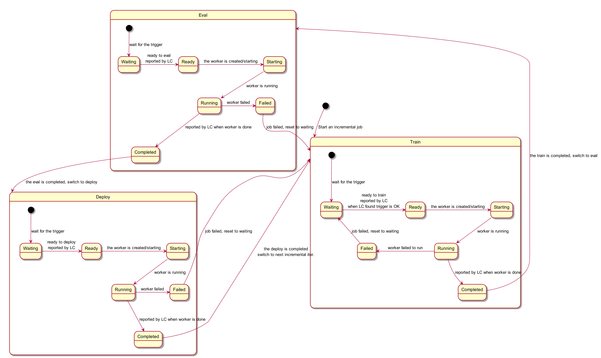
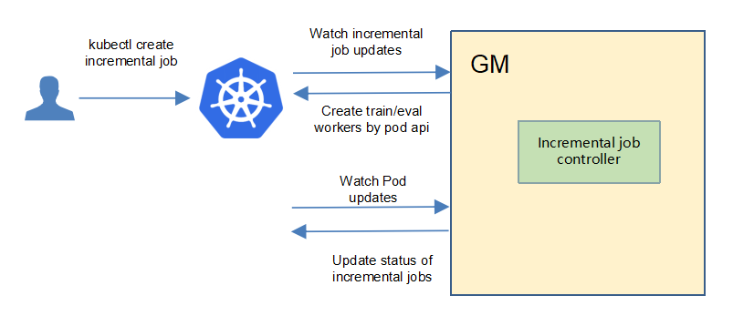
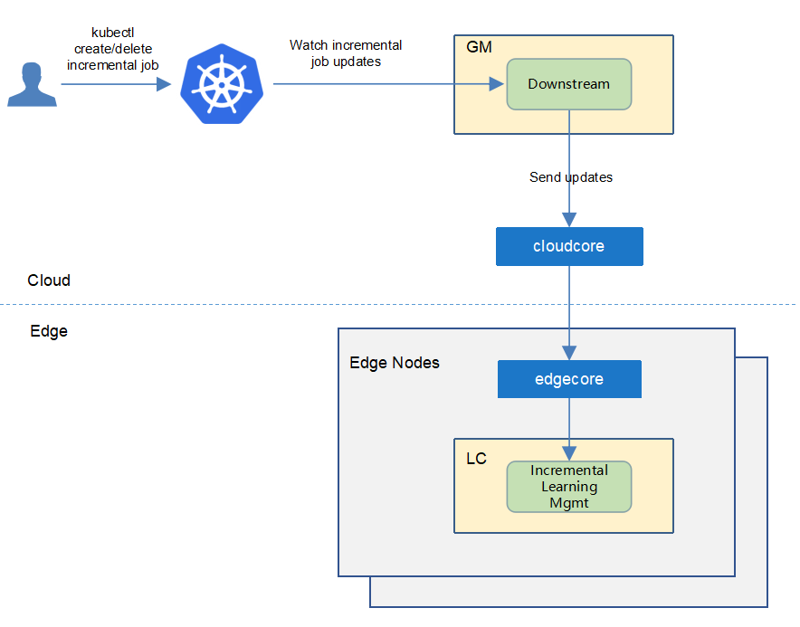
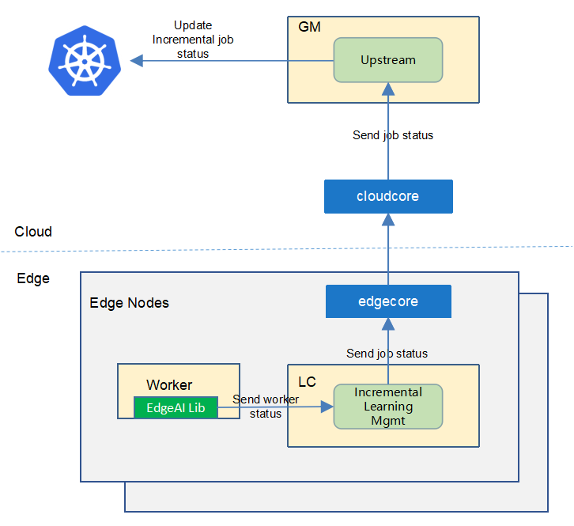
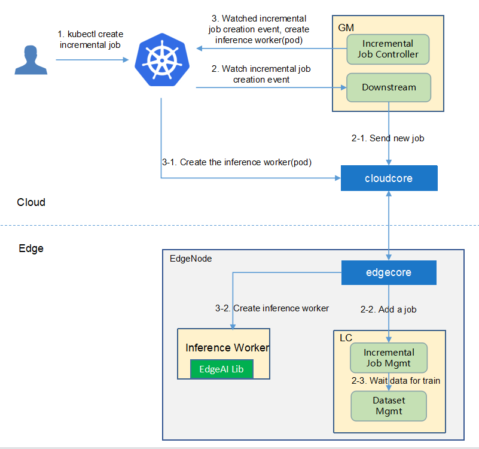
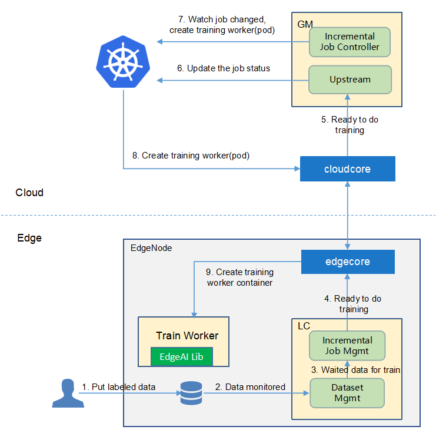
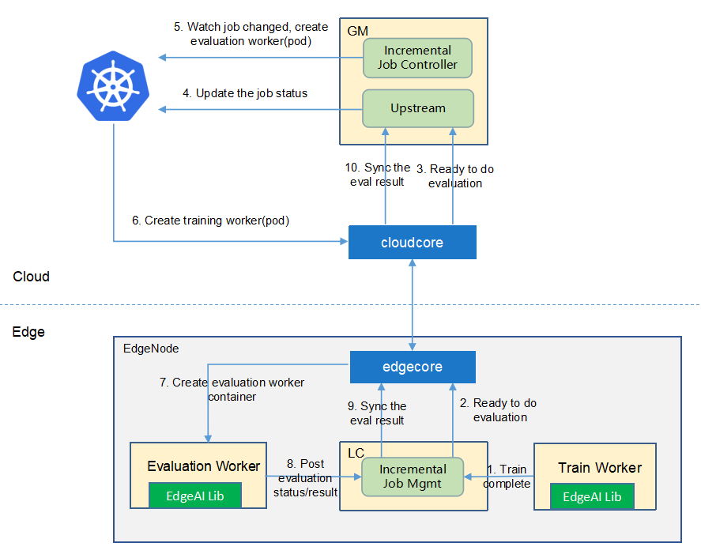
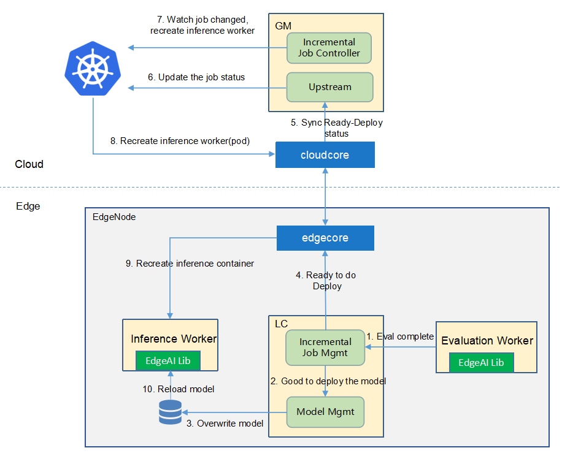

* [Incremental Learning](#incremental-learning)
   * [Motivation](#motivation)
     * [Goals](#goals)
     * [Non\-goals](#non-goals)
   * [Proposal](#proposal)
     * [Use Cases](#use-cases)
   * [Design Details](#design-details)
     * [CRD API Group and Version](#crd-api-group-and-version)
     * [Incremental learning CRD](#incremental-learning-crd)
     * [Incremental learning type definition](#incremental-learning-job-type-definition)
     * [Incremental learning sample](#incremental-learning-job-sample)
     * [Validation](#validation)
   * [Controller Design](#controller-design)
     * [Incremental Learning Controller](#incremental-learning-controller)
     * [Downstream Controller](#downstream-controller)
     * [Upstream Controller](#upstream-controller)
     * [Details of api between GM(cloud) and LC(edge)](#details-of-api-between-gmcloud-and-lcedge)
   * [Workers Communication](#workers-communication)

# Incremental Learning
## Motivation


Data is continuously generated on the edge side. Traditionally, the data is collected manually and periodically retrained on the cloud to improve the model effect. This method wastes a lot of human resources, and the model update frequency is slow.  Incremental learning allows users to continuously monitor the newly generated data and by configuring some triggering rules to determine whether to start training, evaluation, and deployment automatically, and continuously improve the model performance.


### Goals


* Automatically retrains, evaluates, and updates models based on the data generated at the edge.
* Support time trigger, sample size trigger, and precision-based trigger.
* Support manual triggering of training, evaluation, and model update.
* support hard sample discovering of unlabeled data,  for reducing the manual labeling workload. 
* Support lifelong learning that reserves historical knowledge to avoid frequent re-training/ re-fine-tuning, and tackles samples uncovered in historical knowledge base.


## Proposal
We propose using Kubernetes Custom Resource Definitions (CRDs) to describe 
the incremental learning specification/status and a controller to synchronize these updates between edge and cloud.


### Use Cases

* Users can create the incremental learning jobs, by providing training scripts, configuring training hyperparameters, providing training datasets, configuring training and deployment triggers.


## Design Details
There are three stages in a incremental learning job: train/eval/deploy.

Each stage contains these below states:
1. Waiting: wait to trigger satisfied, i.e. wait to train/eval/deploy
1. Ready: the corresponding trigger satisfied, now ready to train/eval/deploy
1. Starting: the corresponding stage is starting
1. Running: the corresponding stage is running
1. Failed: the corresponding stage failed
1. Completed: the corresponding stage completed



### CRD API Group and Version
The `IncrementalLearningJob` CRD will be namespace-scoped.
The tables below summarize the group, kind and API version details for the CRD.

* IncrementalLearningJob

| Field                 | Description             |
|-----------------------|-------------------------|
|Group                  | sedna.io     |
|APIVersion             | v1alpha1                |
|Kind                   | IncrementalLearningJob             |

### Incremental learning CRD
See the [crd source](/build/crds/sedna/incrementallearningjob_v1alpha1.yaml) for details.

### Incremental learning job type definition

See the [golang source](/pkg/apis/sedna/v1alpha1/incrementallearningjob_types.go) for details.

#### Validation
[Open API v3 Schema based validation](https://kubernetes.io/docs/tasks/access-kubernetes-api/custom-resources/custom-resource-definitions/#validation) can be used to guard against bad requests.
Invalid values for fields (example string value for a boolean field etc) can be validated using this.

Here is a list of validations we need to support :
1. The `dataset` specified in the crd should exist in k8s.
1. The `model` specified in the crd should exist in k8s.
1. The edgenode name specified in the crd should exist in k8s.

### Incremental learning job sample
See the [source](/build/crd-samples/sedna/incrementallearningjob_v1alpha1.yaml) for an example.
    
## Controller Design

The incremental learning controller starts three separate goroutines called `upstream`, `downstream` and `incrementallearningjob`controller.<br/>
These are not separate controllers as such but named here for clarity.
- incremental learning: watch the updates of incremental-learning job crds, and create the workers depending on the state machine.
- downstream: synchronize the incremental-learning-job updates from the cloud to the edge node.
- upstream: synchronize the incremental-learning-job updates from the edge to the cloud node.

### Incremental Learning Controller


The incremental-learning controller watches for the updates of incremental-learning jobs and the corresponding pods against the K8S API server.<br/>
Updates are categorized below along with the possible actions:

| Update Type                    | Action                                       |
|-------------------------------|---------------------------------------------- |
|New Incremental-learning-job Created             | Wait to train trigger satisfied|
|Incremental-learning-job Deleted                 | NA. These workers will be deleted by [k8s gc](https://kubernetes.io/docs/concepts/workloads/controllers/garbage-collection/).|
|The Status of Incremental-learning-job Updated               | Create the train/eval worker if it's ready.|
|The corresponding pod created/running/completed/failed                 | Update the status of incremental-learning job.|

### Downstream Controller


The downstream controller watches for the incremental-learning job updates against the K8S API server.<br/>
Updates are categorized below along with the possible actions that the downstream controller can take:

| Update Type                    | Action                                       |
|-------------------------------|---------------------------------------------- |
|New Incremental-learning-job Created             |Sends the job information to LCs.|
|Incremental-learning-job Deleted                 | The controller sends the delete event to LCs.|

### Upstream Controller


The upstream controller watches for the incremental-learning job updates from the edge node and applies these updates against the API server in the cloud.<br/>
Updates are categorized below along with the possible actions that the upstream controller can take:

| Update Type                        | Action                                        |
|-------------------------------     |---------------------------------------------- |
|Incremental-learning-job Reported State Updated    |  The controller appends the reported status of the job by LC in the cloud. |

### Details of api between GM(cloud) and LC(edge)
1. GM(downstream controller) syncs the job info to LC:
    ```go
    // POST <namespace>/incrementallearningjobs/<job-name>
    // body same to the job crd of k8s api, omitted here.
    ```

1. LC uploads the job status which reported by the worker to GM(upstream controller):
    ```go
    // POST <namespace>/incrementallearningjobs/<job-name>/status
   
    // WorkerMessage defines the message from that the training worker. It will send to GM.
    type WorkerMessage struct {
        Phase  string        `json:"phase"`
        Status string        `json:"status"`
        Output *WorkerOutput `json:"output"`
    }
    // 
    type WorkerOutput struct {
        Models   []*Model  `json:"models"`
        OwnerInfo *OwnerInfo `json:"ownerInfo"`
    }
    
    // Model defines the model information 
    type Model struct {
        Format  string             `json:"format"`
        URL     string             `json:"url"`
        // Including the metrics, e.g. precision/recall
        Metrics map[string]float64 `json:"metrics"`
    }
    
    // TaskInfo defines the task information
    type TaskInfo struct {
        // Current training round
        CurrentRound int    `json:"currentRound"`
        UpdateTime   string `json:"updateTime"`
    }
    ```    

### The flows of incremental learning job
- Flow of the job creation:



- Flow of the `train` stage:



- Flow of the `eval` stage:



- Flow of the `deploy` stage:



## Workers Communication
No need to communicate between workers.
