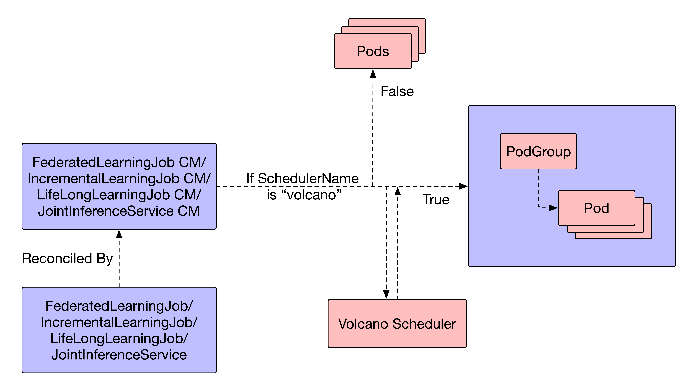

- [Motivation](#motivation)
    - [Goals and Non-Goals](#goals-and-non-goals)
- [Proposal](#proposal)
    - [Synopsis](#synopsis)
    - [The Workflow of Training/Inference Task Scheduling](#the-workflow-of-traininginference-task-scheduling)
- [Design Details](#design-details)
    - [New Fields in CRDs](#new-fields-in-crds)
    - [Enable Volcano Scheduling in `FederatedLearningJob` CM](#enable-volcano-scheduling-in-federatedlearningjob-cm)
    - [Enable Volcano Scheduling in `IncrementalLearningJob` CM](#enable-volcano-scheduling-in-incrementallearningjob-cm)
    - [Enable Volcano Scheduling in `LifeLongLearningJob` CM](#enable-volcano-scheduling-in-lifelonglearningjob-cm)
    - [Enable Volcano Scheduling in `JointInferenceService` CM](#enable-volcano-scheduling-in-jointinferenceservice-cm)


# Integrate Sedna with Volcano for high-performance task scheduling

## Motivation

[KubeEdge](https://kubeedge.io) is an open source system for extending native containerized application orchestration capabilities to hosts at Edge. It is built upon kubernetes and provides fundamental infrastructure support for network, application deployment and metadata synchronization between cloud and edge.

[Sedna](https://github.com/kubeedge/sedna) is an edge-cloud synergy AI project incubated in KubeEdge SIG AI. Benefiting from the edge-cloud synergy capabilities provided by KubeEdge, Sedna can implement across edge-cloud collaborative training and collaborative inference capabilities, such as joint inference, incremental learning, federated learning, and lifelong learning. 

Currently, Sedna only supports scheduling with default scheduler, which is not designed for AI workloads and have some drawbacks like low-performance in AI specific scenarios. So, we intend to introduce some high-performance AI-specific schedulers like [Volcano](https://volcano.sh/en/) to Sedna, providing more AI capabilities to users and bonding with more communities. 

By integrating those AI-specific schedulers, we can not only achieve high-performance scheduling within the cloud-edge collaborative framework, but also push the boundaries of what can be achieved in distributed AI and edge computing.

### Goals and Non-Goals

The goal of the project during official coding period:
- Deploy a training task using KubeEdge and Sedna (output: example)
- Integrate Volcano within Sedna's architecture (output: several PRs in the repo)
- Deploy Kubeflow within the architecture of KubeEdge and Sedna (output: blog)

The non-goals include:
- Optimize Sedna CI for Volcano scheduling

## Proposal

### Synopsis

The project aims at achieving high-performance scheduling within the cloud-edge collaborative framework with Volcano. In the meantime, the changes we made to Sedna should be compatible with the old version. As a result, we plan to add new fields `SchedulerName` and `SchedulingPolicy` (default to use built-in scheduler in Kubernetes with no policies) to types `FederatedLearningJob`, `IncrementalLearningJob`, `LifeLongLearningJob`, and `JointInferenceService` in order to introduce features like gang scheduling from volcano.

### The Workflow of Training/Inference Task Scheduling

Currently, we have `FederatedLearningJob`, `IncrementalLearningJob`, `LifeLongLearningJob`, and `JointInferenceService` CRDs for cloud-edge collaborative training/inference. We decided to reserve default scheduling after we introduced Volcano for high-performance scheduling for training tasks. Thus, the main differences lies in their corresponding Controller Managers:

1. Add a conditional branch deciding whether `SchedulerName` is `”volcano”`

2. If False, use default built-in scheduler in K8s and create `Pods` for training tasks

3. If True, use volcano for scheduling and create `PodGroup+Pods` for training tasks



## Design Details

### New Fields in CRDs

Taking FederatedLearningJob for an example, we decided to add some new fields to FLJobSpec in order to enable scheduling with Volcano:

```Golang
// FLJobSpec is a description of a federatedlearning job
type FLJobSpec struct {
    // SchedularName specifies the name of the scheduler we use.
+   SchedulerName     String            `json:"schedulerName,omitempty"`

    // SchedulingPolicy defines the policy related to scheduling
+   SchedulingPolicy  SchedulingPolicy  `json:"schedulingPolicy,omitempty"`

    AggregationWorker AggregationWorker `json:"aggregationWorker"`

    TrainingWorkers   []TrainingWorker  `json:"trainingWorkers"`

    PretrainedModel   PretrainedModel   `json:"pretrainedModel,omitempty"`

    Transmitter       Transmitter       `json:"transmitter,omitempty"`
}
```

Meanwhile, SchedulingPolicy encapsulates various scheduling policies of the distributed training job. Currently, there’re two best practices for open source projects to integrate volcano. The first way is integrating `PodGroup`, which is more simple and can guarantee the basic usage of gang-scheduling. Another way is combining with `vcjob`, which has more advanced scheduling policies but is more complex.

After the community meeting, we decided to adopt the PodGroup proposal:

```Golang
// SchedulingPolicy encapsulates various scheduling policies of the distributed training job
type SchedulingPolicy struct {
    // MinAvailable defines the minimal available pods to run for this FLJob
    MinAvailable  int32             `json:"minAvailable,omitempty"`

    // Queue defines the queue to allocate resource
    Queue         string            `json:"queue,omitempty"`

    // MinResources defines the minimal resource of FLJobs to run
    MinResources  map[string]string `json:"minResources,omitempty"`

    // If specified, indicates the priority of FLJobs
    PriorityClass string            `json:"priorityClass,omitempty"`
}

```

It’s worth noticing that these new changes should be backward compatible.

### Enable Volcano Scheduling in `FederatedLearningJob` CM

Following the workflow defined in the [section](#the-workflow-of-traininginference-task-scheduling) above, we should construct `PodGroup+Pod` resources, watch for their changes, and reconcile them when necessary in the controller manager of `FederatedLearningJob`:

1. Add watchers for `PodGroup+Pod` in `New()` function.

2. Add reconciliation logic for them in the global manager.

3. Make some compatible changes in the local manager.

### Enable Volcano Scheduling in `IncrementalLearningJob` CM

Following the workflow defined in the [section](#the-workflow-of-traininginference-task-scheduling) above, we should construct `PodGroup+Pod` resources, watch for their changes, and reconcile them when necessary in the controller manager of `IncrementalLearningJob`:

1. Add watchers for `PodGroup` in `New()` function.

2. Add reconciliation logic for them in the global manager.

3. Make some compatible changes in the local manager.

### Enable Volcano Scheduling in `LifeLongLearningJob` CM

Following the workflow defined in the [section](#the-workflow-of-traininginference-task-scheduling) above, we should construct `PodGroup+Pod` resources, watch for their changes, and reconcile them when necessary in the controller manager of `LifeLongLearningJob`:

1. Add watchers for `PodGroup` in `New()` function.

2. Add reconciliation logic for them in the global manager.

3. Make some compatible changes in the local manager.

### Enable Volcano Scheduling in `JointInferenceService` CM

Following the workflow defined in the [section](#the-workflow-of-traininginference-task-scheduling) above, we should construct `PodGroup+Pod` resources, watch for their changes, and reconcile them when necessary in the controller manager of `JointInferenceService`:

1. Add watchers for `PodGroup` in `New()` function.

2. Add reconciliation logic for them in the global manager.

3. Make some compatible changes in the local manager.
