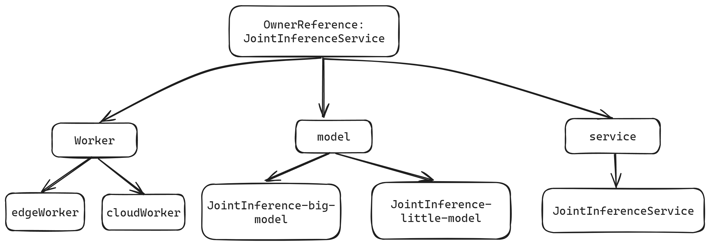
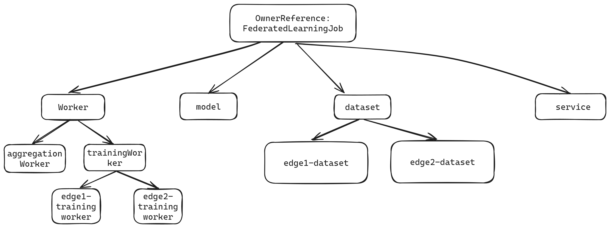
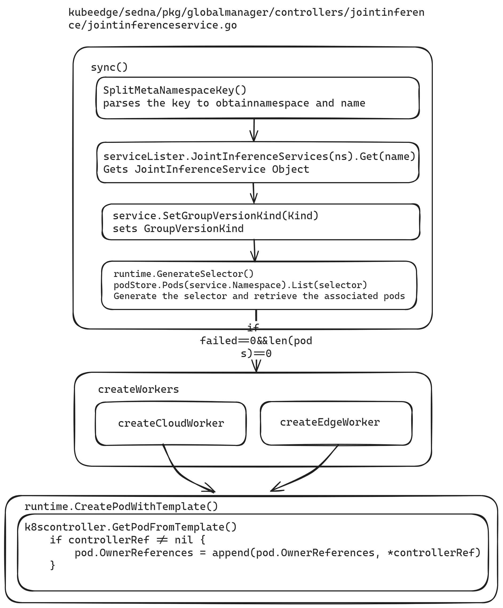
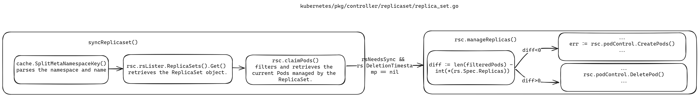
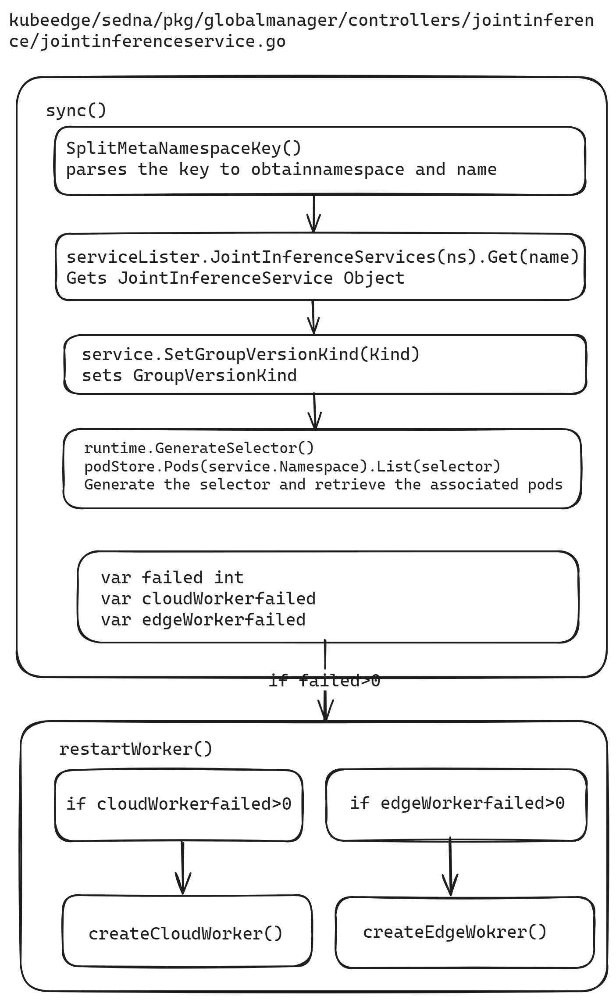

Sedna leverages KubeEdge's edge-cloud collaboration capabilities to enable cross-edge-cloud collaborative training and inference. Joint inference and federated learning are essential applications of Sedna's edge-cloud collaborative inference. However, the current Sedna project has several functional deficiencies in its joint inference and federated learning controllers, primarily reflected in the following aspects:

1. After creating a joint inference or federated learning task, the generated cloud and edge task instances do not automatically rebuild after being manually deleted, indicating a lack of self-healing capabilities.
2. When a joint inference task is deleted, its generated task instances and service configurations are not cascade-deleted, leading to subsequent joint inference task creation failures.

This proposal aims to optimize the joint inference and federated learning controllers to improve task reconstruction and cascade deletion, thereby enhancing the controllers' functionality and application efficiency.

# Goals

The optimization of Sedna's joint inference and federated learning controllers will solely involve modifications to the respective controllers' code, ensuring no impact on other application controllers. The goals of this optimization are to:

1. Implement cascade deletion for joint inference and federated learning controllers to ensure that task instances and service configurations are synchronously deleted when the tasks are removed, preventing conflicts in subsequent task creation.
2. Enhance the self-healing capabilities of joint inference and federated learning tasks to ensure that task instances are automatically rebuilt and resume normal operation after failure or manual deletion.

# Proposal

## Scope

This project focuses on optimizing the logic of joint inference and federated learning task controllers, with no impact on other modules.

1. **Cascade Deletion of Joint Inference and Federated Learning Tasks**
   - Analyze the current deletion mechanism of custom resources (CRs) and leverage Kubernetes' cascade deletion mechanism to implement cascade deletion for CRs.
   - Ensure that task instances and service configurations are synchronously deleted when joint inference and federated learning tasks are removed.
   - Optimize existing code to ensure the accuracy and reliability of the cascade deletion functionality.

2. **Self-Healing Capability of Joint Inference and Federated Learning Tasks**
   - Analyze the self-healing mechanisms in Kubernetes' ReplicaSet and KubeEdge's edge application controller, and design and implement a task instance self-healing mechanism.
   - Ensure that both cloud and edge task instances automatically rebuild and resume normal operation after failure or manual deletion.
   - Develop and optimize related code to ensure the stability of the self-healing functionality.

3. **Testing and Verification**
   - Supplement unit tests and end-to-end (e2e) tests to ensure the optimized controllers operate correctly.
   - Demonstrate functionality using existing joint inference and federated learning demos.

4. **Documentation Updates**
   - Update application instance demonstration documentation to describe the reasons for modifications and the usage methods of the optimized cases.

## Target Users

Users of Sedna's joint inference and federated learning applications.

# Design Details

## Garbage Collection

### Cascade Deletion in Kubernetes

In Kubernetes, the Owner Reference provides information about the relationships between objects, allowing the control plane and other API clients to clean up associated resources when an object is deleted. The garbage collector can implement cascade deletion functionality based on this relationship.

Each resource's metadata includes an `ownerReferences` field, an array indicating its owners. When an owner resource is deleted, it is removed from this array, and the garbage collector will reclaim the resource once all owners are deleted.

### Sedna Controller Garbage Collection

The Owner Reference relationships for JointInferenceService and FederatedLearningJob are depicted in the following diagrams:



#### Setting Owner References in Joint Inference Controller

Taking the Joint Inference Controller as an example, the Owner Reference setting process involves several steps:

In `pkg/globalmanager/controllers/jointinference/jointinferenceservice.go`, the controller name and CR kind name are defined:

```go
    // Name is this controller name
    Name = "JointInference"

    // KindName is the kind name of CR this controller controls
    KindName = "JointInferenceService"
```

The GroupVersionKind for the controller type is defined as follows:

```go
// Kind contains the schema.GroupVersionKind for this controller type.
var Kind = sednav1.SchemeGroupVersion.WithKind(Name)
```

The `run` function starts the controller, defines the number of workers, and sets up worker threads:

```go
for i := 0; i < workers; i++ { go wait.Until(c.worker, time.Second, stopCh) }
```

In the `worker` function, tasks are dequeued, processed, and marked as done:

```go
// worker runs a worker thread that just dequeues items, processes them, and marks them done.
// It enforces that the sync is never invoked concurrently with the same key.
func (c *Controller) worker() {
    for c.processNextWorkItem() {
    }
}
```

The `sync` function parses the key to get the namespace and name:

```go
ns, name, err := cache.SplitMetaNamespaceKey(key)
if err != nil {
    return false, err
}
if len(ns) == 0 || len(name) == 0 {
    return false, fmt.Errorf("invalid jointinference service key %q: either namespace or name is missing", key)
}
```

It then retrieves the JointInferenceService object from the lister:

```go
sharedService, err := c.serviceLister.JointInferenceServices(ns).Get(name)
if err != nil {
    if errors.IsNotFound(err) {
        klog.V(4).Infof("JointInferenceService has been deleted: %v", key)
        return true, nil
    }
    return false, err
}
service := *sharedService
```

The GroupVersionKind is set:

```go
service.SetGroupVersionKind(Kind)
```

A selector is generated, and associated pods are listed:

```go
selector, _ := runtime.GenerateSelector(&service)
pods, err := c.podStore.Pods(service.Namespace).List(selector)
if err != nil {
    return false, err
}
klog.V(4).Infof("list jointinference service %v/%v, %v pods: %v", service.Namespace, service.Name, len(pods), pods)
```

When no worker failures occur, and if no associated pods exist, the `createWorkers` function is called to create pods:

```go
else {
        if len(pods) == 0 {
            active, manageServiceErr = c.createWorkers(&service)
        }
```

In the `createWorkers` function, `createCloudWorker` and `createEdgeWorker` are called to create cloud and edge worker pods. The `runtime.CreatePodWithTemplate` function creates pods, with the OwnerReference set as follows:

```go
    if controllerRef != nil {
        pod.OwnerReferences = append(pod.OwnerReferences, *controllerRef)
    }
```

#### Model Resource Object Garbage Collection

To ensure that model resources point to `JointInferenceService` and `JointInferenceService` acts as their owner, the following steps are taken:

Create edge model resources:

```bash
kubectl create -f - <<EOF
apiVersion: sedna.io/v1alpha1
kind: Model
metadata:
  name: helmet-detection-inference-little-model
  namespace: default
  ownerReferences:
  - apiVersion: sedna.io/v1alpha1
    kind: JointInferenceService
    name: helmet-detection-inference-example
    uid: $(kubectl get jointinferenceservice helmet-detection-inference-example -o jsonpath='{.metadata.uid}')
spec:
  url: "/data/little-model/yolov3_resnet18.pb"
  format: "pb"
EOF
```

Create cloud model resources:

```bash
kubectl create -f - <<EOF
apiVersion: sedna.io/v1alpha1
kind: Model
metadata:
  name: helmet-detection-inference-big-model
  namespace: default
  ownerReferences:
  - apiVersion: sedna.io/v1alpha1
    kind: JointInferenceService
    name: helmet-detection-inference-example
    uid: $(kubectl get jointinferenceservice helmet-detection-inference-example -o jsonpath='{.metadata.uid}')
spec:
  url: "/data/big-model/yolov3_darknet.pb"
  format: "pb"
EOF
```

## Pod Reconstruction

Pod automatic reconstruction upon failure is determined by the restart policy (RestartPolicy). In JointInferenceService, RestartPolicy is not explicitly set, defaulting to `always`. During joint inference tasks, if issues such as improper EdgeMesh configuration arise, causing the edge pod to fail to access the cloud for inference, the edge pod will continuously restart. In FederatedLearningJob, RestartPolicy is set to `OnFailure`.

### Method for Controlling Pod Count in ReplicaSet

The ReplicaSet controller ensures the actual state matches the desired state by creating or deleting pods to achieve the desired replica count. The `syncReplicaSet` function is responsible for this, including the following steps:

Parse namespace and name:

```go
namespace, name, err := cache.SplitMetaNamespaceKey(key)
```

Get the ReplicaSet object:

```go
rs, err := rsc.rsLister.ReplicaSets(namespace).Get(name)
```

Filter and claim the pods managed by the ReplicaSet:

```go
filteredPods, err = rsc.claimPods(ctx, rs, selector, filteredPods)
```

Ensure the ReplicaSet's actual state matches the desired state by calling `manageReplicas` to create or delete pods:

```go
if rsNeedsSync && rs.DeletionTimestamp == nil {
    manageReplicasErr = rsc.manageReplicas(ctx, filteredPods, rs)
}
```

Calculate the difference between the current pod count and the desired

 replica count:

```go
diff := len(filteredPods) - int(*(rs.Spec.Replicas))
```

Create or delete pods based on the difference:

```go
if diff < 0 {
    ...
    err := rsc.podControl.CreatePods(ctx, rs.Namespace, &rs.Spec.Template, rs, metav1.NewControllerRef(rs, rsc.GroupVersionKind))
    ...
} else if diff > 0 {
    ...
    rsc.podControl.DeletePod(ctx, rs.Namespace, targetPod.Name, rs)
    ...
}
```

### Joint Inference and Federated Learning Controller Pod Deletion and Reconstruction Design
In the `sync` function of `JointInferenceService.go`, add logic related to automatic pod reconstruction upon deletion.

# Roadmap

- **2024-07-26 to 2024-08-01:** Implement all cascade deletion functionalities.
- **2024-08-02 to 2024-08-08:** Implement pod reconstruction functionality.
- **2024-08-09 to 2024-08-15:** Submit pull request (PR).
- **2024-08-16 to 2024-08-22:** Complete testing, demonstrate cases, and conclude the project.