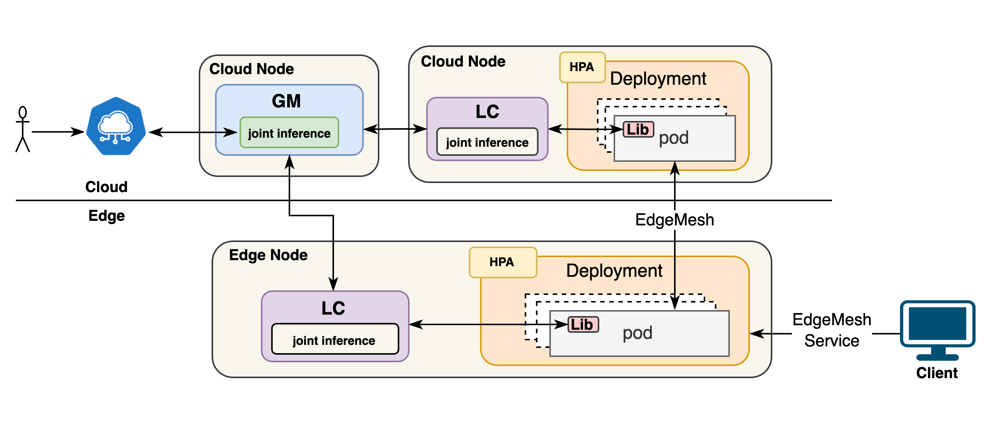

## Horizontal Pod Autoscaling (HPA) for Sedna Joint Inference

- [Project Requirements](#project-requirements)
    - [Description](#description)
    - [Expected Outcomes](#expected-outcomes)
    - [Recommended Skills](#recommended-skills)
- [Kubeedge Elastic Inference Example](#kubeedge-elastic-inference-example)
    - [Prerequisites](#prerequisites)
    - [Why](#why)
    - [Related Reference Links](#related-reference-links)
    - [Tips](#tips)
    - [Deployment Template](#deployment-template)
- [Sedna integrates HPA](#sedna-integrates-hpa)
    - [Why Need HPA](#why-need-hpa)
    - [Overall Architecture](#overall-architecture)
    - [Specific Implementation](#specific-implementation)
    - [The Joint Inference API Adds Support for the Definition of HPA](#the-joint-inference-api-adds-support-for-the-definition-of-hpa)
    - [Sedna Joint Inference Example](#sedna-joint-inference-example)
    - [Actual Demonstration Effect](#actual-demonstration-effect)

### Elastic Inference for Deep Learning Models Using KubeEdge

#### Project Requirements

##### Description

The rapid advancement of AI has led to the widespread application of deep learning models across various fields. However, the resource demands for model inference tasks can fluctuate significantly, especially during peak periods, posing a challenge to the system's computing capabilities. To address this varying load demand, we propose an elastic inference solution leveraging KubeEdge and Horizontal Pod Autoscaling (HPA) to enable dynamic scaling of inference tasks.

KubeEdge is an edge computing framework that extends Kubernetes' capabilities to edge devices, allowing applications to be deployed and managed on edge nodes. By utilizing KubeEdge, we can distribute inference tasks across different edge devices and cloud resources, achieving efficient resource utilization and task processing.

The core of collaborative inference lies in coordinating computing resources across various devices, allowing inference tasks to be dynamically allocated based on the current load. When the system detects an increase in load, the HPA mechanism automatically scales out the number of edge nodes or enhances resource configurations to meet the inference task demands. Conversely, when the load decreases, resource allocation is scaled down to reduce operational costs. This approach ensures optimal resource allocation while maintaining inference performance.

##### Expected Outcomes

1. Based on kubeedge  to complete  an elastic scaling AI inference example.
2. Based on kubeedge and sedna to complete the joint inference task elastic scaling development and output example.
3. Output blog.

##### Recommended Skills

1. Theoretical and practical knowledge of edge and cloud computing, specifically using the KubeEdge and Sedna frameworks.
2. Experience in deploying and managing Kubernetes, including configuring and tuning the HPA mechanism.
3. Expertise in developing and tuning deep learning models.
4. Programming experience, particularly in Python and Go.

#### Kubeedge Elastic Inference Example

##### Prerequisites

- It needs to be used in conjunction with [edgemesh](https://github.com/kubeedge/edgemesh)
- The cluster needs to have [metrics-server](https://github.com/kubernetes-sigs/metrics-server) installed
- The edge nodes need to be configured with [metrics reporting](https://kubeedge.io/zh/docs/advanced/metrics)

##### Why

- Without edgemesh, when the number of instances in a deployment is greater than 1, there is no way to provide load - balancing capabilities on the edge side, thus making the HPA on the edge side of little use; the HPA capability requires monitoring the relevant metrics information of the pod and then performing dynamic scaling in and out in combination with the user's HPA configuration.

##### Related Reference Links

- AI Project Address: [LlamaEdge](https://github.com/LlamaEdge/LlamaEdge)

- HPA Documentation: [horizontal-pod-autoscale](https://kubernetes.io/zh-cn/docs/tasks/run-application/horizontal-pod-autoscale/)

- HPA Example: [hpa-example](https://kubernetes.io/zh-cn/docs/tasks/run-application/horizontal-pod-autoscale-walkthrough/)

##### Tips

- The CPU allocated to the container should preferably be greater than 4 cores, otherwise the inference will be very slow. The minimum memory is 1GB.
- The inference service port is exposed at 8080.

##### Deployment Template

```yaml
apiVersion: apps/v1
kind: Deployment
metadata:
  labels:
    app: wasmedge-qwen-2-0-5b-allminilm-2
  name: wasmedge-qwen-2-0-5b-allminilm-2
  namespace: default
spec:
  selector:
    matchLabels:
      app: wasmedge-qwen-2-0-5b-allminilm-2
  template:
    metadata:
      labels:
        app: wasmedge-qwen-2-0-5b-allminilm-2
    spec:
      containers:
      - image: docker.io/secondstate/qwen-2-0.5b-allminilm-2:latest
        imagePullPolicy: IfNotPresent
        name: qwen-2-0-5b-container
        resources:
          limits:
            cpu: 3000m
          requests:
            cpu: 3000m
      affinity:
        nodeAffinity:
          requiredDuringSchedulingIgnoredDuringExecution:
            nodeSelectorTerms:
              - matchExpressions:
                  - key: kubernetes.io/hostname
                    operator: In
                    values:
                      - edgenode
      schedulerName: default-scheduler
      nodeName: nvidia-edge-node
      tolerations:
        - key: node-role.kubernetes.io/edge
          operator: Exists
          effect: NoSchedule
# Note:
# 1. The replicas field is not required.
# 2. The resources field is required. If it is not restricted, the resource utilization rate cannot be calculated.
```

The above solution is to directly run the Wasmedge server inside a regular container.

**ToDo:** Another solution is to directly use the Wasm runtime to run it. We can try this later. When creating the Wasm image, a Wasm label needs to be added so that when containerd uses the underlying runtime, it will use the Wasm runtime.

##### Configure HPA

- Configure with `kubectl`

```shell
kubectl autoscale deployment wasmedge-qwen-2-0-5b-allminilm-2 --cpu-percent=50 --min=1 --max=10
```

- Configure with `yaml`

```yaml
apiVersion: autoscaling/v2
kind: HorizontalPodAutoscaler
metadata:
  name: hpa
  namespace: default
spec:
  maxReplicas: 10
  metrics:
  - resource:
      name: cpu
      target:
        averageUtilization: 50
        type: Utilization
    type: Resource
  minReplicas: 1
  scaleTargetRef:
    apiVersion: apps/v1
    kind: Deployment
    name: wasmedge-qwen-2-0-5b-allminilm-2
```

**Tips**: Applications using `HPA` should be used in conjunction with Service. Otherwise, even if `HPA` is performed, if the service access still uses the `hostNetwork`, the service access traffic will still be on only one machine, and the traffic cannot be load-balanced to other `pods`.

#### Sedna integrates `HPA`

##### Why Need `HPA`

In the scenario of large - model inference, the resource requirements of inference tasks usually increase significantly with the increase in the number of accesses. In the current cloud - edge joint - inference architecture, the fixed single - instance configuration is difficult to effectively cope with such fluctuations, resulting in insufficient resource utilization or performance bottlenecks. By configuring `HPA` (Horizontal Pod Autoscaler) in the `deployment`, the number of inference instances can be automatically adjusted according to the real - time number of accesses, and resources can be dynamically expanded or reduced. This mechanism can increase instances during high - load periods and reduce instances during low - load periods, thereby improving concurrent processing capabilities, maximizing the optimization of resource utilization, and ensuring the high efficiency and scalability of the inference service.

##### Overall Architecture



##### Specific Implementation

The HPA implementation of `sedna` is achieved based on the `sedna` joint inference controller.

- With the help of `deployment`, use `HPA` to configure dynamic scaling for its instances.
- Using `deployment` allows for load balancing based on `Service`.
- The cloud and the edge can independently choose whether to enable the HPA mode. If they choose to enable it, the joint - inference controller will automatically create HPA resources for the cloud or the edge, which can be viewed by `kubectl get hpa -n {ns}`.
- Since the HPA capability of k8s provided a stable version in k8s version 1.23, it is necessary to upgrade the k8s API to version 1.23.

##### The Joint Inference API Adds Support for the Definition of HPA

```go 
// HPA describes the desired functionality of the HorizontalPodAutoscaler.
type HPA struct {
	// +optional
	MinReplicas *int32 `json:"minReplicas,omitempty"`

	MaxReplicas int32 `json:"maxReplicas"`

	// +optional
	Metrics []autoscalingv2.MetricSpec `json:"metrics,omitempty"`

	// +optional
	Behavior *autoscalingv2.HorizontalPodAutoscalerBehavior `json:"behavior,omitempty"`
}

// EdgeWorker describes the data a edge worker should have
type EdgeWorker struct {
	Model             SmallModel         `json:"model"`
	HardExampleMining HardExampleMining  `json:"hardExampleMining"`
	Template          v1.PodTemplateSpec `json:"template"`

	// HPA describes the desired functionality of the HorizontalPodAutoscaler.
	// +optional
	HPA *HPA `json:"hpa"`
}

// CloudWorker describes the data a cloud worker should have
type CloudWorker struct {
	Model    BigModel           `json:"model"`
	Template v1.PodTemplateSpec `json:"template"`

	// HPA describes the desired functionality of the HorizontalPodAutoscaler.
	// +optional
	HPA *HPA `json:"hpa"`
}
```

**According to the API definition, add the creation, update, and deletion logic of HPA resources in the joint - inference controller.**

```go
func CreateHPA(client kubernetes.Interface, object CommonInterface, kind, scaleTargetRefName, workerType string, hpa *sednav1.HPA) error {
	hpaName := "hpa-" + scaleTargetRefName
	newHPA := &autoscalingv2.HorizontalPodAutoscaler{
		ObjectMeta: metav1.ObjectMeta{
			Name:      hpaName,
			Namespace: object.GetNamespace(),
			OwnerReferences: []metav1.OwnerReference{
				*metav1.NewControllerRef(object, object.GroupVersionKind()),
			},
			Labels: generateLabels(object, workerType),
		},
		Spec: autoscalingv2.HorizontalPodAutoscalerSpec{
			MaxReplicas: hpa.MaxReplicas,
			Metrics:     hpa.Metrics,
			MinReplicas: hpa.MinReplicas,
			ScaleTargetRef: autoscalingv2.CrossVersionObjectReference{
				APIVersion: "apps/v1",
				Kind:       kind,
				Name:       scaleTargetRefName,
			},
			Behavior: hpa.Behavior,
		},
	}
	_, err := client.AutoscalingV2().HorizontalPodAutoscalers(object.GetNamespace()).Create(context.TODO(), newHPA, metav1.CreateOptions{})
	if err != nil {
		return fmt.Errorf("failed to create hpa for %s %s, err: %s", kind, hpaName, err)
	}
	return nil
}

func UpdateHPA(client kubernetes.Interface, object CommonInterface, kind, scaleTargetRefName, workerType string, hpa *sednav1.HPA) error {
	// get existing HPA
	hpaName := "hpa-" + scaleTargetRefName
	existingHPA, err := client.AutoscalingV2().HorizontalPodAutoscalers(object.GetNamespace()).Get(context.TODO(), hpaName, metav1.GetOptions{})
	if err != nil {
		// create HPA if not found
		if errors.IsNotFound(err) {
			klog.Info("hpa not found, creating new hpa...")
			return CreateHPA(client, object, kind, scaleTargetRefName, workerType, hpa)
		}
		return fmt.Errorf("failed to get hpa for %s %s, err: %s", kind, hpaName, err)
	}

	// update HPA
	existingHPA.ObjectMeta.Labels = generateLabels(object, workerType)
	existingHPA.ObjectMeta.OwnerReferences = []metav1.OwnerReference{
		*metav1.NewControllerRef(object, object.GroupVersionKind()),
	}
	existingHPA.Spec.MaxReplicas = hpa.MaxReplicas
	existingHPA.Spec.MinReplicas = hpa.MinReplicas
	existingHPA.Spec.Metrics = hpa.Metrics
	existingHPA.Spec.ScaleTargetRef = autoscalingv2.CrossVersionObjectReference{
		APIVersion: "apps/v1",
		Kind:       kind,
		Name:       scaleTargetRefName,
	}
	existingHPA.Spec.Behavior = hpa.Behavior

	// update HPA
	_, err = client.AutoscalingV2().HorizontalPodAutoscalers(object.GetNamespace()).Update(context.TODO(), existingHPA, metav1.UpdateOptions{})
	if err != nil {
		return fmt.Errorf("failed to update hpa for %s %s, err: %s", kind, hpaName, err)
	}

	return nil
}

func DeleteHPA(client kubernetes.Interface, namespace, name string) error {
	// check if HPA exists
	_, err := client.AutoscalingV2().HorizontalPodAutoscalers(namespace).Get(context.TODO(), name, metav1.GetOptions{})
	if err != nil {
		// Return nil if HPA not found
		if errors.IsNotFound(err) {
			return nil
		}

		return fmt.Errorf("failed to get hpa %s in namespace %s, err: %s", name, namespace, err)
	}

	// delete HPA
	err = client.AutoscalingV2().HorizontalPodAutoscalers(namespace).Delete(context.TODO(), name, metav1.DeleteOptions{})
	if err != nil {
		return fmt.Errorf("failed to delete hpa %s in namespace %s, err: %s", name, namespace, err)
	}

	return nil
}

// create/update HPA
func (c *Controller) createOrUpdateWorker(service *sednav1.JointInferenceService, workerType string, bigModelHost string, bigModelPort int32, create bool) error {
	...
	var hpa *sednav1.HPA
	...

	if create {
		...
		// create HPA
		if hpa != nil {
			return runtime.CreateHPA(c.kubeClient, service, "Deployment", deploymentName, workerType, hpa)
		}
	} else {
		...

		// update HPA
		if hpa != nil {
			return runtime.UpdateHPA(c.kubeClient, service, "Deployment", deploymentName, workerType, hpa)
		} else {
			return runtime.DeleteHPA(c.kubeClient, service.GetNamespace(), "hpa-"+deploymentName)
		}
	}
	return err
}
```

##### Sedna Joint Inference Example

- Workers at the edge and in the cloud can choose to use or not use HPA. They can be configured simultaneously or separately.

```yaml
apiVersion: sedna.io/v1alpha1
kind: JointInferenceService
metadata:
  name: helmet-detection-inference-example
  namespace: default
spec:
  edgeWorker:
    hpa:
      maxReplicas: 2
      metrics:
        - resource:
            name: cpu
            target:
              averageUtilization: 50
              type: Utilization
          type: Resource
      minReplicas: 1
    model:
      name: "helmet-detection-inference-little-model"
    hardExampleMining:
      name: "IBT"
      parameters:
        - key: "threshold_img"
          value: "0.9"
        - key: "threshold_box"
          value: "0.9"
    template:
      spec:
        nodeName: edge1i70kbjod
        hostNetwork: true
        dnsPolicy: ClusterFirstWithHostNet
        containers:
        - image: kubeedge/sedna-example-joint-inference-helmet-detection-little:v0.5.0
          imagePullPolicy: IfNotPresent
          name:  little-model
          env:  # user defined environments
          - name: input_shape
            value: "416,736"
          - name: "video_url"
            value: "rtsp://localhost/video"
          - name: "all_examples_inference_output"
            value: "/data/output"
          - name: "hard_example_cloud_inference_output"
            value: "/data/hard_example_cloud_inference_output"
          - name: "hard_example_edge_inference_output"
            value: "/data/hard_example_edge_inference_output"
          resources:  # user defined resources
            requests:
              memory: 64M
              cpu: 50m
            limits:
              memory: 2Gi
              cpu: 500m
          volumeMounts:
            - name: outputdir
              mountPath: /data/
        volumes:   # user defined volumes
          - name: outputdir
            hostPath:
              # user must create the directory in host
              path: /joint_inference/output
              type: Directory

  cloudWorker:
    hpa:
      maxReplicas: 5
      metrics:
        - resource:
            name: cpu
            target:
              averageUtilization: 20
              type: Utilization
          type: Resource
      minReplicas: 1
    model:
      name: "helmet-detection-inference-big-model"
    template:
      spec:
        nodeName: worker-01
        dnsPolicy: ClusterFirstWithHostNet
        containers:
          - image: kubeedge/sedna-example-joint-inference-helmet-detection-big:v0.5.0
            name:  big-model
            imagePullPolicy: IfNotPresent
            env:  # user defined environments
              - name: "input_shape"
                value: "544,544"
            resources:  # user defined resources
              requests:
                cpu: 1024m
                memory: 2Gi
              limits:
                cpu: 1024m
                memory: 2Gi
```
##### Actual Demonstration Effect
```shell
[root@master-01 ~]# kubectl get hpa -w
NAME                                                      REFERENCE                                                        TARGETS         MINPODS   MAXPODS   REPLICAS   AGE
hpa-helmet-detection-inference-example-deployment-cloud   Deployment/helmet-detection-inference-example-deployment-cloud   37%/20%         1         5         3          92s
hpa-helmet-detection-inference-example-deployment-edge    Deployment/helmet-detection-inference-example-deployment-edge    348%/50%        1         2         2          92s
hpa-helmet-detection-inference-example-deployment-cloud   Deployment/helmet-detection-inference-example-deployment-cloud   37%/20%         1         5         4          106s
hpa-helmet-detection-inference-example-deployment-edge    Deployment/helmet-detection-inference-example-deployment-edge    535%/50%        1         2         2          106s
hpa-helmet-detection-inference-example-deployment-cloud   Deployment/helmet-detection-inference-example-deployment-cloud   18%/20%         1         5         4          2m1s
hpa-helmet-detection-inference-example-deployment-edge    Deployment/helmet-detection-inference-example-deployment-edge    769%/50%        1         2         2          2m1s
hpa-helmet-detection-inference-example-deployment-cloud   Deployment/helmet-detection-inference-example-deployment-cloud   12%/20%         1         5         4          2m16s


[root@master-01 jointinference]# kubectl get po
NAME                                                              READY   STATUS    RESTARTS      AGE
helmet-detection-inference-example-deployment-cloud-7dffd47c6fl   1/1     Running   0             4m34s
helmet-detection-inference-example-deployment-cloud-7dffd4dpnnh   1/1     Running   0             2m49s
helmet-detection-inference-example-deployment-cloud-7dffd4f4dtw   1/1     Running   0             4m19s
helmet-detection-inference-example-deployment-cloud-7dffd4kcvwd   1/1     Running   0             5m20s
helmet-detection-inference-example-deployment-cloud-7dffd4shk86   1/1     Running   0             5m50s
helmet-detection-inference-example-deployment-edge-7b6575c52s7k   1/1     Running   0             5m50s
helmet-detection-inference-example-deployment-edge-7b6575c59g48   1/1     Running   0             5m20s
```

