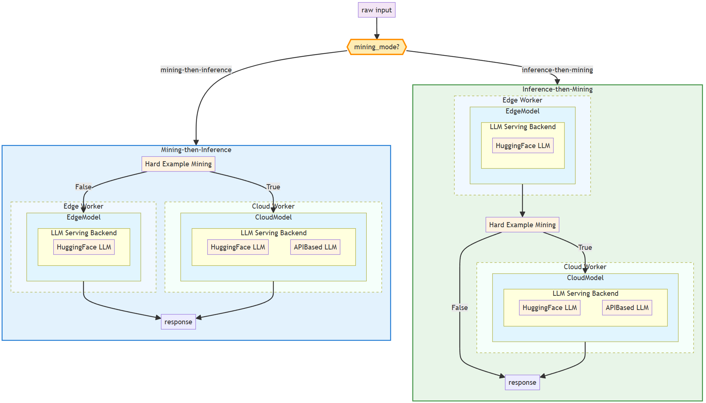

# Proposal: Migrate the Joint Inference Example for LLM from KubeEdge-Ianvs to KubeEdge-Sedna

## Table of Contents

- [Background and Motivation](#background-and-motivation)
- [Goals](#goals)
- [Design Details](#design-details)
   - [Architecture Overview](#architecture-overview)
   - [Custom Router and Data Path Modification](#custom-router-and-data-path-modification)
   - [How the New Architecture Works](#how-the-new-architecture-works)
   - [Support for NLP Tasks](#support-for-nlp-tasks)
- [Project Plan](#project-plan)
- [Deliverables](#deliverables)

This proposal outlines a project to migrate the Large Language Model (LLM) joint inference example from `kubeedge-ianvs` to `kubeedge-sedna`. The original example can be found at https://github.com/kubeedge/ianvs/tree/main/examples/cloud-edge-collaborative-inference-for-llm. The project will focus on implementing custom query routing algorithms for NLP tasks and creating the necessary `Estimator` classes and data handlers to support them.

## Background and Motivation

KubeEdge-Sedna excels at edge-cloud collaborative AI for Computer Vision (CV) tasks but lacks examples for the increasingly important domain of LLMs. The `kubeedge-ianvs` project already contains an example for LLM joint inference. This project aims to migrate that proven pattern to Sedna, enriching the Sedna ecosystem with a powerful, real-world example for developers looking to deploy collaborative LLMs on the edge.

## Goals

- Migrate the core functionality of the ianvs LLM joint inference example to Sedna.

- Implement custom Hard Example Mining (HEM) routing algorithms suitable for NLP tasks.

- Modify Sedna's data pipeline to enable routers to access raw input data, not just model inference results.

- Develop new Estimator classes and modular LLM handlers (HuggingfaceLLM, APIBasedLLM, etc.) for NLP workflows.

- Produce a complete and well-documented example, including code and configuration files.

## Design Details

### Architecture Overview

The architecture of the joint inference system will consist of:
- **Edge Worker**: A lightweight model running on edge devices, responsible for lightweight inference and routing decisions.
- **Cloud Worker**: A more powerful model running in the cloud, handling complex inference tasks and generating more accurate results. As api-based LLMs are often used, this worker will also include API-based LLM handlers.

The joint inference workflow is illustrated below:



### Custom Router and Data Path Modification

Sedna's existing routers (`HardExampleMining`) are designed for CV tasks and follow an "inference-then-mining" pattern, where the router can only access the inference result from the edge model. The ianvs example includes a `BERTFilter` which requires a "mining-then-inference" approach, needing access to the original input data to perform its routing logic. The new architecture will support both "inference-then-mining" and "mining-then-inference" modes, allowing the router to access raw input data directly.

I will reference the implementation in https://github.com/kubeedge/ianvs/blob/main/examples/resources/third_party/sedna-0.6.0.1-py3-none-any.whl to introduce relevant features. By adding an optional `mining_mode` parameter to the `inference` method of the `JointInference` class (with values "inference-then-mining" or "mining-then-inference", defaulting to the former to ensure seamless compatibility with existing examples), I will enable `JointInference` to flexibly switch between these paths during inference.

The new parameter `mining_mode` will be passed to the model via container environment variables defined in the YAML config file, thus avoiding changes to the Go-written Sedna control layer.

To support the new data path and the new hard-example-mining algorithms, I will modify the following files:

```
|- lib
|   |- sedna
|      |- algorithms
|         |- hard_example_mining.py
|      |- backend
|         |- torch
|            |- __init__.py
|      |- core
|         |- joint_inference.py
```

The modification to `hard_example_mining.py` will focus on adding several new hard-example-mining algorithms: `BertRouter`, `EdgeOnly`, and `CloudOnly`. These new algorithms will be implemented as separate classes and will not affect existing algorithms, ensuring backward compatibility.

The modification to `torch/__init__.py` and `joint_inference.py` aims to enable the framework to support importing URL-based models, rather than only local model weights. This will only involve minor modifications to judgment conditions without changing the main logic, and should not affect existing examples.

The modification is necessary because the existing library performs file path validation when loading models, checking whether the specified model path corresponds to an actual file on the local filesystem. However, for HuggingFace-based and API-based LLMs, the `model_url` parameter passed in is a URL string (such as a HuggingFace model identifier like "bert-base-uncased" or an API endpoint), not a local file path. The current validation logic would incorrectly reject these valid URL-based model specifications, preventing the framework from supporting modern LLM deployment patterns where models are loaded directly from remote repositories or accessed via APIs.

### How the New Architecture Works

When a user tries to create a `JointInference` CRD with command `kubectl create`, he needs to specify the `mining_mode` in the environment variable section of the yaml file. Then, the global manager of sedna will pass the configuration file (which contains the mining_mode) to the edge worker, which will then use this parameter to determine whether to follow the "inference-then-mining" or "mining-then-inference" workflow during runtime. The architecture is illustrated below:


An example of yaml configuration for `JointInference` CRD:

```yaml
apiVersion: sedna.io/v1alpha1
kind: JointInferenceService
metadata:
  name: answer-generation-inference-example
  namespace: default
spec:
  edgeWorker:
    model:
      name: "answer-generation-inference-little-model"
    hardExampleMining:
      name: "BERTRouter"
      parameters:
        - key: "model"
          value: "routellm/bert"
        - key: "threshold"
          value: "0.5"
    template:
      spec:
        nodeName: $EDGE_NODE
        dnsPolicy: ClusterFirstWithHostNet
        containers:
        - image: kubeedge/sedna-example-joint-inference-answer-generation-little:v0.1.0
          imagePullPolicy: IfNotPresent
          name:  little-model
          env:  # user defined environments
          - name: "MINING_MODE"
            value: "mining-then-inference"
          - name: "MODEL_LOAD_MODE"
            value: "file"
          - name: "input_text"
            value: "/data/input"
          - name: "all_examples_inference_output"
            value: "/data/output"
          - name: "hard_example_cloud_inference_output"
            value: "/data/hard_example_cloud_inference_output"
          - name: "hard_example_edge_inference_output"
            value: "/data/hard_example_edge_inference_output"
          resources:  # user defined resources
            requests:
              memory: 64M 
              cpu: 100m
            limits:
              memory: 2Gi
          volumeMounts:
            - name: outputdir
              mountPath: /data/
        volumes:   # user defined volumes
          - name: outputdir
            hostPath:
              # user must create the directory in host
              path: /joint_inference/output
              type: Directory

  cloudWorker:
    model:
      name: "answer-generation-inference-big-model"
    template:
      spec:
        nodeName: $CLOUD_NODE
        dnsPolicy: ClusterFirstWithHostNet
        containers:
          - image: kubeedge/sedna-example-joint-inference-answer-generation-big:v0.1.0
            name:  big-model
            imagePullPolicy: IfNotPresent
            env:
              - name: "MODEL_LOAD_MODE"
                value: "url"
            resources:
              requests:
                memory: 2Gi
```

### Support for NLP Tasks

Sedna's current Estimator classes and data modules are CV-focused. To handle LLMs, they must be adapted for text-based workflows.

Solution: I will:

- Create new Estimator classes specifically for NLP inference.

- Develop modular LLM handlers (e.g., `HuggingfaceLLM`, `APIBasedLLM`) that can be reused by both edge and cloud models.

- Adapt Sedna's data management to handle text datasets.

Files to be added include:

```
|- examples
|   |- joint_inference
|      |- answer_generation_inference
|         |- big_model
|            |- interface.py
|            |- big_model.py
|         |- little_model
|            |- interface.py
|            |- little_model.py
|         |- build
|            |- joint-inference-answer-generation-big.Dockerfile
|            |- joint-inference-answer-generation-little.Dockerfile
|         answer_generation_inference.yaml
|         README.md
|   |- joint-inference-answer-generation-big.Dockerfile
|   |- joint-inference-answer-generation-little.Dockerfile
```

The `interface.py` files will define the `Estimator` classes for the edge and cloud models, while the `big_model.py` and `little_model.py` files will create and launch the `BigModelService` and `JointInference` instances. The `Estimator` classes will automatically load models from local storage, URLs, or switch to API-based LLMs based on configuration settings.

## Project Plan

### Phase 1: Foundation and Analysis (Weeks 1-2)

1. **Environment Setup and Analysis**
   - Set up development environment with KubeEdge-Sedna
   - Conduct deep analysis of the existing joint inference implementation in Sedna

2. **Architecture Design**
   - Design the "mining-then-inference" data flow modification for `JointInference` class
   - Plan NLP-specific Estimator class hierarchy and interfaces
   - Define modular LLM handler architecture (HuggingfaceLLM, APIBasedLLM)

### Phase 2: Core Framework Development (Weeks 3-4)

3. **Data Path Enhancement**
   - Implement `mining_mode` parameter in `JointInference.inference()` method
   - Modify core joint inference logic to support both inference patterns
   - Update hard example mining algorithms to handle raw input data access

4. **NLP Infrastructure Development**
   - Create base NLP Estimator classes for edge and cloud models
   - Implement modular LLM handlers with unified interfaces
   - Develop text data processing and management capabilities
   - Add URL-based model loading support to torch backend

### Phase 3: Algorithm Implementation (Weeks 5-6)

5. **Custom Router Development**
   - Implement `BertRouter` for BERT-based filtering decisions
   - Create `EdgeOnly` and `CloudOnly` routing algorithms
   - Ensure backward compatibility with existing CV-based routers

6. **Model Integration**
   - Develop edge model interface with lightweight inference capabilities
   - Implement cloud model interface supporting both local and API-based LLMs
   - Create configuration-driven model loading and switching logic

### Phase 4: Example Development and Testing (Weeks 7-8)

7. **Complete Example Implementation**
   - Build the answer generation inference example with all components
   - Create comprehensive configuration files and deployment scripts
   - Create comprehensive documentation with usage examples and troubleshooting guides

### Deliverables

1. Modified Sedna components supporting NLP-based joint inference
2. NLP Estimator classes and LLM handlers
3. Custom routing algorithms for NLP tasks
4. Working example implementation with configuration files
5. Detailed documentation and usage guide


