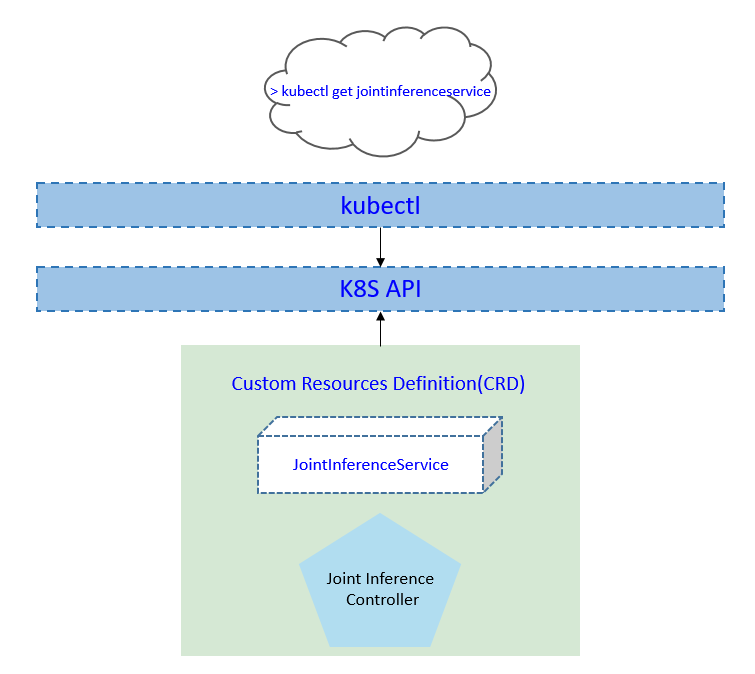
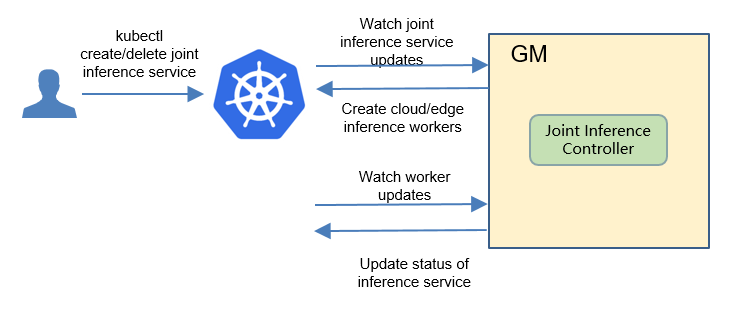
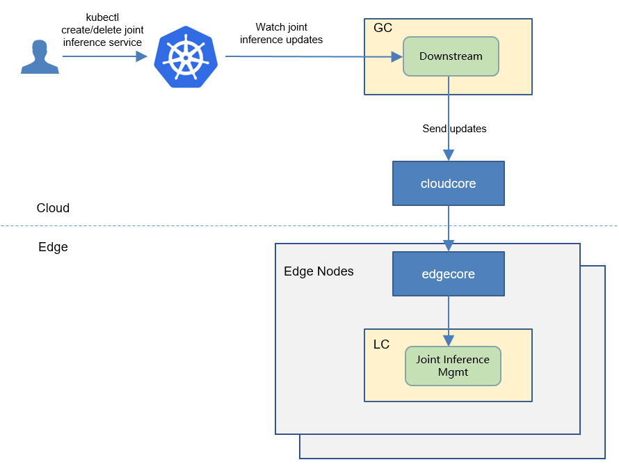
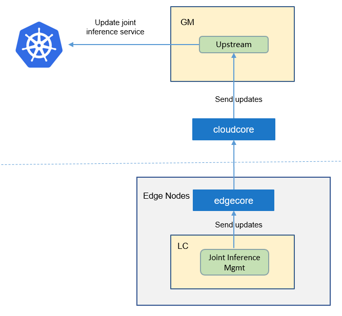
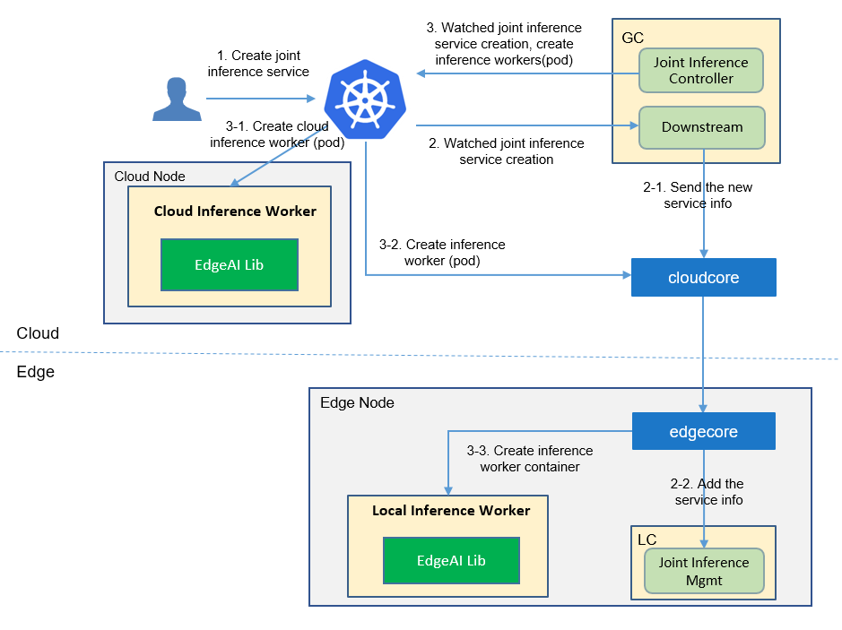
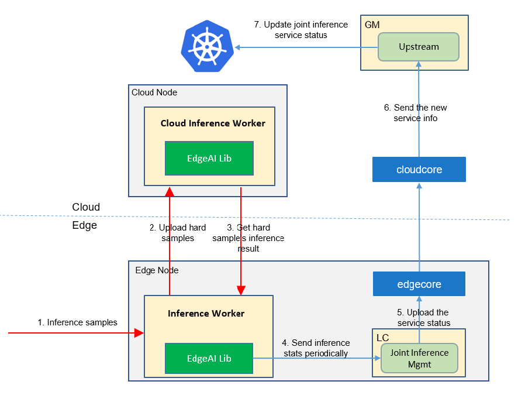

* [Joint Inference](#joint-inference)
   * [Motivation](#motivation)
     * [Goals](#goals)
     * [Non\-goals](#non-goals)
   * [Proposal](#proposal)
     * [Use Cases](#use-cases)
   * [Design Details](#design-details)
     * [CRD API Group and Version](#crd-api-group-and-version)
     * [Joint inference CRD](#joint-inference-crd)
     * [Joint inference type definition](#joint-inference-type-definition)
     * [Joint inference sample](#joint-inference-sample)
     * [Validation](#validation)
   * [Controller Design](#controller-design)
     * [Joint Inference Controller](#joint-inference-controller)
     * [Downstream Controller](#downstream-controller)
     * [Upstream Controller](#upstream-controller)
     * [Details of api between GM(cloud) and LC(edge)](#details-of-api-between-gmcloud-and-lcedge)
     * [Details of api between Worker(edge) and LC(edge)](#details-of-api-between-workeredge-and-lcedge)
     * [Flow of Joint Inference](#flow-of-joint-inference)
   * [Workers Communication](#workers-communication)
   
# Joint Inference
## Motivation

Inference on the edge can get a shorter latency and a higher throughput, and inference on the cloud can get better inference precision. 
The collaborative inference technology detects hard samples on the edge and sends them to the cloud for inference. 
**In this way, simple samples inference on the edge ensures latency and throughput, while hard samples inference on the cloud improves the overall precision.**


### Goals
* Joint inference improves the inference precision without significantly reducing the time and throughput.


## Proposal
We propose using Kubernetes Custom Resource Definitions (CRDs) to describe 
the joint inference specification/status and a controller to synchronize these updates between edge and cloud.



### Use Cases

* User can create a joint inference service with providing a training script,
 specifying the aggregation algorithm, configuring training hyper parameters, 
 configuring training datasets.

* Users can get the joint inference status, including the counts of inference at the edge/cloud.


## Design Details

### CRD API Group and Version
The `JointInferenceService` CRD will be namespace-scoped.
The tables below summarize the group, kind and API version details for the CRD.

* JointInferenceService

| Field                 | Description             |
|-----------------------|-------------------------|
|Group                  | sedna.io     |
|APIVersion             | v1alpha1                |
|Kind                   | JointInferenceService             |

### Joint inference CRD

see [crd source](/build/crds/sedna.io_jointinferenceservices.yaml)

### Joint inference type definition

see [go source](/pkg/apis/sedna/v1alpha1/jointinferenceservice_types.go)

#### Validation
[Open API v3 Schema based validation](https://kubernetes.io/docs/tasks/access-kubernetes-api/custom-resources/custom-resource-definitions/#validation) can be used to guard against bad requests.
Invalid values for fields ( example string value for a boolean field etc) can be validated using this.

Here is a list of validations we need to support :
1. The `dataset` specified in the crd should exist in k8s.
1. The `model` specified in the crd should exist in k8s.
1. The edgenode name specified in the crd should exist in k8s.

### joint inference sample
see [sample source](/build/crd-samples/sedna/jointinferenceservice_v1alpha1.yaml)

## Controller Design
The joint inference controller starts three separate goroutines called `upstream`, `downstream` and `joint-inference`controller. These are not separate controllers as such but named here for clarity.
- joint inference: watch the updates of joint-inference-task crds, and create the workers to complete the task.
- downstream: synchronize the joint-inference updates from the cloud to the edge node.
- upstream: synchronize the joint-inference updates from the edge to the cloud node.

### Joint Inference Controller


The joint-inference controller watches for the updates of joint-inference tasks and the corresponding pods against the K8S API server.
Updates are categorized below along with the possible actions:

| Update Type                    | Action                                       |
|-------------------------------|---------------------------------------------- |
|New  Joint-inference-service Created             |Create the cloud/edge worker|
|Joint-inference-service Deleted                 | NA. These workers will be deleted by GM.|
|The corresponding pod created/running/completed/failed                 | Update the status of joint-inference task.|


### Downstream Controller


The downstream controller watches for joint-inference updates against the K8S API server.
Updates are categorized below along with the possible actions that the downstream controller can take:

| Update Type                    | Action                                       |
|-------------------------------|---------------------------------------------- |
|New Joint-inference-service Created             |Sends the task information to LCs.|
|Joint-inference-service Deleted                 | The controller sends the delete event to LCs.|

### Upstream Controller


The upstream controller watches for joint-inference-task updates from the edge node and applies these updates against the API server in the cloud.
Updates are categorized below along with the possible actions that the upstream controller can take:

| Update Type                        | Action                                        |
|-------------------------------     |---------------------------------------------- |
|Joint-inference-service Reported State Updated    |  The controller appends the reported status of the Joint-inference-service in the cloud. |

### Details of api between GM(cloud) and LC(edge)
1. GM(downstream controller) syncs the task info to LC:
    ```go
    // POST <namespace>/sedna/downstream/jointinferenceservices/<name>/insert
    // body same to the task crd of k8s api, omitted here.
    ```

1. LC uploads the task status which reported by the worker to GM(upstream controller):
    ```go
    // POST <namespace>/sedna/upstream/jointinferenceservices/<name>/status
       
    // JoinInferenceServiceStatus defines status that send to GlobalManager
    type JoinInferenceServiceStatus struct {
    	Phase  string  `json:"phase"`
    	Status string  `json:"status"`
    	Output *Output `json:"output"`
    }
    
    // Output defines task output information
    type Output struct {
    	Models   []Model   `json:"models"`
    	TaskInfo *TaskInfo `json:"taskInfo"`
    }
    
    // Model defines the model information
    type Model struct {
    	Format string `json:"format"`
    	URL    string `json:"url"`
    }
    
    // TaskInfo defines the task information
    type TaskInfo struct {
    	InferenceNumber   int     `json:"inferenceNumber"`
    	HardExampleNumber int     `json:"hardExampleNumber"`
    	UploadCloudRatio  float64 `json:"uploadCloudRatio"`
    	StartTime         string  `json:"startTime"`
    	CurrentTime       string  `json:"currentTime"`
    }

    ```

### Details of api between Worker(edge) and LC(edge)
1. Worker sends inference info to LC in same edge node:

    ```
    // POST /sedna/workers/<worker-name>/info
    ```
 
    ```json
   {
       "name": "worker-name",
       "namespace": "default",
       "ownerName": "jointinferenceservice-name",
       "ownerKind": "jointinferenceservice",
       "kind": "inference",
       "status": "completed/failed/running",
       "taskInfo": {
           "inferenceNumber": 1000,
           "hardExampleNumber": 100,
           "uploadCloudRatio": 0.1,
           "startTime": "2020-11-03T08:39:22.517Z",
           "updateTime": "2020-11-03T08:50:22.517Z"
       }
   }
   ```


### Flow of Joint Inference
- The flow of joint inference service creation:



## Workers Communication


