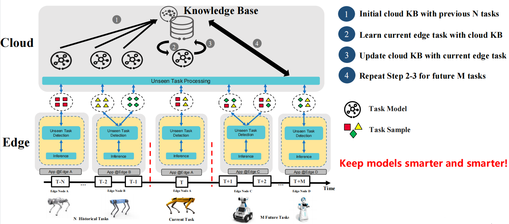

* [Unstructured Lifelong Learning](#lifelong-learning)
   * [Motivation](#motivation)
     * [Goals](#goals)
     * [Algorithm Process Design](#algorithm-process-design)
     * [Scenario](#scenario)
     * [Dataset](#dataset)
   * [Proposal](#proposal)
     * [Use Cases](#use-cases)
   * [Design Details](#design-details)
     * [CRD API Group and Version](#crd-api-group-and-version)
     * [Lifelong learning CRD](#lifelong-learning-crd)
     * [Lifelong learning type definition](#lifelong-learning-job-type-definition)
     * [Lifelong learning sample](#lifelong-learning-job-sample)
     * [Validation](#validation)
   * [Controller Design](#controller-design)
     * [Lifelong Learning Controller](#lifelong-learning-controller)
     * [Downstream Controller](#downstream-controller)
     * [Upstream Controller](#upstream-controller)
     * [Details of api between GM(cloud) and LC(edge)](#details-of-api-between-gmcloud-and-lcedge)
   * [Workers Communication](#workers-communication)

# Unstructured Lifelong Learning
## Motivation

Edge cloud synergy lifelong learning has been proposed and realized through Sedna in [ATCII example](https://github.com/kubeedge/sedna/blob/main/examples/lifelong_learning/atcii/README.md) which handles structured data. However, [version v0.5.1](https://github.com/kubeedge/sedna/releases/tag/v0.5.1) of Sedna lifelong learning scheme has the following limitations.

* **It can't directly apply to unstructured data scenarios** such as images, texts, voices, etc, which instead a majority of AI applications have been working on. The adaption to unstructured data is essential for Sedna lifelong learning to support more diversified applications.

* **It hasn't enable to detect or tackle unseen samples**, also called heterogeneous samples, at the inference stage. As is well known, Non-IID is prevailing situation that exists in distributed AI. When encountering heterogeneous data, the real-time inference performance of original model is greatly reduced which might cause unacceptable loss in certain scenarios. Hence, how to detect heterogeneous or unseen data in advance and process them properly in real time become sigificant topics.

* **It has not realized efficient unseen task processing**. As unseen samples are collected, turning them to be seen samples in order to make model smarter is challenging and important. In addition to retraining all the data, efficiently training unseen sample is worth studying. 

In this version of lifelong learning, we seek to fundamentally overcome the above challenges of edge-cloud distributed machine learning.
### Goals

* Supports unstructured lifelong learning to complete semantic segmentation based on RGB-D images.
* Supports unseen task detection before inference to avoid model performance deteriation. 
* Supports unseen task inference. When unseen task is detected which shouldn't be inferenced by base model, we provide extra means such as manul intervention, mechanism methods, etc., to guarantee that unseen task will be well processed.
* Supports unseen task training. In addition to retraining all the data without pretrained model, more efficient unseen task training is supported with different strategies and pretrained model can be configured to accelerate and improve the training process.
* Supports knowledgebase content exhibition. Namely, Sedna will provide knowledgebase messages, e.g., number of tasks or models, number of unseen samples, etc., for users using kubenetes commands.

### Algorithm Process Design
* Initial training stage: create knowledge base with initial dataset by multi-task learning. After that, seen tasks of the first round are stored in knowledge base and wait to be deployed to inference workers.

* Evaluation stage: before inference starts, this stage finds out proper seen tasks for specified edge inference workers by configured evaluation mechanism, in order to improve inference performance.

* Inference stage: at this stage, we design unseen task detection and unseen task inference to cope with heterogeneous data which are creatively proposed. With real-time unseen task processing, economic loss can be saved in certain industrial scenarios such as quality inspection.

* Update: after enough unseen samples are collected and labeled, knowledge base update is carried out via unseen task training.

### Scenario
In this proposal, we achieve intelligent navigation based on Sedna lifelong perception of cloud robotics. 

Robots are more generally to be utilized to conduct delivery or inspection tasks. However, robot laser radar usually fails to detect low obstacles, resulting in falling. Therefore, AI visual detection helps to solve laser radar deficiency, and recognize environment accurately. Due to limitation resources of a robot, edge-cloud synergy AI makes robots smarter to detect low obstacles, offers more accurate models from cloud and help robots make intelligent decisions. However, cloud robotics still face challenges from edge data heterogeneity and edge data deficiency.

- Edge data heterogeneity: when inference samples generated from unseen spots, severe weather or different brightness, the model performance deteriorates greatly.
- Edge data deficiency: it is hard to train an accurate new model quickly for a new spot because of huge labeling cost and few samples at a single edge site. Usually model training requires cold start.

While lifelong learning can help to improve model performance, tackle edge data heterogeneity and data deficiency, and save labeling cost greatly in cloud robotics scenarios. It proposes the following three modules to solve the above challenges.

- Unseen task detection: it recognizes and saves edge heterogeneous data (unseen task) to the cloud. On one hand, we can alarm robot to stop. On the other hand, unseen tasks at cloud can be used for further training.
- Unseen task inference: it processes edge heterogeneous data in real time by notifying manual intervention, teleoperation, etc.
- Unseen task training: it trains new models for unseen samples by multi-task learning and transfer learning and turns unseen tasks to be seen for edge data deficiency.

### Dataset
In this example, we utilize two sets of dataset, i.e., **CITYSCAPES** and **SYNTHIA** to apply semantic segmentation to cloud robotics and realize intelligent environment perception.

#### [CITYSCAPES](https://www.cityscapes-dataset.com)
CITYSCAPES dataset contains a diverse set of stereo video sequences recorded in street scenes from 50 different cities, with high quality pixel-level annotations of 5000 frames in addition to a larger set of 20 000 weakly annotated frames. The dataset is thus an order of magnitude larger than similar previous attempts.

The Cityscapes Dataset is intended for assessing the performance of vision algorithms for major tasks of semantic urban scene understanding: pixel-level, instance-level, and panoptic semantic labeling; supporting research that aims to exploit large volumes of (weakly) annotated data, e.g. for training deep neural networks.

Below are examples of high quality dense pixel annotations. 

CITYSCAPE Image

CITYSCAPE Annotation

#### [SYNTHIA](https://synthia-dataset.net/)
SYNTHIA, the SYNTHetic collection of Imagery and Annotations, is a dataset that has been generated with the purpose of aiding semantic segmentation and related scene understanding problems in the context of driving scenarios. SYNTHIA consists of a collection of photo-realistic frames rendered from a virtual city and comes with precise pixel-level semantic annotations for 13 classes: misc, sky, building, road, sidewalk, fence, vegetation, pole, car, sign, pedestrian, cyclist, lane-marking.

Below are the examples of synthia images and pixel annotations.

SYNTHIA Image

SYNTHIA Annotation

#### Re-organized dataset of lifelong cloud robotics
While we also provided a [re-organized dataset](https://kubeedge.obs.cn-north-1.myhuaweicloud.com/examples/robo_dog_delivery/segmentation_data.zip) from CITYSCAPES and SYNTHIA to run this example. After decompression, the data organization is listed as follows:

<table class="tg">
<thead>
  <tr>
    <th class="tg-0pky" colspan="2">Dataset</th>
    <th class="tg-0pky">Number</th>
  </tr>
</thead>
<tbody>
  <tr>
    <td class="tg-0pky">CITYSCAPES</td>
    <td class="tg-0pky">rgb</td>
    <td class="tg-0pky">250</td>
  </tr>
  <tr>
    <td class="tg-0pky"></td>
    <td class="tg-0pky">disparity</td>
    <td class="tg-0pky">250</td>
  </tr>
  <tr>
    <td class="tg-0pky"></td>
    <td class="tg-0pky">groudtruth annotation</td>
    <td class="tg-0pky">250</td>
  </tr>
  <tr>
    <td class="tg-0pky" rowspan="3">SYNTHIA</td>
    <td class="tg-0pky">rgb</td>
    <td class="tg-0pky">250</td>
  </tr>
  <tr>
    <td class="tg-0pky">disparity</td>
    <td class="tg-0pky">250</td>
  </tr>
  <tr>
    <td class="tg-0pky">groudtruth annotation</td>
    <td class="tg-0pky">250</td>
  </tr>
  <tr>
    <td class="tg-0pky" colspan="2">Total</td>
    <td class="tg-0pky">1500</td>
  </tr>
</tbody>
</table>

** Note: the following sections of **Proposal**, **Design Details**, **Controller Design** and **Workers Communication** are the same as that of version v0.5.1.

## Proposal
We propose using Kubernetes Custom Resource Definitions (CRDs) to describe 
the lifelong learning specification/status and a controller to synchronize these updates between edge and cloud.

### Use Cases

* Users can create the lifelong learning jobs, by providing training scripts, configuring training hyperparameters, providing training datasets, configuring training and deployment triggers.

## Design Details
There are three stages in a lifelong learning job: train/eval/deploy.

Each stage contains these below states:
1. Waiting: wait to trigger satisfied, i.e. wait to train/eval/deploy
1. Ready: the corresponding trigger satisfied, now ready to train/eval/deploy
1. Starting: the corresponding stage is starting
1. Running: the corresponding stage is running
1. Failed: the corresponding stage failed
1. Completed: the corresponding stage completed

### CRD API Group and Version
The `LifelongLearningJob` CRD will be namespace-scoped.
The tables below summarize the group, kind and API version details for the CRD.

* LifelongLearningJob

| Field                 | Description             |
|-----------------------|-------------------------|
|Group                  | sedna.io     |
|APIVersion             | v1alpha1                |
|Kind                   | LifelongLearningJob             |

### Lifelong learning CRD
See the [crd source](/build/crds/sedna/sedna.io_lifelonglearningjobs.yaml) for details.

### Lifelong learning job type definition

See the [golang source](/pkg/apis/sedna/v1alpha1/lifelonglearningjob_types.go) for details.

#### Validation
[Open API v3 Schema based validation](https://kubernetes.io/docs/tasks/access-kubernetes-api/custom-resources/custom-resource-definitions/#validation) can be used to guard against bad requests.
Invalid values for fields (example string value for a boolean field etc) can be validated using this.

Here is a list of validations we need to support :
1. The `dataset` specified in the crd should exist in k8s.
1. The edgenode name specified in the crd should exist in k8s.

### Lifelong learning job sample
See the [source](/build/crd-samples/sedna/lifelonglearningjob_v1alpha1.yaml) for an example.
    
## Controller Design

The Lifelong learning controller starts three separate goroutines called `upstream`, `downstream` and `Lifelonglearningjob`controller. 
These are not separate controllers as such but named here for clarity.
- Lifelong learning: watch the updates of lifelong-learning job crds, and create the workers depending on the state machine.
- downstream: synchronize the lifelong-learning-job updates from the cloud to the edge node.
- upstream: synchronize the lifelong-learning-job updates from the edge to the cloud node.

### Lifelong Learning Controller

The lifelong-learning controller watches for the updates of lifelong-learning jobs and the corresponding pods against the K8S API server. 
Updates are categorized below along with the possible actions:

| Update Type                    | Action                                       |
|-------------------------------|---------------------------------------------- |
|New lifelong-learning-job Created             | Wait to train trigger satisfied|
|lifelong-learning-job Deleted                 | NA. These workers will be deleted by [k8s gc](https://kubernetes.io/docs/concepts/workloads/controllers/garbage-collection/).|
|The Status of lifelong-learning-job Updated               | Create the train/eval worker if it's ready.|
|The corresponding pod created/running/completed/failed                 | Update the status of lifelong-learning job.|

### Downstream Controller

The downstream controller watches for the lifelong-learning job updates against the K8S API server. 
Updates are categorized below along with the possible actions that the downstream controller can take:

| Update Type                    | Action                                       |
|-------------------------------|---------------------------------------------- |
|New Lifelong-learning-job Created             |Sends the job information to LCs.|
|Lifelong-learning-job Deleted                 | The controller sends the delete event to LCs.|

### Upstream Controller

The upstream controller watches for the lifelong-learning job updates from the edge node and applies these updates against the API server in the cloud. 
Updates are categorized below along with the possible actions that the upstream controller can take:

| Update Type                        | Action                                        |
|-------------------------------     |---------------------------------------------- |
|Lifelong-learning-job Reported State Updated    |  The controller appends the reported status of the job by LC in the cloud. |

### Details of api between GM(cloud) and LC(edge)
[Reference](https://github.com/kubeedge/sedna/blob/main/docs/proposals/incremental-learning.md#details-of-api-between-gmcloud-and-lcedge)

### The flows of lifelong learning job
- Flow of the job creation:

- Flow of the `train` stage:

- Flow of the `eval` stage:

- Flow of the `deploy` stage:

## Workers Communication
No need to communicate between workers.
