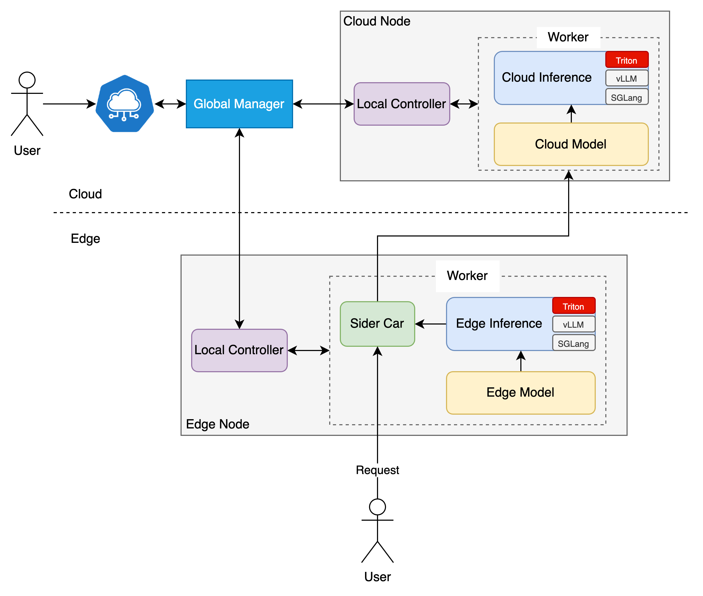
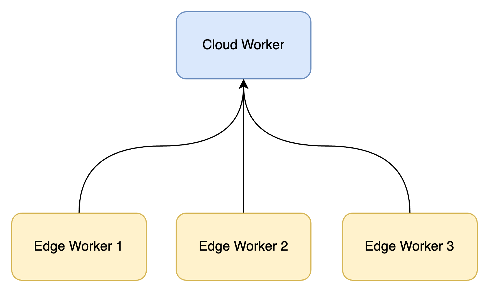

# The Reconstruction of Sedna's Joint Inference Paradigm
Sedna leverages the edge-cloud collaboration capabilities of the edge computing framework KubeEdge to achieve cross-edge-cloud collaborative training and inference. Joint inference is an important application of Sedna's edge-cloud collaborative inference, which effectively improves the efficiency and accuracy of edge-side inference. However, there are still some deficiencies in the ease of use and scalability of the current Sedna joint inference, mainly manifested in the following aspects:

1. Currently, the application development of joint inference strongly depends on the SDK toolkit provided by Sedna. For users, getting familiar with the Sedna SDK is a matter with a high learning cost. Moreover, it also involves the compilation of Docker images. For some pure algorithm engineers, they may not be familiar with the theory of cloud-native, which undoubtedly increases the difficulty of getting started.
2. The current design of Sedna's joint inference can only meet the joint inference tasks of traditional discriminative models, and it is difficult to adapt to the existing large language model algorithms.
3. Sedna's joint inference can only achieve one-to-one deployment, and cannot achieve one-to-many deployment.
4. Sedna's joint inference forces the deployment of edge-cloud inference models and does not support the single-cloud or single-edge mode.

Based on the above problems, this proposal aims to introduce the following functional enhancement solutions:

1. Decouple the SDK from the Sedna framework. Users only need to perform simple model configuration to start the model service, without the need for instance development based on the SDK.
2. Support the configuration of both discriminative models and large language models at the same time.
3. Support the many-to-one configuration of joint inference tasks (that is, batch-deploy multiple edge-side models and share the same cloud-side model).
4. Do not force users to use the joint inference mode, and support the single-edge or single-cloud mode.

# Goals

In summary, the goal of this reconstruction of the joint inference paradigm is:

1. Implement a new inference paradigm in Sedna to achieve the above-mentioned functions (Since there are already significant differences in functionality compared to the original inference paradigm, we will conduct development on the new version v1alpha2.).
2. Provide two examples corresponding to the traditional discriminative model and the large language model respectively.
3. Add necessary test cases.
4. Update the Sedna documentation to reflect the new inference paradigm.

# Proposal

## Technology selection

Currently, the mainstream inference frameworks mainly include Triton, vLLM, SGLang, lmdeploy and Ollama. The following is a detailed comparison of them.

|                                       | [Triton](https://github.com/triton-inference-server/server) | [vLLM](https://github.com/vllm-project/vllm)        | [SGLang](https://github.com/sgl-project/sglang) | [LMDeploy](https://github.com/InternLM/lmdeploy)     | [Ollama](https://github.com/ollama/ollama) |
|---------------------------------------|-------------------------------------------------------------|-----------------------------------------------------|-------------------------------------------------|------------------------------------------------------|--------------------------------------------|
| **Core Positioning**                  | Industrial-grade multi-model inference service              | High-throughput inference for large language models | Structured generation control engine            | Enterprise-level edge-cloud collaborative deployment | Local lightweight deployment tool          |
| **Single GPU Throughput** (Llama3-8B) | 1800 tokens/s                                               | **4200 tokens/s**                                   | 3200 tokens/s                                   | 3800 tokens/s                                        | 850 tokens/s                               |
| **Memory Utilization Rate**           | 65%-75%                                                     | **92%-95%**                                         | 80%-85%                                         | 88%-90%                                              | 50%-60%                                    |
| **First Token Time**                  | 18ms                                                        | **9ms**                                             | 12ms                                            | 11ms                                                 | 35ms                                       |
| **Model Support**                     | PyTorch/TensorFlow/ONNX                                     | Llama3/GPT-5/Mistral                                | Structured generation in JSON/YAML format       | HuggingFace/AWQ/TensorRT                             | GGML/GGUF/AWQ                              |
| **Core Technological Innovation**     | Orchestration of cross-model pipelines                      | Dynamic KV cache sharding                           | Fast parsing of xGrammar                        | Dynamic Batching & GPU Memory Compression            | Hot replacement of local models            |
| **Typical Latency** (batch=32)        | 22ms/token                                                  | 15ms/token                                          | 18ms/token                                      | **13ms/token**                                       | 45ms/token                                 |
| **Hardware Compatibility**            | The whole series of NVIDIA products/AMD MI300               | NVIDIA/AMD ROCm                                     | NVIDIA/Intel GPU                                | NVIDIA / Acend 910B                                  | CPU/Apple Silicon                          |
| **Open Source License**               | BSD-3                                                       | Apache 2.0                                          | MIT                                             | Apache 2.0                                           | AGPL                                       |
| **Applicable Field**                  | Industrial-grade AI services, CV/NLP multimodality          | Commercial LLM applications, AI assistant backends  | Code generation, dialogue systems               | Edge-cloud collaborative deployment                  | Personal research, prototype development   |

Through the above comparison, it can be found that vLLM, LMDeploy and SGLang can only provide services for large language models (LLMs) and cannot provide services for discriminative models (such as CV models). On the other hand, Ollama is designed for local experiments and is not suitable for large-scale production environments.
Triton as a general-purpose framework, although it has some performance gaps compared with vLLM, LMDeploy and SGLang, it performs relatively balanced in all aspects and can support both traditional discriminative models and large language models(LLMs) simultaneously. Moreover, it can also support both GPU and CPU inference, making it quite suitable for our application scenarios.

However, Triton also has its drawbacks: 
- Firstly, as mentioned before, there is a certain performance gap compared with vLLM and SGLang. 
- Secondly, the inference tasks of Triton on GPUs strongly rely on Nvidia and it cannot support GPUs from manufacturers such as Ascend and Cambricon.

Therefore, when designing the API, we need to reserve expandable interfaces to facilitate the subsequent support for more other inference frameworks.

# Design Details
## Overall Architecture

  

**Cloud/Edge Inference:** Inference instances at the cloud side and the edge side, with the inference services directly provided by the Triton framework (meanwhile, expansion capabilities are reserved to facilitate the subsequent expansion of other inference frameworks, such as vLLM, SGLang, LMDeploy...). 

**Side Car:** It is responsible for providing an external access entrance, intercepting user requests, and the corresponding difficult case mining algorithm is also implemented here, so as to decide whether the cloud side needs to intervene in the inference request. (The reason for not making the Sidecar an independent Agent is that the difficult case mining algorithms corresponding to different inference instances may vary, and standardization is not possible.) 

- The difficult case mining algorithm needs to be designed to be user-customizable, such as through functional computing?

**Edge/Cloud Model:** The inference models at the cloud side and the edge side can be expanded on the existing Model API, and need to support large language models. This model will be mounted in the inference instance. 

**Local Controller:** It is responsible for collecting the status information of the inference instances at the cloud side and the edge side, and cooperates with the GM to complete the lifecycle management of the entire inference task. 

**Global Manager:** The control plane of Sedna.

## bacth deployment

The current joint inference paradigm of Sedna forcibly sets the inference instances at the cloud side and the edge side to be one. This approach is not conducive to the batch deployment scenario. 

Therefore, in our design, we have added support for the batch deployment of the same task. For the same task type, we support users to deploy multiple instances to multiple nodes simultaneously, while the cloud service reuses the same service, as shown in the following figure.

  

# implementation
## API Design
* todo

