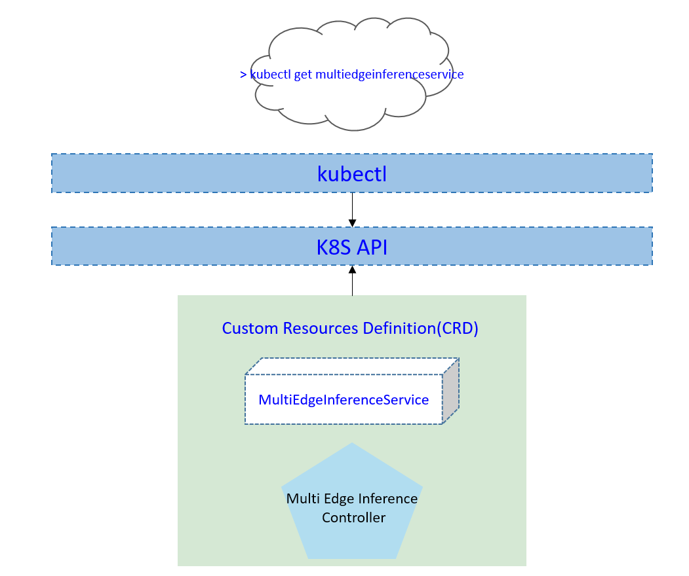
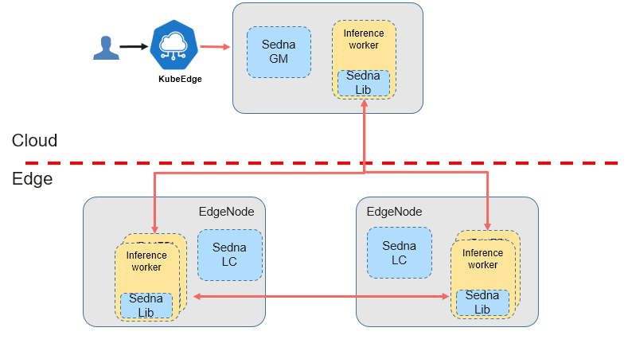
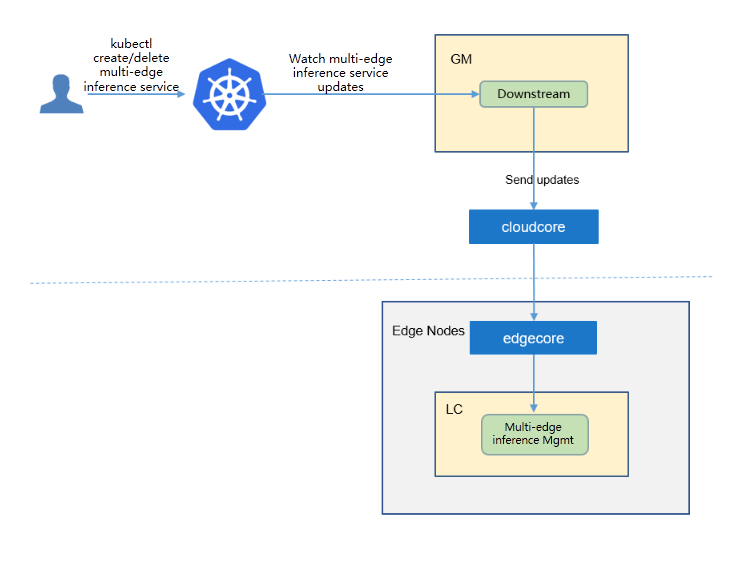
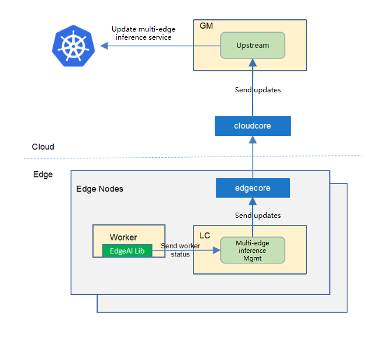

- [Multi Edge Inference Service](#multi-edge-inference-service)
    - [Motivation](#motivation)
        - [Goals](#goals)
    - [Proposal](#proposal)
        - [Use Cases](#use-cases)
    - [Design Details](#design-details)
        - [CRD API Group and Version](#crd-api-group-and-version)
        - [Multi Edge Inference Service type definition](#multi-edge-inference-service-type-definition)
            - [Validation](#validation)
        - [Multi Edge Inference Service sample](#multi-edge-inference-service-sample)
    - [Controller Design](#controller-design)
        - [Multi Edge Inference Service Controller](#multi-edge-inference-service-controller)
        - [Downstream Controller](#downstream-controller)
        - [Upstream Controller](#upstream-controller)

# Multi Edge Inference
## Motivation
Let's start with a typical Edge AI application to introduce inference on edge. 

Object tracking is an essential technology in computer vision, which has been widely used for suspect tracking in security surveillance, container tracking in ports, material tracking in warehouses, carrier tracking in epidemiology surveys, and many others. It has become more and more popular in many application scenarios in recent years.

However, in the course of practical application, we found many problems:
1. Due to the strict data privacy policy, the owner of video data (such as campus property) is not allowed to leak camera data to the outside for processing. Because the person under surveillance cameras is only told to use the data for security protection, not for other purposes, the video data cannot be transferred to the cloud.
2. Even though the data can be transmitted to the cloud in some scenarios, streaming high-definition video requires broadband and generates a large amount of data transfer. The construction of a private line network is costly.
3. The nature scenes taken by a camera are complicated, and many challenges need to be solved, such as illumination changes, occlusion, a large number of targets, and chaotic environments.
 
A standalone object tracking algorithm often cannot obtain a good result.
Regarding the problems mentioned above, we think that for the object tracking scenario, the collaboration capability of multiple edge nodes could offer a reliable solution.

Therefore, based on KubeEdge's edge-cloud collaboration and resource management capabilities, we propose an end-to-end collaborative object tracking approach employing the flexible synergy of multiple edge nodes. Our proposed approach can enhance data privacy protection, reduce transmission bandwidth, and improve tracking accuracy on edge nodes with limited computing resources.

### Goals
* Support single/multi-object tracking
* Support across-camera object tracking
* Support on-the-fly/history object tracking
* Support parallel object re-identification(ReID)
* etc..

## Proposal
We propose using Kubernetes Custom Resource Definitions (CRDs) to describe the object tracking service specification/status and a controller to synchronize these updates between edge and cloud.

### Use Cases

* User can create typical multi-edge collaborative object tracking applications with providing AI models.

## Design Details
### CRD API Group and Version
The `MultiEdgeInference` CRD will be namespace-scoped.
The tables below summarize the group, kind and API version details for the CRD.

* MultiEdgeTracking

| Field                 | Description        |
|-----------------------|--------------------|
|Group                  | sedna.io           |
|APIVersion             | v1alpha1           |
|Kind                   | MultiEdgeInference |

#### Validation
[Open API v3 Schema based validation](https://kubernetes.io/docs/tasks/access-kubernetes-api/custom-resources/custom-resource-definitions/#validation) can be used to guard against bad requests.
Invalid values for fields (example string value for a boolean field etc) can be validated using this.

## System Architecture and Components

The image below shows the system architecture and its simplified workflow:

## Controller Design

The multi edge inference controller starts three separate goroutines called `upstream`, `downstream` and `multi-edge-inference ` controller. These are not separate controllers as such but named here for clarity.
- multi-edge-inference : watch the updates of multi-edge-inference crds, and create the workers to complete the task.
- downstream: synchronize the multi-edge-inference  updates from the cloud to the edge node.
- upstream: synchronize the multi-edge-inference  updates from the edge to the cloud node.

### Multi edge inference Service Controller

The multi-edge-inference  controller watches for the updates of multi-edge-inference  tasks and the corresponding pods against the K8S API server.
Updates are categorized below along with the possible actions:

| Update Type                    | Action                                       |
|-------------------------------|---------------------------------------------- |
|New Multi-edge-inference  Created             |Create the cloud/edge worker|
|Multi-edge-inference  Deleted                 | NA. These workers will be deleted by GM.|
|The corresponding pod created/running/completed/failed                 | Update the status of multi-edge-inference  task. |

### Downstream Controller

The downstream controller watches for multi-edge-inference  updates against the K8S API server.
Updates are categorized below along with the possible actions that the downstream controller can take:

| Update Type                    | Action                                       |
|-------------------------------|---------------------------------------------- |
|New Multi-edge-inference  Created             |Sends the task information to LCs.|
|Multi-edge-inference  Deleted                 | The controller sends the delete event to LCs.|

### Upstream Controller

The upstream controller watches for multi-edge-inference  task updates from the edge node and applies these updates against the API server in the cloud.
Updates are categorized below along with the possible actions that the upstream controller can take:

| Update Type                                 | Action                                                       |
| ------------------------------------------- | ------------------------------------------------------------ |
| Multi-edge-inference  Reported State Updated | The controller appends the reported status of the multi-edge-inference  in the cloud. |
