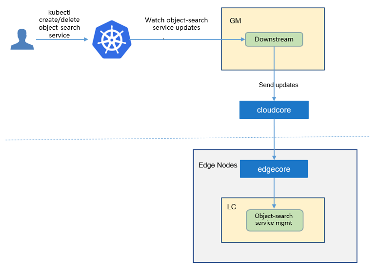
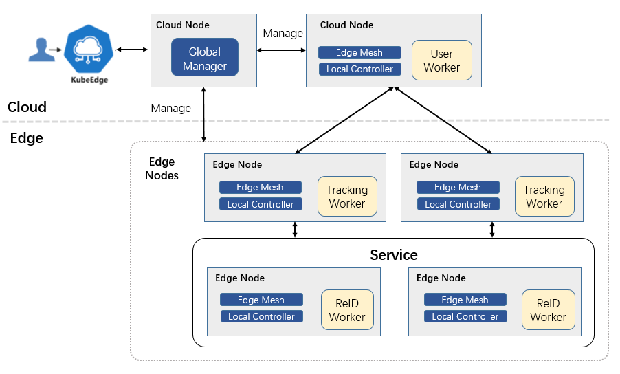

- [Object Search Service](#object-search-service)
  - [Motivation](#motivation)
    - [Goals](#goals)
  - [Proposal](#proposal)
    - [Use Cases](#use-cases)
  - [Design Details](#design-details)
    - [CRD API Group and Version](#crd-api-group-and-version)
    - [Object search service type definition](#object-search-service-type-definition)
      - [Validation](#validation)
    - [Object search service sample](#object-search-service-sample)
  - [Controller Design](#controller-design)
    - [Object search service Controller](#object-search-service-controller)
    - [Downstream Controller](#downstream-controller)
    - [Upstream Controller](#upstream-controller)
    - [Details of api between GM(cloud) and LC(edge)](#details-of-api-between-gmcloud-and-lcedge)
    - [Flow of object search service creation](#flow-of-object-search-service-creation)
  - [Workers Communication](#workers-communication)
# Object Search Service
## Motivation
Object search is an important technology in the field of computer vision, which is widely used in security monitoring, intelligent transportation, etc. Generally, online object search applications have stringent latency constraints, which cannot be met by cloud computing schemes. Object search schemes based on edge computing have the characteristics of low latency and data privacy security, and are the mainstream technology trend. 

However, the amount of feature matching computation increases exponentially with the expansion of the search object scale, and a single edge computing node is difficult to support large-scale object search. Multi-edge collaborative computing can accelerate large-scale object search applications and improve the search accuracy, which is the future development trend. 

We propose the first open source end-to-end multi-edge collaborative object search solution. Based on KubeEdge's cloud-edge collaboration and resource management capabilities, we utilize multiple edge computing nodes to execute the AI inference tasks of object search in parallel. Our solution can not only reduce delay and improve throughput, but also will bring accuracy promotion. In addition, our solution will also support efficient offline object search.
### Goals
* Support single/multi-object search
* Support across-camera object search
* Support parallel object re-identification(ReID)
* Support historical video data object search
* Support multi-camera data joint analysis and decision making
* Provide a user entry for submitting search tasks and result queries


## Proposal
We propose using Kubernetes Custom Resource Definitions (CRDs) to describe the object search service specification/status and a controller to synchronize these updates between edge and cloud.


### Use Cases

* User can create typical multi-edge collaborative object search applications with providing AI models.

## Design Details
### CRD API Group and Version
The `ObjectSearchService` CRD will be namespace-scoped.
The tables below summarize the group, kind and API version details for the CRD.

* ObjectSearchService

| Field                 | Description             |
|-----------------------|-------------------------|
|Group                  | sedna.io     |
|APIVersion             | v1alpha1                |
|Kind                   | ObjectSearchService   |


### Object search service type definition

[go source](/pkg/apis/sedna/v1alpha1/objectsearchservice_types.go)

#### Validation
[Open API v3 Schema based validation](https://kubernetes.io/docs/tasks/access-kubernetes-api/custom-resources/custom-resource-definitions/#validation) can be used to guard against bad requests.
Invalid values for fields (example string value for a boolean field etc) can be validated using this.


### Object search service sample
See the [source](/build/crd-samples/sedna/objectsearchservice_v1alpha1.yaml) for an example.

## Controller Design
The object search service controller starts three separate goroutines called `upstream`, `downstream` and `object-search-service` controller. These are not separate controllers as such but named here for clarity.
- object-search-service: watch the updates of object-search-service task crds, and create the workers to complete the task.
- downstream: synchronize the object-search-service updates from the cloud to the edge node.
- upstream: synchronize the object-search-service updates from the edge to the cloud node.

### Object search service Controller


The object-search-service controller watches for the updates of object-search-service tasks and the corresponding pods against the K8S API server.
Updates are categorized below along with the possible actions:

| Update Type                    | Action                                       |
|-------------------------------|---------------------------------------------- |
|New Object-search-service Created             |Create the cloud/edge worker|
|Object-search-service Deleted                 | NA. These workers will be deleted by GM.|
|The corresponding pod created/running/completed/failed                 | Update the status of object-search-service task.|


### Downstream Controller


The downstream controller watches for object-search-service updates against the K8S API server.
Updates are categorized below along with the possible actions that the downstream controller can take:

| Update Type                    | Action                                       |
|-------------------------------|---------------------------------------------- |
|New Object-search-service Created             |Sends the task information to LCs.|
|Object-search-service Deleted                 | The controller sends the delete event to LCs.|

### Upstream Controller


The upstream controller watches for object-search-service task updates from the edge node and applies these updates against the API server in the cloud.
Updates are categorized below along with the possible actions that the upstream controller can take:

| Update Type                        | Action                                        |
|-------------------------------     |---------------------------------------------- |
|Object-search-service Reported State Updated    |  The controller appends the reported status of the object-search-service in the cloud. |


### Details of api between GM(cloud) and LC(edge)
1. GM(downstream controller) syncs the task info to LC:
    ```go
    // POST <namespace>/sedna/downstream/objectsearchservices/<name>/insert
    // body same to the task crd of k8s api, omitted here.
    ```

1. LC uploads the task status which reported by the worker to GM(upstream controller):
    ```go
    // POST <namespace>/sedna/upstream/objectsearchservices/<name>/status
       
    // ObjectSearchServiceStatus defines status that send to GlobalManager
    type ObjectSearchServiceStatus struct {
        Phase  string  `json:"phase"`
        Status string  `json:"status"`
        Output *Output `json:"output"`
    }
    
    // Output defines task output information
    type Output struct {
        TaskInfo *TaskInfo `json:"taskInfo"`
    }
    
    // TaskInfo defines the task information
    type TaskInfo struct {
        SearchingObjectNumber      int     `json:"searchingObjectNumber"`
        SearchedObjectNumber       int     `json:"searchedObjectNumber"`
        StartTime                  string  `json:"startTime"`
        CurrentTime                string  `json:"currentTime"`
    }

    ```

### Flow of object search service creation
- The flow of object search service creation:


The object search service controller watches the creation of object search service crd in the cloud, syncs them to lc via the cloudhub-to-edgehub channel, and creates the workers on the edge nodes specified by the user. 

- The components of object search service:


The object search service includes three types of workers: 1) User worker; 2) Tracking worker; 3）ReID worker. An user worker is used to provide API interface to users, and users can submit the object images to be searched through the API interface. There are usually multiple tracking workers and ReID workers, which can perform inference tasks of object search in parallel. Tracking workers are used to read camera data and perform object detection. Different tracking workers read data from different cameras. ReID worker is used for object feature extraction and matching to determine whether the detected object is the object to be searched.

The user worker, tracking workers, and ReID workers are started by the kubeedge at the edge nodes.

## Workers Communication

