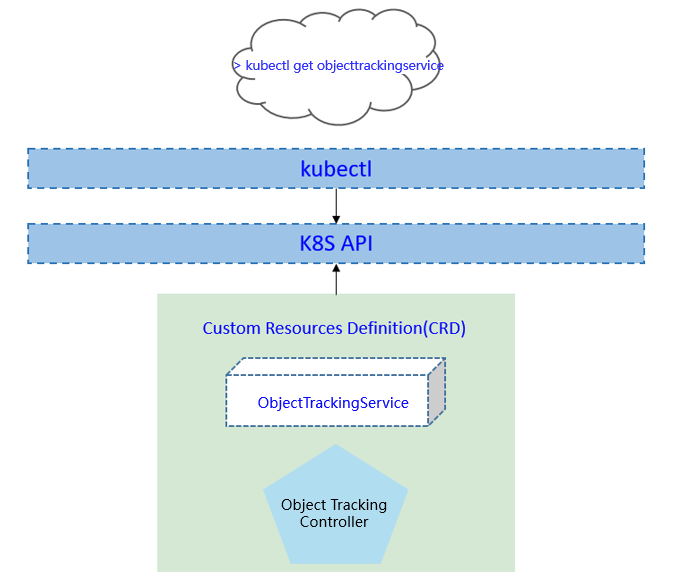

- [Object Tracking Service](#object-tracking-service)
  - [Motivation](#motivation)
    - [Goals](#goals)
  - [Proposal](#proposal)
    - [Use Cases](#use-cases)
  - [Design Details](#design-details)
    - [CRD API Group and Version](#crd-api-group-and-version)
    - [Object tracking service type definition](#object-tracking-service-type-definition)
      - [Validation](#validation)
    - [Object tracking service sample](#object-tracking-service-sample)
  - [Controller Design](#controller-design)
    - [Object tracking service Controller](#object-tracking-service-controller)
    - [Downstream Controller](#downstream-controller)
    - [Upstream Controller](#upstream-controller)
    - [Details of api between GM(cloud) and LC(edge)](#details-of-api-between-gmcloud-and-lcedge)
    - [Flow of object tracking service creation](#flow-of-object-tracking-service-creation)
  - [Workers Communication](#workers-communication)
  
# Object Tracking Service
## Motivation
Object tracking is an important technology in the field of computer vision, which is widely used in security monitoring, intelligent transportation, etc. Generally, object tracking applications have high latency requirements, which cannot be met by cloud computing schemes. The object tracking schemes based on edge computing have the characteristics of low latency and data privacy security, and are the mainstream technology trend. 

However, it is difficult for a single edge computing node to provide high-quality object tracking services. On the one hand, the coordination of multiple edge computing nodes is often required for across-camera object tracking. On the other hand, when there are large-scale tracking objects, a single computing node is difficult to handle. Multi-edge collaborative computing can accelerate large-scale object tracking applications and improve the tracking accuracy, which is the future development trend. 

We propose the first open source end-to-end multi-edge collaborative object tracking solution. Based on KubeEdge's cloud-edge collaboration and resource management capabilities, we use multiple edge computing nodes to execute the AI inference tasks of object tracking in parallel. Our solution can not only reduce delay and improve throughput, but also will bring accuracy promotion.
### Goals
* Support single/multi-object tracking
* Support across-camera object tracking
* Support parallel object re-identification(ReID)
* Support multi-camera data joint analysis and decision making


## Proposal
We propose using Kubernetes Custom Resource Definitions (CRDs) to describe the object tracking service specification/status and a controller to synchronize these updates between edge and cloud.


### Use Cases

* User can create typical multi-edge collaborative object tracking applications with providing AI models.

## Design Details
### CRD API Group and Version
The `ObjectTrackingService` CRD will be namespace-scoped.
The tables below summarize the group, kind and API version details for the CRD.

* ObjectTrackingService

| Field                 | Description             |
|-----------------------|-------------------------|
|Group                  | sedna.io     |
|APIVersion             | v1alpha1                |
|Kind                   | ObjectTrackingService   |


### Object tracking service type definition

[go source](/pkg/apis/sedna/v1alpha1/objecttrackingservice_types.go)

#### Validation
[Open API v3 Schema based validation](https://kubernetes.io/docs/tasks/access-kubernetes-api/custom-resources/custom-resource-definitions/#validation) can be used to guard against bad requests.
Invalid values for fields (example string value for a boolean field etc) can be validated using this.

### Object tracking service sample
See the [source](/build/crd-samples/sedna/objecttrackingservice_v1alpha1.yaml) for an example.

## Controller Design
The object tracking service controller starts three separate goroutines called `upstream`, `downstream` and `object-tracking-service` controller. These are not separate controllers as such but named here for clarity.
- object-tracking-service: watch the updates of object-tracking-service task crds, and create the workers to complete the task.
- downstream: synchronize the object-tracking-service updates from the cloud to the edge node.
- upstream: synchronize the object-tracking-service updates from the edge to the cloud node.

### Object tracking service Controller


The object-tracking-service controller watches for the updates of object-tracking-service tasks and the corresponding pods against the K8S API server.
Updates are categorized below along with the possible actions:

| Update Type                    | Action                                       |
|-------------------------------|---------------------------------------------- |
|New Object-tracking-service Created             |Create the cloud/edge worker|
|Object-tracking-service Deleted                 | NA. These workers will be deleted by GM.|
|The corresponding pod created/running/completed/failed                 | Update the status of object-tracking-service task.|


### Downstream Controller


The downstream controller watches for object-tracking-service updates against the K8S API server.
Updates are categorized below along with the possible actions that the downstream controller can take:

| Update Type                    | Action                                       |
|-------------------------------|---------------------------------------------- |
|New Object-tracking-service Created             |Sends the task information to LCs.|
|Object-tracking-service Deleted                 | The controller sends the delete event to LCs.|

### Upstream Controller


The upstream controller watches for object-tracking-service task updates from the edge node and applies these updates against the API server in the cloud.
Updates are categorized below along with the possible actions that the upstream controller can take:

| Update Type                        | Action                                        |
|-------------------------------     |---------------------------------------------- |
|Object-tracking-service Reported State Updated    |  The controller appends the reported status of the object-tracking-service in the cloud. |


### Details of api between GM(cloud) and LC(edge)
1. GM(downstream controller) syncs the task info to LC:
    ```go
    // POST <namespace>/sedna/downstream/objecttrackingservices/<name>/insert
    // body same to the task crd of k8s api, omitted here.
    ```

1. LC uploads the task status which reported by the worker to GM(upstream controller):
    ```go
    // POST <namespace>/sedna/upstream/objecttrackingservices/<name>/status
       
    // ObjectTrackingServiceStatus defines status that send to GlobalManager
    type ObjectTrackingServiceStatus struct {
        Phase  string  `json:"phase"`
        Status string  `json:"status"`
        Output *Output `json:"output"`
    }
    
    // Output defines task output information
    type Output struct {
        TaskInfo *TaskInfo `json:"taskInfo"`
    }
    
    // TaskInfo defines the task information
    type TaskInfo struct {
        TrackingObjectNumber      int     `json:"trackingObjectNumber"`
        FindUnknownObject         bool    `json:"findUnkownObject"`
        StartTime                 string  `json:"startTime"`
        CurrentTime               string  `json:"currentTime"`
    }

    ```

### Flow of object tracking service creation
- The flow of object tracking service creation:


The object tracking service controller watches the creation of object tracking service crd in the cloud, syncs them to lc via the cloudhub-to-edgehub channel, and creates the inference workers on the edge nodes specified by the user.

- The components of object tracking service:


The object tracking service includes two types of workers: 1) Tracking worker; 2）ReID worker. There are usually multiple tracking workers and ReID workers, which can perform inference tasks of object tracking in parallel. Tracking workers are used to read camera data and perform object detection and tracking. Different tracking workers read data from different cameras. ReID worker is used for object feature extraction and matching to determine the identity of the objects.

The tracking workers, and ReID workers are started by the kubeedge at the edge nodes.
## Workers Communication

