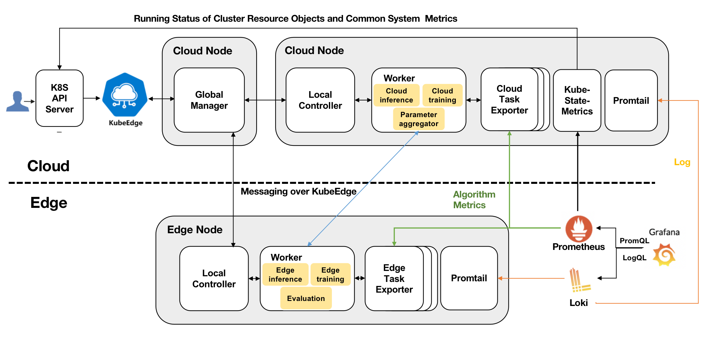

* [Observability Management](#observability-management)
  * [Motivation](#motivation)
    * [Goals](#goals)
  * [Proposal](#proposal)
  * [Design Details](#design-details)
    * [Monitoring Metrics](#monitoring-metrics)
    * [Collecting Logs](#collecting-logs)
    * [Display](#display)
  * [Key Deliverable](#key-deliverable)
  * [Road Map](#roadmap)

# Observability Management

## Motivation
Currently, users can only check the status, parameters and metrics of tasks via the command line after creating edge-cloud synergy AI tasks by sedna.

This proposal provides observability management for displaying logs and metrics to monitor tasks in real time, so that users can easily check the status, parameters and metrics of tasks.

### Goals
* The status of edge nodes and cloud nodes can be collected.
* The metrics and status of Sedna's components, such as Global Manager, Local Controllers and Workers, can be monitored.
* The parameters of edge-cloud synergy AI tasks like the count of inference can be collected and displayed on the Observability management.
* Logs of all pods created by Sedna can be collected to manage and display.
* Observability data collected can be displayed on Grafana appropriately and aesthetically.

## Proposal
We propose using Prometheus and Loki to collect observability data like metrics and logs. 
And the Observability data can be displayed with functions of Grafana.

## Design Details

### Monitoring Metrics
Sedna consists of GlobalManager, LocalControllers and Workers, which ensure Sedna works.
The observability management can monitor these components from different aspects.

* The status of edge nodes and cloud nodes can be collected by node-exporter.
  * Resource consumption like CPU and memory
  * Network receive/send bytes
  * I/O time consumption of disk operations
  * ...

* The running status of cluster resource objects like pods, service, deployment on edge and cloud can be monitored by kube-state-metrics. Especially for sedna, the running status of CRDs like JointInferenceService, IncrementalLearningJob, FederatedLearningJob and LifelongLearningJob can also be monitored.
  * The running status of pods like running, pending and failed
  * The running status of containers like running, waiting and terminated
  * The status of Kubernetes Job like succeeded and failed
  * ...

* For edge-cloud synergy AI tasks, we create customized exporters to collect the metrics we need in different types of tasks.
  * For joint inference, the counts of inference at edge/cloud can be collected.
  * For incremental learning, we can collect job status, evaluation status, trigger type and so on.
  * For federated learning, the federated learning status, including the nodes participating in training, current training status, samples size of each node, current iteration times and current aggregation times, can be collected.
  * For lifelong learning, the states of each stage can be collected.

### Collecting Logs
We plan to use Loki to collect logs from all pods created by Sedna like Local Controllers, Global Manager and workers derived from tasks.

### Display

Grafana supports presentation of customised query based on Prometheus and Loki monitored data via PromQL and LogQL.
For metrics, data can be displayed as line graphs, pie charts, histogram and so on. 
For logs, querying can be performed to show all logs matched and the number of matched logs at different times.

## Key Deliverable
* Open-Source software deployment and usage guide
* Code and configuration files
  * Code of edge-cloud synergy AI task exporters
  * Component configuration files for Prometheus, Loki and Grafana
  * Exporter configuration files for node-exporter and kube-state-metrics
  * JSON configuration files for easy-to-use and good-looking panels on Grafana
* End-to-end test cases

## Roadmap
* July 2022: 
  * Complete Prometheus configuration files writing for node monitoring and cluster resource objects monitoring.
  * Finish Loki configuration files writing for logs management.
* August 2022:
  * Create the customized exporters to collect metrics of tasks.
  * Design easy-to-use and good-looking panels and display the observability data on Grafana.
* September 2022:
  * Design test cases.
  * Write the document for deploying observability management.
