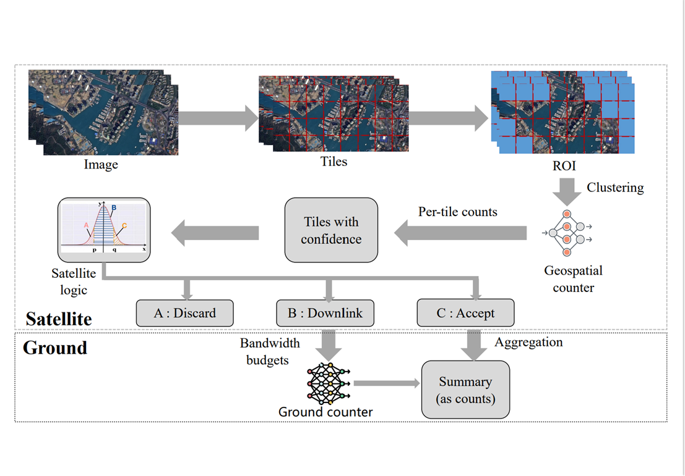

# Satellite-ground-joint-inference

## Motivation

With the rapid proliferation of large Low Earth Orbit (LEO) satellite constellations, a huge amount of in-orbit data is generated and needs to be transmitted to the ground for processing. However, traditional LEO satellite constellations, which downlink raw data to the ground, are significantly restricted in transmission capability.

### Goals

* Incorporates a combination of techniques to minimize detection errors under energy and bandwidth constraints.
* Implement the method we designed on multiple datasets such as xView, UAVOD10, DOTA, etc.
* Comparing our devised method with existing methods for error rate and bandwidth savings.

## Design Details

### Architechture

### Workflow

**Step0:**

For each image, divide images into tiles with a relatively lower execution overhead.

**Step1:**

Filter out the tiles we are interested in through a simple two-category CNN model.

**Step2:**

Using a low-dimension label vector that indicates the geographic features described by computing moments present in each image tile to cluster the representative image tiles by similarity.

**Step3:**

We ensures that downlinking stays within the bandwidth budget constraint while downlinking as many tiles as possible to the ground to minimize counting errors.

The selection logic, based on the confidence threshold from the DNN counter in space, is divided into three groups: when confidence threshold is relatively smaller (i.e.,< confp), we discards them directly; when confidence threshold is large enough (i.e., > confq), we accepts the counting result; only when confidence threshold is between confp and confq (i.e., [confp, confq]), we downlinks the tiles and executes them on the ground DNN counter.

**Step4:**

During each communication cycle between the satellite and the ground station, the tiles that need to be downloaded are downloaded from the satellite to the ground station.

**Step5:**

The counter in the ground station counts the objects of interest in the tiles that are downlinked to the ground station.

**Step6:**

Combine the counting results of the satellite and the ground station to get the final counting result.

## Future development tasks

- Explore a more suitable method for counting on the satellite side to reduce the overall error rate.

- Research on a faster clustering method for similar tiles.
