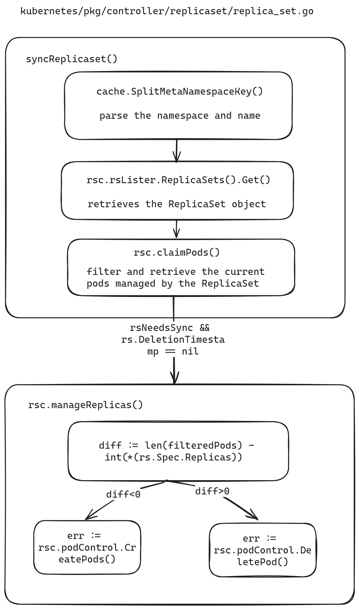

- [Goals](#goals)
- [Proposal](#proposal)
  * [Scope](#scope)
  * [Content](#content)
  * [Target Users](#target-users)
- [Design Details](#design-details)
  * [Garbage Collection](#garbage-collection)
    + [Cascade Deletion in Kubernetes](#cascade-deletion-in-kubernetes)
    + [Sedna Controller Garbage Collection](#sedna-controller-garbage-collection)
      - [Setting Owner References in Joint Inference Controller](#setting-owner-references-in-joint-inference-controller)
  * [Pod Reconstruction](#pod-reconstruction)
    + [Method for Controlling Pod Count in ReplicaSet](#method-for-controlling-pod-count-in-replicaset)
    + [k8s Informer Mechanism](#k8s-informer-mechanism)
      - [Informer Workflow](#informer-workflow)
    + [Joint Inference and Federated Learning Controller Pod Deletion and Reconstruction Design](#joint-inference-and-federated-learning-controller-pod-deletion-and-reconstruction-design)
- [Roadmap](#roadmap)

Sedna leverages KubeEdge's edge-cloud collaboration capabilities to enable cross-edge-cloud collaborative training and inference. Joint inference and federated learning are essential applications of Sedna's edge-cloud collaborative inference. However, the current Sedna project has several functional deficiencies in its joint inference and federated learning controllers, primarily reflected in the following aspects:

1. After creating a joint inference or federated learning task, the generated cloud and edge task instances do not automatically rebuild after being manually deleted, indicating a lack of self-healing capabilities.
2. When a joint inference task is deleted, its generated task instances and service configurations are not cascade-deleted, leading to subsequent joint inference task creation failures.

This proposal aims to optimize the joint inference and federated learning controllers to improve task reconstruction and cascade deletion, thereby enhancing the controllers' functionality and application efficiency.

# Goals
The goals of the optimization of Sedna's joint inference and federated learning controllers optimization are to:

1. Implement cascade deletion for joint inference and federated learning controllers to ensure that task instances and service configurations are synchronously deleted when the tasks are removed, preventing conflicts in subsequent task creation.
2. Enhance the self-healing capabilities of joint inference and federated learning tasks to ensure that task instances are automatically rebuilt and resume normal operation after failure or manual deletion.

# Proposal

## Scope
Sedna joint inference and federated learning controller optimization only modifies the joint inference and federated learning controller codes. The controllers are decoupled from each other, and the function interface and library functions are not modified, so it will not affect the functions of other controllers. For existing application cases, since the CRD is not modified, the deployment of existing applications will not be affected.

Specific modifications are limited to the files `/pkg/globalmanager/controllers/jointinference/jointinferenceservice.go` and `pkg/globalmanager/controllers/federatedlearning/federatedlearningjob.go`.
## Content
This project focuses on optimizing the logic of joint inference and federated learning task controllers, with no impact on other modules.

1. **Cascade Deletion of Joint Inference and Federated Learning Tasks**
   - Analyze the current deletion mechanism of custom resources (CRs) and leverage Kubernetes' cascade deletion mechanism to implement cascade deletion for CRs.
   - Ensure that task instances and service configurations are synchronously deleted when joint inference and federated learning tasks are removed.
   - Optimize existing code to ensure the accuracy and reliability of the cascade deletion functionality.

2. **Self-Healing Capability of Joint Inference and Federated Learning Tasks**
   - Analyze the self-healing mechanisms in Kubernetes' ReplicaSet and KubeEdge's edge application controller, and design and implement a task instance self-healing mechanism.
   - Ensure that both cloud and edge task instances automatically rebuild and resume normal operation after failure or manual deletion.
   - Develop and optimize related code to ensure the stability of the self-healing functionality.

3. **Testing and Verification**
   - Supplement unit tests and end-to-end (e2e) tests to ensure the optimized controllers operate correctly.
   - Demonstrate functionality using existing joint inference and federated learning demos.

4. **Documentation Updates**
   - Update application instance demonstration documentation to describe the reasons for modifications and the usage methods of the optimized cases.
## Target Users

Users of Sedna's joint inference and federated learning applications.

# Design Details

## Garbage Collection

### Cascade Deletion in Kubernetes

In Kubernetes, the Owner Reference provides information about the relationships between objects, allowing the control plane and other API clients to clean up associated resources when an object is deleted. The garbage collector can implement cascade deletion functionality based on this relationship.

Each resource's metadata includes an `ownerReferences` field, an array indicating its owners. When an owner resource is deleted, it is removed from this array, and the garbage collector will reclaim the resource once all owners are deleted.
### Sedna Controller Garbage Collection
The Owner Reference relationships for JointInferenceService is depicted in the following diagrams:

The Owner Reference relationships for FederatedLearningJob is depicted in the following diagrams:


#### Setting Owner References in Joint Inference Controller
Taking the Joint Inference Controller as an example, the Owner Reference setting process involves several steps:

In `pkg/globalmanager/controllers/jointinference/jointinferenceservice.go`, the controller name and CR kind name are defined:
```go
    // Name is this controller name
    Name = "JointInference"

    // KindName is the kind name of CR this controller controls
    KindName = "JointInferenceService"
```
The GroupVersionKind for the controller type is defined as follows:
```go
// Kind contains the schema.GroupVersionKind for this controller type.
var Kind = sednav1.SchemeGroupVersion.WithKind(Name)
```
The `run` function starts the controller, defines the number of workers, and sets up worker threads:
```go
for i := 0; i < workers; i++ { go wait.Until(c.worker, time.Second, stopCh) }
```
In the `worker` function, tasks are dequeued, processed, and marked as done:
```go
// worker runs a worker thread that just dequeues items, processes them, and marks them done.
// It enforces that the sync is never invoked concurrently with the same key.
func (c *Controller) worker() {
    for c.processNextWorkItem() {
    }
}
```
The `sync` function parses the key to get the namespace and name:
```go
ns, name, err := cache.SplitMetaNamespaceKey(key)
if err != nil {
    return false, err
}
if len(ns) == 0 || len(name) == 0 {
    return false, fmt.Errorf("invalid jointinference service key %q: either namespace or name is missing", key)
}
```
It then retrieves the JointInferenceService object from the lister:
```go
sharedService, err := c.serviceLister.JointInferenceServices(ns).Get(name)
if err != nil {
    if errors.IsNotFound(err) {
        klog.V(4).Infof("JointInferenceService has been deleted: %v", key)
        return true, nil
    }
    return false, err
}
service := *sharedService
```
The GroupVersionKind is set:
```go
service.SetGroupVersionKind(Kind)
```
A selector is generated, and associated pods are listed:
```go
selector, _ := runtime.GenerateSelector(&service)
pods, err := c.podStore.Pods(service.Namespace).List(selector)
if err != nil {
    return false, err
}
klog.V(4).Infof("list jointinference service %v/%v, %v pods: %v", service.Namespace, service.Name, len(pods), pods)
```
When no worker failures occur, and if no associated pods exist, the `createWorkers` function is called to create pods:
```go
else {
        if len(pods) == 0 {
            active, manageServiceErr = c.createWorkers(&service)
        }
```
In the `createWorkers` function, `createCloudWorker` and `createEdgeWorker` are called to create cloud and edge worker pods. The `runtime.CreatePodWithTemplate` function creates pods, with the OwnerReference set as follows:
```go
    if controllerRef != nil {
        pod.OwnerReferences = append(pod.OwnerReferences, *controllerRef)
    }
```
## Pod Reconstruction
Pod automatic reconstruction upon failure is determined by the restart policy (RestartPolicy). In JointInferenceService, RestartPolicy is not explicitly set, defaulting to `always`. During joint inference tasks, if issues such as improper EdgeMesh configuration arise, causing the edge pod to fail to access the cloud for inference, the edge pod will continuously restart. In FederatedLearningJob, RestartPolicy is set to `OnFailure`.
### Method for Controlling Pod Count in ReplicaSet


The ReplicaSet controller ensures the actual state matches the desired state by creating or deleting pods to achieve the desired replica count. The `syncReplicaSet` function is responsible for this, including the following steps:
Parse namespace and name:
```go
namespace, name, err := cache.SplitMetaNamespaceKey(key)
```
Get the ReplicaSet object:
```go
rs, err := rsc.rsLister.ReplicaSets(namespace).Get(name)
```
Filter and claim the pods managed by the ReplicaSet:
```go
filteredPods, err = rsc.claimPods(ctx, rs, selector, filteredPods)
```
Ensure the ReplicaSet's actual state matches the desired state by calling `manageReplicas` to create or delete pods:
```go
if rsNeedsSync && rs.DeletionTimestamp == nil {
    manageReplicasErr = rsc.manageReplicas(ctx, filteredPods, rs)
}
```
Calculate the difference between the current pod count and the desired replica count:
```go
diff := len(filteredPods) - int(*(rs.Spec.Replicas))
```
Create or delete pods based on the difference:
```go
if diff < 0 {
    ...
    err := rsc.podControl.CreatePods(ctx, rs.Namespace, &rs.Spec.Template, rs, metav1.NewControllerRef(rs, rsc.GroupVersionKind))
    ...
} else if diff > 0 {
    ...
    rsc.podControl.DeletePod(ctx, rs.Namespace, targetPod.Name, rs)
    ...
}
```
### k8s Informer Mechanism
In Kubernetes, Informers are used instead of Controllers to access the API Server. All operations of the Controller interact with the Informer, and the Informer does not access the API Server every time. The Informer uses the ListAndWatch mechanism. When the Informer starts for the first time, it calls the LIST API to get all the latest versions of the resource objects, and then uses the WATCH API to monitor changes to these objects. It maintains event information in a read-only cache queue, improving query efficiency and reducing the load on the API Server.

Explain the components in the Informer Mechanism based on the flowchart:
- **Controller**: The implementation carrier of the Informer, which can create a Reflector and control the processLoop. The processLoop pops data from the DeltaFIFO queue, first calling the Indexer to cache and index the data, and then distributing it to the processor for handling.
- **Reflector**: The Informer does not directly access the Kubernetes API server but does so through an object called a Reflector. The Reflector monitors specified Kubernetes resources through ListAndWatch. When a resource changes, such as an Added event, it stores the resource object in the local cache DeltaFIFO.
- **DeltaFIFO**: A first-in, first-out cache queue used to store various events returned by the Watch API, such as Added, Updated, and Deleted.
- **LocalStore**: The cache of the Informer, which stores objects from the API server (some of which may still be in the DeltaFIFO). When users query objects, they directly retrieve them from the cache, reducing the load on the API server. LocalStore is only accessed by the Lister's List/Get methods.
- **WorkQueue**: After DeltaFIFO receives an event, it first stores the event in its data structure and then directly operates on the data stored in the Store. After updating the Store, DeltaFIFO pops the event to the WorkQueue. The Controller receives the event from the WorkQueue and triggers the corresponding callback function based on the event type.

#### Informer Workflow
- Informer will first list/watch the apiserver. The Reflector package used by Informer is responsible for establishing a connection with the apiserver. Reflector uses the ListAndWatch method to list all instances of the resource from the apiserver. The list will get the latest resourceVersion of the object, and then use the watch method to monitor all changes after the resourceVersion. If an exception occurs in the middle, reflector will try to monitor all changes from the disconnected resourceVersion again. Once the instance of the object is created, deleted, or updated, Reflector will receive an "event notification". At this time, the combination of the event and its corresponding API object is called a delta, which will be placed in the DeltaFIFO.
- Informer will continuously read deltas from this DeltaFIFO. Every time an object is taken out, Informer will determine the time type of the delta and then create or update the local cache, that is, the store.
- If the event type is Added, the Informer will save the API object in the increment to the local cache through the Indexer library and create an index for it. If it is a delete operation, the object will be deleted from the local cache.
- DeltaFIFO pops this event to the controller, and the controller calls the previously registered ResourceEventHandler callback function to process it.
- In the ResourceEventHandler callback function, it actually just does a simple filtering, and then puts the object of interest into the workqueue.
- The Controller takes the object from the workqueue and starts a worker to execute its own business logic. The business logic usually calculates the difference between the current state of the cluster and the state that the user wants to achieve, and then lets the apiserver evolve the state to the state that the user wants to achieve, such as creating new pods for deployment, or scaling up/down deployment.
- In the worker, you can use the lister to obtain resources without frequently accessing the apiserver, because changes to resources in the apiserver will be reflected in the local cache.
### Joint Inference and Federated Learning Controller Pod Deletion and Reconstruction Design

Taking `jointinferenceservice.go` as an example, the `New()` function creates a new `JointInferenceService` controller to keep the related pods in sync with the corresponding `JointInferenceService` objects. Within the `New()` function, the `informers` are initialized as follows:
```go
podInformer := cc.KubeInformerFactory.Core().V1().Pods()

serviceInformer := cc.SednaInformerFactory.Sedna().V1alpha1().JointInferenceServices()
```
The service informer uses a custom handler:
```go
serviceInformer.Informer().AddEventHandler(cache.ResourceEventHandlerFuncs{
    AddFunc: func(obj interface{}) {
        jc.enqueueController(obj, true)
        jc.syncToEdge(watch.Added, obj)
    },
    UpdateFunc: func(old, cur interface{}) {
        jc.enqueueController(cur, true)
        jc.syncToEdge(watch.Added, cur)
    },
    DeleteFunc: func(obj interface{}) {
        jc.enqueueController(obj, true)
        jc.syncToEdge(watch.Deleted, obj)
    },
})
```
The pod informer uses a custom handler:
```go
podInformer.Informer().AddEventHandler(cache.ResourceEventHandlerFuncs{
    AddFunc:    jc.addPod,
    UpdateFunc: jc.updatePod,
    DeleteFunc: jc.deletePod,
})
```
The `EventHandler` (`addPod`, `updatePod`, `deletePod`) here merely adds the related objects to the queue without performing any additional processing.
`podInformer.Lister()` creates a `Lister()` to retrieve Pod resources, and `podInformer.Informer().HasSynced` checks if the informer's cache has synced.
```go
jc.serviceLister = serviceInformer.Lister()
jc.serviceStoreSynced = serviceInformer.Informer().HasSynced
//...
jc.podStore = podInformer.Lister()
jc.podStoreSynced = podInformer.Informer().HasSynced
```
The process of synchronizing resources from the API server is handled in the `Run()` function of the `jointinferenceservice` controller. The `Run()` function starts the main goroutine responsible for watch and sync services.
```go
if !cache.WaitForNamedCacheSync(Name, stopCh, c.podStoreSynced, c.serviceStoreSynced) {
    klog.Errorf("failed to wait for %s caches to sync", Name)
    return
}
```
After starting the informer and waiting for the local cache to sync, workers are started. Upon receiving a change event, the changed object is retrieved from the event, an object key in the form of `namespace/name` is generated, and the key is placed into the worker queue. The `worker()` function calls `c.processNextWorkItem()` function.
```go
func (c *Controller) worker() {
    for c.processNextWorkItem() {
    }
}
```
The `processNextWorkItem` function retrieves the key from the worker queue, calls `sync()`, which uses the lister to fetch the actual object from the local cache, and executes the actual business logic. Therefore, in the `sync()` function, logic related to automatically rebuilding pods upon deletion is added. Below is the code logic diagram for pod rebuilding.

# Roadmap

- **2024-07-26 to 2024-08-01:** Implement all cascade deletion functionalities.
- **2024-08-02 to 2024-08-15:** Implement pod reconstruction functionality.
- **2024-08-16 to 2024-08-22:** Submit pull request (PR).
- **2024-08-23 to 2024-08-29:** Complete testing, demonstrate cases, and conclude the project.
