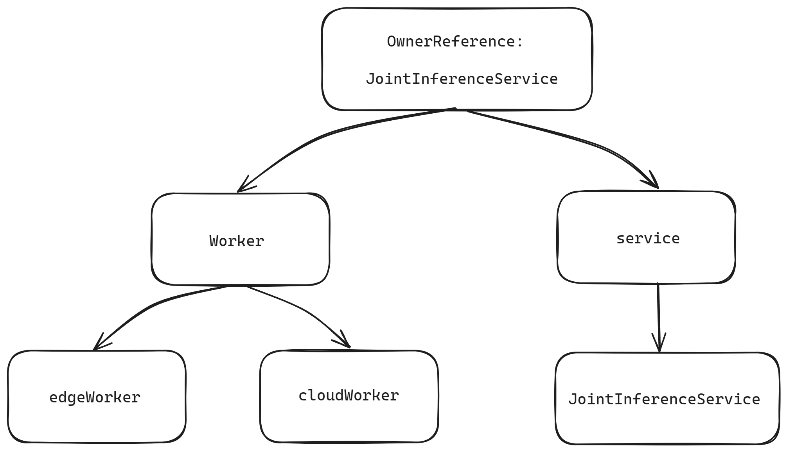

- [Goals](#goals)
- [Proposal](#proposal)
  - [Scope](#scope)
  - [Content](#content)
  - [Target Users](#target-users)
- [Design Details](#design-details)
  - [Garbage Collection](#garbage-collection)
    - [Cascade Deletion in Kubernetes](#cascade-deletion-in-kubernetes)
    - [Sedna Controller Garbage Collection](#sedna-controller-garbage-collection)
      - [Setting Owner References in Joint Inference Controller](#setting-owner-references-in-joint-inference-controller)
  - [Pod Reconstruction](#pod-reconstruction)
    - [K8S Informer Mechanism](#k8s-informer-mechanism)
      - [Informer Workflow](#informer-workflow)
    - [Informer Workflow for Joint Inference and Federated Learning Controllers](#informer-workflow-for-joint-inference-and-federated-learning-controllers)
    - [Design of the Pod Reconstruction Solution for Federated Learning](#design-of-the-pod-reconstruction-solution-for-federated-learning)
      - [Code Logic](#code-logic)
    - [Design of the Pod Reconstruction Solution for Joint Inference](#design-of-the-pod-reconstruction-solution-for-joint-inference)
    - [Federated learning modifies the CRD to update the pod](#federated-learning-modifies-the-crd-to-update-the-pod)
      - [Code Logic](#code-logic-1)
    - [Joint Inference modifies the CRD to update the pod](#joint-inference-modifies-the-crd-to-update-the-pod)
      - [Code Logic](#code-logic-2)
- [Testing](#testing)
  - [Federated Learning Unit Tests](#federated-learning-unit-tests)
    - [`Test_deletePod()`](#test_deletepod)
      - [Delete the existing pod and recreate it](#delete-the-existing-pod-and-recreate-it)
      - [Delete non-existent pods](#delete-non-existent-pods)
    - [`Test_updateJob()`](#test_updatejob)
  - [Joint Inference Unit Tests](#joint-inference-unit-tests)
    - [`Test_UpdateService()`](#test_updateservice)


Sedna leverages KubeEdge's edge-cloud collaboration capabilities to enable cross-edge-cloud collaborative training and inference. Joint inference and federated learning are essential applications of Sedna's edge-cloud collaborative inference. However, the current Sedna project has several functional deficiencies in its joint inference and federated learning controllers, primarily reflected in the following aspects:

1. After creating a joint inference or federated learning task, the generated cloud and edge task instances do not automatically rebuild after being manually deleted, indicating a lack of self-healing capabilities.
2. When a joint inference task is deleted, its generated task instances and service configurations are not cascade-deleted, leading to subsequent joint inference task creation failures.

This proposal aims to optimize the joint inference and federated learning controllers to improve task reconstruction and cascade deletion, thereby enhancing the controllers' functionality and application efficiency.

# Goals

The goals of the optimization of Sedna's joint inference and federated learning controllers optimization are to:

1. Implement cascade deletion for joint inference and federated learning controllers to ensure that task instances and service configurations are synchronously deleted when the tasks are removed, preventing conflicts in subsequent task creation.
2. Enhance the self-healing capabilities of joint inference and federated learning tasks to ensure that task instances are automatically rebuilt and resume normal operation after failure or manual deletion.
3. Modify the Joint Inference and Federated Learning CRD to enable automatic updates of pod configurations.

# Proposal

## Scope

The optimization of the Sedna Joint Inference and Federated Learning controllers only modifies the Joint Inference and Federated Learning controller code. The controllers are decoupled from each other, and the functions that were changed have been updated in the affected controllers as well. Since no changes were made to the CRD, the deployment of existing applications will not be impacted.

The main changes are in the files `/pkg/globalmanager/controllers/jointinference/jointinferenceservice.go` and `/pkg/globalmanager/controllers/federatedlearning/federatedlearningjob.go`.

Additionally, in the file `/pkg/globalmanager/runtime/worker.go`, to meet the need for creating a `deployment` in joint inference, we modified the `CreateDeploymentWithTemplate` function and the `injectDeploymentParam`. The necessary updates were also made in the files`/pkg/globalmanager/controllers/objectsearch/objectsearchservice.go` and `/pkg/globalmanager/controllers/featureextraction/featureextractionservice.go` where these functions are used. We also added a new function, `UpdateDeploymentWithTemplate`, to handle deployment updates.

The test files are `/pkg/globalmanager/controllers/jointinference/jointinferenceservice_test.go` and `/pkg/globalmanager/controllers/federatedlearning/federatedlearningjob_test.go`.

The test files introduced the `fake` package, which brought in some additional dependency code, increasing the pull request size.

## Content

This project focuses on optimizing the logic of joint inference and federated learning task controllers, with no impact on other modules.

1. **Cascade Deletion of Joint Inference and Federated Learning Tasks**
   - Analyze the current deletion mechanism of custom resources (CRs) and leverage Kubernetes' cascade deletion mechanism to implement cascade deletion for CRs.
   - Ensure that task instances and service configurations are synchronously deleted when joint inference and federated learning tasks are removed.
   - Optimize existing code to ensure the accuracy and reliability of the cascade deletion functionality.

2. **Self-Healing Capability of Joint Inference and Federated Learning Tasks**
   - Analyze the self-healing mechanisms in Kubernetes' ReplicaSet and KubeEdge's edge application controller, and design and implement a task instance self-healing mechanism.
   - Ensure that both cloud and edge task instances automatically rebuild and resume normal operation after failure or manual deletion.
   - Develop and optimize related code to ensure the stability of the self-healing functionality.

3. **Testing and Verification**
   - Supplement unit tests and end-to-end (e2e) tests to ensure the optimized controllers operate correctly.
   - Demonstrate functionality using existing joint inference and federated learning demos.

4. **Documentation Updates**
   - Update application instance demonstration documentation to describe the reasons for modifications and the usage methods of the optimized cases.

## Target Users

Users of Sedna's joint inference and federated learning applications.

# Design Details

## Garbage Collection

### Cascade Deletion in Kubernetes

In Kubernetes, the Owner Reference provides information about the relationships between objects, allowing the control plane and other API clients to clean up associated resources when an object is deleted. The garbage collector can implement cascade deletion functionality based on this relationship.

Each resource's metadata includes an `ownerReferences` field, an array indicating its owners. When an owner resource is deleted, it is removed from this array, and the garbage collector will reclaim the resource once all owners are deleted.

### Sedna Controller Garbage Collection

The Owner Reference relationships for JointInferenceService is depicted in the following diagrams:

The Owner Reference relationships for FederatedLearningJob is depicted in the following diagrams:


#### Setting Owner References in Joint Inference Controller

Taking the Joint Inference Controller as an example, the Owner Reference setting process involves several steps:

In `pkg/globalmanager/controllers/jointinference/jointinferenceservice.go`, the controller name and CR kind name are defined:

```go
    // Name is this controller name
    Name = "JointInference"

    // KindName is the kind name of CR this controller controls
    KindName = "JointInferenceService"
```

The GroupVersionKind for the controller type is defined as follows:

```go
// Kind contains the schema.GroupVersionKind for this controller type.
var Kind = sednav1.SchemeGroupVersion.WithKind(Name)
```

The `run` function starts the controller, defines the number of workers, and sets up worker threads:

```go
for i := 0; i < workers; i++ { go wait.Until(c.worker, time.Second, stopCh) }
```

In the `worker` function, tasks are dequeued, processed, and marked as done:

```go
// worker runs a worker thread that just dequeues items, processes them, and marks them done.
// It enforces that the sync is never invoked concurrently with the same key.
func (c *Controller) worker() {
    for c.processNextWorkItem() {
    }
}
```

The `sync` function parses the key to get the namespace and name:

```go
ns, name, err := cache.SplitMetaNamespaceKey(key)
if err != nil {
    return false, err
}
if len(ns) == 0 || len(name) == 0 {
    return false, fmt.Errorf("invalid jointinference service key %q: either namespace or name is missing", key)
}
```

It then retrieves the JointInferenceService object from the lister:

```go
sharedService, err := c.serviceLister.JointInferenceServices(ns).Get(name)
if err != nil {
    if errors.IsNotFound(err) {
        klog.V(4).Infof("JointInferenceService has been deleted: %v", key)
        return true, nil
    }
    return false, err
}
service := *sharedService
```

The GroupVersionKind is set:

```go
service.SetGroupVersionKind(Kind)
```

A selector is generated, and associated pods are listed:

```go
selector, _ := runtime.GenerateSelector(&service)
pods, err := c.podStore.Pods(service.Namespace).List(selector)
if err != nil {
    return false, err
}
klog.V(4).Infof("list jointinference service %v/%v, %v pods: %v", service.Namespace, service.Name, len(pods), pods)
```

When no worker failures occur, and if no associated pods exist, the `createWorkers` function is called to create pods:

```go
else {
        if len(pods) == 0 {
            active, manageServiceErr = c.createWorkers(&service)
        }
```

In the `createWorkers` function, `createCloudWorker` and `createEdgeWorker` are called to create cloud and edge worker pods. The `runtime.CreatePodWithTemplate` function creates pods, with the OwnerReference set as follows:

```go
    if controllerRef != nil {
        pod.OwnerReferences = append(pod.OwnerReferences, *controllerRef)
    }
```

## Pod Reconstruction

The automatic reconstruction of a failed Pod is determined by the RestartPolicy. In the JointInferenceService, the RestartPolicy is not explicitly set, so the default is always. During the joint inference task, if an issue arises, such as EdgeMesh being improperly configured, preventing the edge from accessing the cloud's port 5000 for cloud-based inference, the edge pod will continuously restart. In the FederatedLearningJob, the RestartPolicy is set to OnFailure.

### K8S Informer Mechanism

Pod Reconstruction

The automatic reconstruction of a failed Pod is determined by the RestartPolicy. In the JointInferenceService, the RestartPolicy is not explicitly set, so the default is always. During the joint inference task, if an issue arises, such as EdgeMesh being improperly configured, preventing the edge from accessing the cloud's port 5000 for cloud-based inference, the edge pod will continuously restart. In the FederatedLearningJob, the RestartPolicy is set to OnFailure.
K8S Informer Mechanism

Kubernetes uses an Informer instead of a Controller to access the API Server. All Controller operations interact with the Informer, which does not access the API Server each time. Informer uses a ListAndWatch mechanism. When the Informer starts for the first time, it calls the LIST API to retrieve the latest versions of all resource objects and then uses the WATCH API to monitor changes to these objects. This event information is maintained in a read-only cache queue to improve query efficiency and reduce the load on the API Server.


According to the diagram, let's explain the roles of some components in the Informer:

Controller: The core of the Informer, it can create reflectors and control the processLoop. The processLoop pops data from the DeltaFIFO queue, first calls the Indexer for caching and indexing, and then distributes it to the processor for handling.

Reflector: The Informer does not directly access the k8s API server but uses a Reflector to do so. The Reflector monitors specific Kubernetes resources through ListAndWatch. When a resource changes, such as an Added event, the resource object is stored in the local DeltaFIFO cache.

DeltaFIFO: A first-in-first-out cache queue used to store various events returned by the Watch API, such as Added, Updated, and Deleted.

LocalStore: The cache of the Informer, which stores objects from the API server (some of which may still be in DeltaFIFO). Users query the cache directly, reducing the API server's load. LocalStore is accessed by the Lister's List/Get methods.

WorkQueue: After DeltaFIFO receives an event, it stores the event in its data structure, directly operates the data stored in the Store, updates the Store, and then pops the event into the WorkQueue. The Controller triggers the corresponding callback function based on the event type received in the WorkQueue.


#### Informer Workflow

- Informer first lists/watches the API server. The Reflector handles the connection, listing all instances of the resource and monitoring changes through the watch method. If the connection is interrupted, it resumes from the latest resourceVersion. When instances are created, deleted, or updated, the Reflector receives event notifications, which are placed into DeltaFIFO.

- Informer reads these deltas from DeltaFIFO, determines the event type, and updates the local cache accordingly.

- For Added events, the Informer saves the object to the local cache via the Indexer and creates an index. For Deleted events, it removes the object from the cache.

- DeltaFIFO then pops the event into the Controller, which calls the ResourceEventHandler callback for handling.

- ResourceEventHandler filters and places the relevant objects into the WorkQueue.

- The Controller retrieves objects from the WorkQueue, launches a worker, and executes business logic. This typically involves comparing the cluster's current state with the desired state and instructing the API server to make adjustments, like creating new pods for a deployment.

- Workers can use the Lister to get resources from the cache, avoiding frequent access to the API server.

There are three types of `ResourceEventHandler` functions in Informer:

```go
// ResourceEventHandlerFuncs is an adaptor to let you easily specify as many or  
// as few of the notification functions as you want while still implementing  
// ResourceEventHandler.  
type ResourceEventHandlerFuncs struct {  
    AddFunc    func(obj interface{})  
    UpdateFunc func(oldObj, newObj interface{})  
    DeleteFunc func(obj interface{})  
}
```

The logic for these three functions is user-defined. After registering the `ResourceEventHandler` during controller initialization, the corresponding `ResourceEventHandler` will be triggered whenever an instance of the object is created, deleted, or updated.

### Informer Workflow for Joint Inference and Federated Learning Controllers


Taking `jointinferenceservice.go` as an example, the `New()` function creates a new `JointInferenceService` controller to keep the relevant pods in sync with the corresponding `JointInferenceService` objects. In the `New()` function, the `informer` is initialized.

```go
podInformer := cc.KubeInformerFactory.Core().V1().Pods()

serviceInformer := cc.SednaInformerFactory.Sedna().V1alpha1().JointInferenceServices()
```

The service informer uses a custom handler:

```go
    serviceInformer.Informer().AddEventHandler(cache.ResourceEventHandlerFuncs{
        AddFunc: func(obj interface{}) {
            jc.enqueueController(obj, true)
            jc.syncToEdge(watch.Added, obj)
        },
        UpdateFunc: func(old, cur interface{}) {
            jc.enqueueController(cur, true)
            jc.syncToEdge(watch.Added, cur)
        },

        DeleteFunc: func(obj interface{}) {
            jc.enqueueController(obj, true)
            jc.syncToEdge(watch.Deleted, obj)
        },
    })
```

The pod informer uses a custom handler:

```go
    podInformer.Informer().AddEventHandler(cache.ResourceEventHandlerFuncs{
        AddFunc:    jc.addPod,
        UpdateFunc: jc.updatePod,
        DeleteFunc: jc.deletePod,
    })
```

The `EventHandler` functions (`addPod`, `updatePod`, `deletePod`) here simply add the relevant objects to the queue without performing any other processing.

`podInformer.Lister()` creates a `Lister()` to retrieve Pod resources, and `podInformer.Informer().HasSynced` checks whether the Informer's cache has been synchronized.

```go
    jc.serviceLister = serviceInformer.Lister()
    jc.serviceStoreSynced = serviceInformer.Informer().HasSynced
    //...
    jc.podStore = podInformer.Lister()
    jc.podStoreSynced = podInformer.Informer().HasSynced
```

The process of synchronizing resources from the API server is carried out by the jointinferenceservice controller in the Run() function. The Run() function starts the main goroutine responsible for the watch and sync services.

```go
    if !cache.WaitForNamedCacheSync(Name, stopCh, c.podStoreSynced, c.serviceStoreSynced) {
        klog.Errorf("failed to wait for %s caches to sync", Name)
        return

    }
```

After starting the Informer, it waits for the local cache to sync before launching the workers. When a change event is received, the changed object is retrieved from the event, an object key (in the form of namespace/name) is generated, and the key is placed into the worker queue. The `worker()` function then calls the `c.processNextWorkItem()` function.

```go
func (c *Controller) worker() {
    for c.processNextWorkItem() {
    }
}
```

The `processNextWorkItem` function retrieves the key from the worker queue and calls `sync()`. In the `sync()` function, it fetches the actual object from the local cache using the lister and performs the relevant synchronization operations.

### Design of the Pod Reconstruction Solution for Federated Learning


Listen for delete events. When the Informer detects a delete event with `OwnerReference` set to `FederatedLearning`, it triggers the `DeletePod` function, which reconstructs the pod. The newly created pod will be almost identical to the original pod, retaining its configuration and specifications, but its resource version and UID will be reset to allow for regeneration.

#### Code Logic

- Pre-Reconstruction Check
  - Check if the pod is owned by a `FederatedLearningJob`.
  - Check if the pod has already been recreated: use `c.recreatedPods.Load(pod.Name)` to verify if this pod has already been recreated. If it has been recreated, do not attempt to recreate it again.
- Recreate Pods
  - Use `pod.DeepCopy()` to create a deep copy of the pod.
  - Reset certain unique identifiers (such as `ResourceVersion` and `UID`) and status fields.
  - Call the Kubernetes API to create a new pod using `c.kubeClient.CoreV1().Pods(pod.Namespace).Create`.
  - If the creation is successful, log the event and mark the pod as recreated.

```go
    // Create a deep copy of the old pod
    newPod := pod.DeepCopy()
    // Reset the resource version and UID as they are unique to each object
    newPod.ResourceVersion = ""
    newPod.UID = ""
    // Clear the status
    newPod.Status = v1.PodStatus{}
    // Remove the deletion timestamp
    newPod.DeletionTimestamp = nil
    // Remove the deletion grace period seconds
    newPod.DeletionGracePeriodSeconds = nil
    _, err := c.kubeClient.CoreV1().Pods(pod.Namespace).Create(context.TODO(), newPod, metav1.CreateOptions{})
    if err != nil {
        return
    }
```

- Mark as Recreated and Set Timer to Clean Up Record:
  - Use `c.recreatedPods.Store(pod.Name, true)` to mark that this pod has been recreated.
  - Set a timer to clear this mark after 5 seconds (`c.recreatedPods.Delete(pod.Name)`), allowing the reconstruction logic to be triggered again if the pod is deleted once more.

```go
    // mark the pod as recreated
    c.recreatedPods.Store(newPod.Name, true)
    // set a timer to delete the record from the map after a while
    go func() {
        time.Sleep(5 * time.Second)
        c.recreatedPods.Delete(pod.Name)
    }()
```

We add a `sync.Map` type field called `recreatedPods` to the Controller's data structure to prevent a pod from being recreated multiple times during a single delete event. When a pod is manually deleted and successfully recreated, its name is added to `recreatedPods`. If the `deletePod` function is called again during the same delete event, the pod name will already exist in `recreatedPods`, preventing the manually deleted pod from being deleted and recreated again. A timer is also set to clear the mark after 5 seconds, allowing the reconstruction logic to be triggered again if the pod is manually deleted later.

```go
type Controller struct{
	//...
	preventRecreation bool
	//...
}
```


### Design of the Pod Reconstruction Solution for Joint Inference


Inference tasks are stateless workloads, so Kubernetes' native component `Deployment` can be leveraged for pod self-healing. A complete process for monitoring and handling resource changes needs to be built. The `Deployment Informer` can replace the `Pod Informer` to manage `worker` control.

- Obtain the `Deployment Informer` resource from the informer factory.
- Register event handlers (`addDeployment`, `updateDeployment`, `deleteDeployment`) in the informer.
- Start the informer and sync data with the Kubernetes API.
- Before processing events, wait for the local cache to synchronize with the API Server.
- When a `Deployment` resource in the cluster changes, the `Informer` will trigger the corresponding event handler.


In addition, to ensure that the `deployment` resource is not accidentally deleted, we adopt the same method used in Federated Learning for recreating `pods` to recreate the `deployment`.

### Federated learning modifies the CRD to update the pod

Flowchart for updating pod by modifying the CRD in the Federated Learning controller:


Listen for update events: When the Informer detects an update event related to the `FederatedLearningJob`, if there are changes in the CRD, the original pod is deleted, and a new pod is created based on the updated parameters in the CRD.

#### Code Logic

The `updateJob` function is triggered, and it first checks whether an update is necessary.

- If `old` and `cur` cannot be converted into `*sednav1.FederatedLearningJob` objects, it returns immediately.
- If the `ResourceVersion` of `oldJob` and `curJob` are the same, it indicates there are no changes, so the function returns without processing the update.
- Set the `preventRecreation` flag to true to prevent Pod recreation during the update process.
  Next, compare the parameters of `oldJob` and `curJob`.
- Compare the `old.Generation` and `cur.Generation` fields. The CRD has a `Generation` field within its `Spec`. This field is automatically generated and increments by 1 every time the CRD object is created or modified, starting at 1 during creation. The `Generation` field only changes when the `Spec` is modified, not when the `Status` is updated. Therefore, this field can be used to determine if a change occurred in the `Spec`. If they are not equal, it means that the parameters of the `FederatedLearningJob` have changed.
- Then, it iterates through the list of Pods and deletes each one.
- Use the updated `curJob.Spec` to recreate the `AggWorker` and `TrainWorker`.
- Finally, reset the `preventRecreation` flag to `false` to allow future Pod self-healing without interference.

### Joint Inference modifies the CRD to update the pod

Flowchart for updating pod by modifying the CRD in the Joint Inference controller:


When an update event is detected, if the Informer detects an update to the `JointInferenceService`, and there are changes to the CRD, the `deployment` will be updated according to the new parameters in the CRD.

#### Code Logic

The logic for updating pods by modifying the CRD in Joint Inference is largely the same as in Federated Learning.

Relevant fields are compared, and if they are not equal, it indicates that the parameters of the `JointInferenceService` have changed. The `cloudWorker` and `edgeWorker` are updated using the new `curService.Spec`.


# Testing

## Federated Learning Unit Tests

Unit tests are used instead of end-to-end tests, focusing on testing the two modified functions: `deletePod()` and `updateJob()`.

### `Test_deletePod()`

#### Delete the existing pod and recreate it

- A simulated Kubernetes client is created using `fake.NewSimpleClientset()`.
- A test pod is created through the `fakeclient`.
- A controller is created, and the `fakeclient` is registered with it.
- The test pod is passed to the `controller.deletePod()` function, and `fakeClient.CoreV1().Pods("default").Get(context.TODO(), "test-pod", metav1.GetOptions{})` is used to check if the pod has been recreated; if it has not been recreated, the test fails.

#### Delete non-existent pods

- Create a simulated client.
- Create a controller.
- Call `controller.deletePod()` to delete a non-existent pod.
- Confirm whether an error occurs.

### `Test_updateJob()`

- Mock the pod list process.
- Create a simulated client.
- Create datasets, models, and relevant job and pod resources.
- Initialize the controller, passing in the simulated client, test jobs, mocked pod list, and other necessary dependencies.
- Define a new job and update some of its parameters (changing the `batch_size` in `TrainingWorker` from `32` to `16`).
- Call the `updateJob` function to update the old job to the new job, simulating the job update process in a real environment.
- Validate the update results; if the parameters match the expectations after the update, the test passes.


## Joint Inference Unit Tests

### `Test_UpdateService()`

- Create simulated clients for Sedna and Kubernetes.
- Create an old service that includes configuration information for the cloud worker and edge worker, as well as two model resources.
- Create deployment and pod resources based on the old service.
- Initialize the controller, setting it up with the simulated client, pod list, and deployment list.
- The controller's `sendToEdgeFunc` is set to an empty function (not performing actual edge communication).
- A copy of the old joint inference service is made, modifying the hard example mining parameter in the edge worker from `value1` to `value2`, while also incrementing the service's `Generation` value.
- Call the controller's `updateService` function to trigger an update to the joint inference service.
- The test verifies whether the updated joint inference service can be successfully retrieved through the simulated client.
- Check whether the updated HEM parameter has been correctly changed from `value1` to `value2`, ensuring that the service update logic executes correctly.
