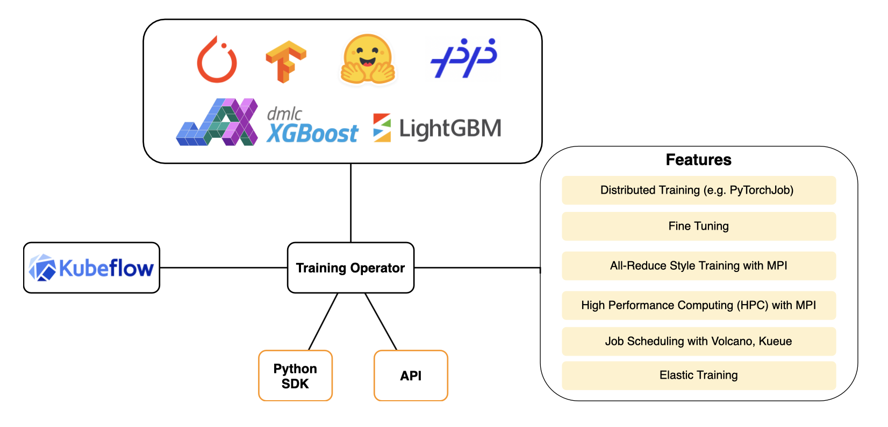
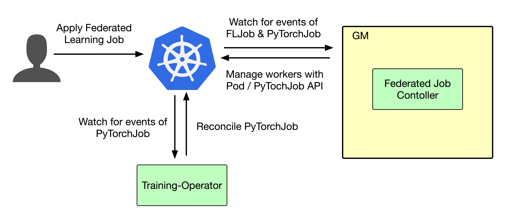

- [Sedna Federated Learning V2](#sedna-federated-learning-v2)
    - [Background](#background)
    - [Motivation](#motivation)
        - [Goals and Non-Goals](#goals-and-non-goals)
    - [User Story](#user-story)
    - [Proposal](#proposal)
        - [Use Cases](#use-cases)
    - [Design Details](#design-details)
        - [New Fields in FederatedLearningJob CRD](#new-fields-in-federatedlearningjob-crd)
        - [Sedna Federated Learning Example](#sedna-federated-learning-example)
    - [Controller Design](#controller-design)
        - [Federated Learning Controller](#federated-learning-controller)
        - [Downstream Controller](#downstream-controller)
        - [Upstream Controller](#upstream-controller)
        - [Details of API between GM(cloud) and LC(edge)](#details-of-api-between-gmcloud-and-lcedge)
        - [The Flow of Federated Learning Job Creation](#the-flow-of-federated-learning-job-creation)
    - [Workers Communication](#workers-communication)


# Sedna Federated Learning V2

## Background

[KubeEdge](https://kubeedge.io) is an open source system for extending native containerized application orchestration capabilities to hosts at Edge. It is built upon kubernetes and provides fundamental infrastructure support for network, application deployment and metadata synchronization between cloud and edge.

[Sedna](https://github.com/kubeedge/sedna) is an edge-cloud synergy AI project incubated in KubeEdge SIG AI. Benefiting from the edge-cloud synergy capabilities provided by KubeEdge, Sedna can implement across edge-cloud collaborative training and collaborative inference capabilities, such as joint inference, incremental learning, federated learning, and lifelong learning.

## Motivation

Currently, we want to **integrate Sedna with a high-performance gang-scheduler like [Volcano](https://volcano.sh/en/)** to provide users with more AI-specific scheduling capabilities and resolve the performance drawbacks brought by default scheduler.

However, **gang-scheduler only makes sense when we execute the distributed tasks**. Many job patterns in Sedna are now, of nature, not in a distributed pattern. Some job sequential job patterns like `IncrementalLearningJob`, execute the training stage sequentially. And bringing in a gang-scheduler is meaningless in this scenario.

In order to:

1. Integrating a high-performance gang-scheduler to Sedna

2. Extending more jobs to distributed patterns to provide users with more powerful model training abilities, such as training large models distributedly.

3. Reduce the workload in development

We **decided to adopt [training-operator](https://github.com/kubeflow/training-operator)**, a state-of-art AI training toolkit on Kubernetes having rich support for multiple ML training frameworks, **as the runtime for our distributed training tasks**. 

(**Note**: In the early stage of integrating Sedna with Training-Operator, we will do some proof-of-concepts work and migrate federated learning jobs to distributed patterns first.)



### Goals and Non-Goals

The goals include:

- Integrate `FederatedLearningJob` with training-operator

- Provide a federated learning example in the new architecture

The non-goals include:

- Integrate other types of training jobs (currently)

- Integrate inference jobs (currently)

## User Story

Nowadays, the number of edge devices explodes in an exponential way, making federated learning more popular in some security-sensitive cloud-edge scenarios. However, the edge devices are heterogenous and have different amounts of resources like CPU, GPU, and memory. It’s unnecessary and impossible to execute federated learning on all of them with the consideration of capability and efficiency. So we just need to place the training task on those devices with abundant resources and use a portion of data for training.

By integrating training-operator, we can schedule training tasks to those devices where richer resources are prepared for training, thus making federated-learning more efficient and practical. And also, we will have various lifecycle managing abilities so that the training process would be more robust and scalable.

## Proposal

We propose **reusing Kubernetes Custom Resource Definitions (CRDs) for federated learning** (i.e. `FederatedLearningJob`) to enable distributed training with training-operator. In this way, we can implement new training runtime with training-operator while maintaining backward compatibility with the default one. 

The design details  will be described in the following chapter. The main ideas of new design are: 

1. Add new fields to the CRD of federated learning (i.e. `FederatedLearningJob`) 

2. Add training-operator runtime (e.g. `PyTorchJob`, `TFJob`) as an alternative to default runtime (i.e. `Pod`)

3. If not specified, `Pod` will be the default runtime so as to maintain backward compatibility.


### Use Cases

Add “specifying training runtime” compared to [the proposal for federated learning](./federated-learning.md):

- Users can create a federated learning job, with providing a training script, specifying the aggregation algorithm, configuring training hyperparameters, configuring training datasets, **specifying training runtime (default/training-operator)**.

- Users can get the federated learning status, including the nodes participating in training, current training status, sample size of each node, current iteration times, and current aggregation times.

- Users can get the saved aggregated model. The model file can be stored on the cloud or edge node.

## Design Details

### New Fields in `FederatedLearningJob` CRD

We decided to add a `TrainingPolicy` field. It allows users to choose two training mode:

1. `Default`: Use the original training mode in Sedna. 

2. **`Distributed`: Use training-operator as the training runtime to orchestrate training tasks**.

When the `Mode` field is set to `Distributed`, users need to specify the framework (e.g. PyTorch, Tensorflow, etc.)  they use to decide the CRD we use in training-operator (e.g. PyTorchJob).

```Golang
// FLJobSpec is a description of a federated learning job
type FLJobSpec struct {
+   TrainingPolicy    TrainingPolicy      `json:"trainingPolicy,omitempty"`

    AggregationWorker AggregationWorker   `json:"aggregationWorker"`

    TrainingWorkers   []TrainingWorker    `json:"trainingWorkers"`

    PretrainedModel   PretrainedModel     `json:"pretrainedModel,omitempty"`

    Transmitter       Transmitter         `json:"transmitter,omitempty"`
}

// TrainingPolicy defines the policy we take in the training phase
type TrainingPolicy struct {
    // Mode defines the training mode, chosen from Default and Distributed
    Mode string `json:"mode,omitempty"`

    // Framework indicates the framework we use(e.g. PyTorch). We will determine the training runtime(i.e. CRDs in training-operator) we adopt to orchestrate training tasks when the Mode field is set to Distributed
    Framework string `json:"framework,omitempty"`
}
```

### Sedna Federated Learning Example

The configuration of federated learning jobs should look like:

```YAML
apiVersion: sedna.io/v1alpha1
kind: FederatedLearningJob
metadata:
  name: surface-defect-detection
spec:
+ trainingPolicy: 
+   mode: Distributed
+   framework: PyTorch
  aggregationWorker:
    model:
      name: "surface-defect-detection-model"
    template:
      spec:
        nodeName: $CLOUD_NODE
        containers:
          - image: $AGGR_IMAGE
            name:  agg-worker
            imagePullPolicy: IfNotPresent
            env: # user defined environments
              - name: "exit_round"
                value: "3"
            resources:  # user defined resources
              limits:
                memory: 2Gi
  trainingWorkers:
    - dataset:
        name: "edge1-surface-defect-detection-dataset"
      template:
        spec:
          nodeName: $EDGE1_NODE
          containers:
            - image: $TRAIN_IMAGE
              name:  train-worker
              imagePullPolicy: IfNotPresent
              env:  # user defined environments
                - name: "batch_size"
                  value: "32"
                - name: "learning_rate"
                  value: "0.001"
                - name: "epochs"
                  value: "2"
              resources:  # user defined resources
                limits:
                  memory: 2Gi
    - dataset:
        name: "edge2-surface-defect-detection-dataset"
      template:
        spec:
          nodeName: $EDGE2_NODE
          containers:
            - image: $TRAIN_IMAGE
              name:  train-worker
              imagePullPolicy: IfNotPresent
              env:  # user defined environments
                - name: "batch_size"
                  value: "32"
                - name: "learning_rate"
                  value: "0.001"
                - name: "epochs"
                  value: "2"
              resources:  # user defined resources
                limits:
                  memory: 2Gi
```

## Controller Design

The new design **will not change the main architecture** of the original Federated Learning Controller, which would start three separate goroutines called `federated-learning`, `upstream`, and `downstream` controllers. 

### Federated Learning Controller



The Federated Learning Controller watches for the updates of `FederatedLearningJob` and the corresponding pods/**`PyTorchJob`** against the Kubernetes API Server.

Updates are categorized below along with the possible actions:

| Update Type | Action |
| --- | --- |
| New Federated Learning Job Created | Create the aggregation worker and these local-training workers |
| Federated Learning Job Deleted | NA. These workers will be deleted by k8s gc |
| The corresponding pod/**PyTorchJob** created/running/completed/failed | Update the status of Federated Learning Job |

### Downstream Controller

Not changed, see [the corresponding section in the federated learning proposal](https://github.com/kubeedge/sedna/blob/main/docs/proposals/federated-learning.md#downstream-controller).


### Upstream Controller

Not changed, see [the corresponding section in the federated learning proposal](https://github.com/kubeedge/sedna/blob/main/docs/proposals/federated-learning.md#upstream-controller).


### Details of API between GM(cloud) and LC(edge)

Not changed, see [the corresponding section in the federated learning proposal](https://github.com/kubeedge/sedna/blob/main/docs/proposals/federated-learning.md#the-flow-of-federated-learning-job-creation)

### The Flow of Federated Learning Job Creation


The Federated Learning Controller watches the creation of `FederatedLearningJob` CRD in the cloud, syncs them to LC via the cloudcore-to-edgecore channel, and creates the aggregator worker on the cloud nodes and the training workers on the edge nodes specified by users.

The aggregator worker and training workers are started by either Pods directly or **`PyTorchJob` indirectly**.

## Workers Communication

Not changed, see [the corresponding section in the federated learning proposal](https://github.com/kubeedge/sedna/blob/main/docs/proposals/federated-learning.md#workers-communication).


