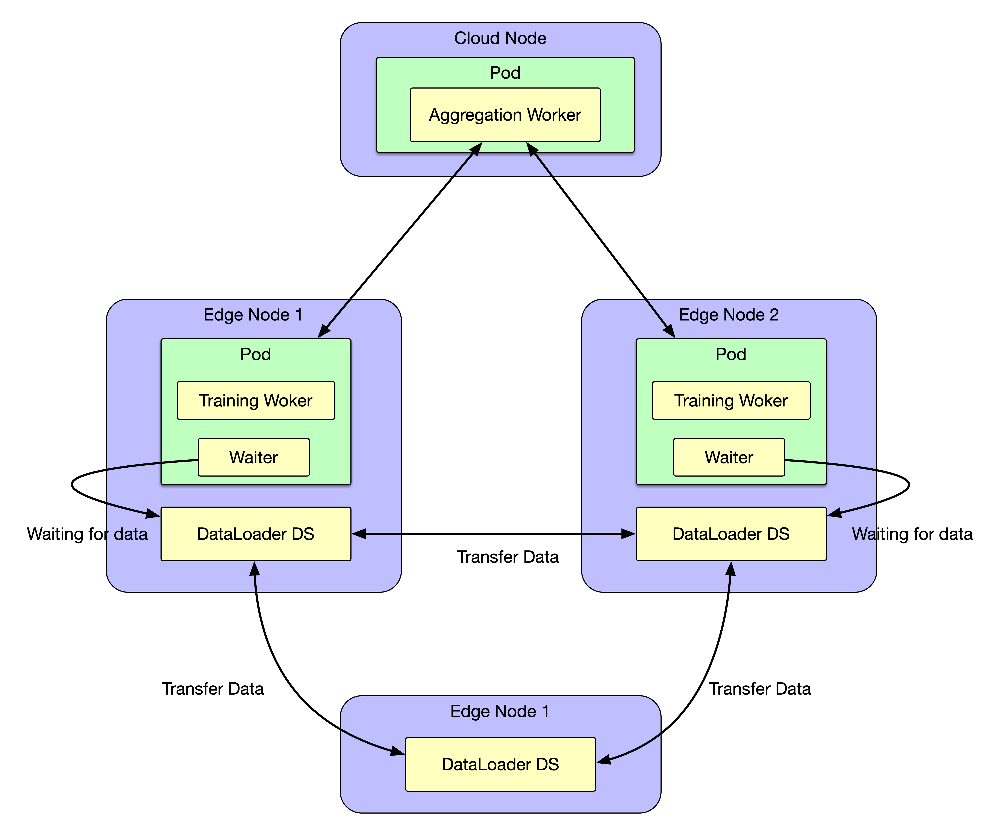

- [Sedna Federated Learning V2](#sedna-federated-learning-v2)
    - [Background](#background)
    - [Motivation](#motivation)
        - [Goals and Non-Goals](#goals-and-non-goals)
    - [User Story](#user-story)
    - [Proposal](#proposal)
        - [Use Cases](#use-cases)
    - [Design Details](#design-details)
        - [Subnet Management](#subnet-management)
        - [FederatedLearningJob CRD](#federatedlearningjob-crd)
        - [DataLoader Daemonset & Waiter Container](#dataloader-daemonset--waiter-container)
    - [Controller Design](#controller-design)
        - [Federated Learning Controller](#federated-learning-controller)
        - [Downstream Controller](#downstream-controller)
        - [Upstream Controller](#upstream-controller)
        - [Details of API between GM(cloud) and LC(edge)](#details-of-api-between-gmcloud-and-lcedge)
        - [The Flow of Federated Learning Job Creation](#the-flow-of-federated-learning-job-creation)
    - [Workers Communication](#workers-communication)


# Sedna Federated Learning V2

## Background

[KubeEdge](https://kubeedge.io) is an open source system for extending native containerized application orchestration capabilities to hosts at Edge. It is built upon kubernetes and provides fundamental infrastructure support for network, application deployment and metadata synchronization between cloud and edge.

[Sedna](https://github.com/kubeedge/sedna) is an edge-cloud synergy AI project incubated in KubeEdge SIG AI. Benefiting from the edge-cloud synergy capabilities provided by KubeEdge, Sedna can implement across edge-cloud collaborative training and collaborative inference capabilities, such as joint inference, incremental learning, federated learning, and lifelong learning.

## Motivation

Currently, we want to **integrate Sedna with a high-performance gang-scheduler like [Volcano](https://volcano.sh/en/)** to provide users with more AI-specific scheduling capabilities and resolve the performance drawbacks brought by default scheduler.

However, **gang-scheduler only makes sense when we execute the distributed tasks**. Many job patterns in Sedna are now, of nature, not in a distributed pattern. Some job sequential job patterns like `IncrementalLearningJob`, execute the training stage sequentially. And bringing in a gang-scheduler is meaningless in this scenario.

In order to:

1. Integrating a high-performance gang-scheduler to Sedna

2. Extending more jobs to distributed patterns to provide users with more powerful model training abilities, such as training large models distributedly.

3. Reduce the workload in development

We **decided to adopt [training-operator](https://github.com/kubeflow/training-operator)**, a state-of-art AI training toolkit on Kubernetes having rich support for multiple ML training frameworks, **as the runtime for our distributed training tasks**. 

(**Note**: In the early stage of integrating Sedna with Training-Operator, we will do some proof-of-concepts work and migrate federated learning jobs to distributed patterns first.)


### Goals and Non-Goals

The goals include:

- Integrate `FederatedLearningJob` with training-operator

- Provide a federated learning example in the new architecture

The non-goals include:

- Integrate other types of training jobs (currently)

- Integrate inference jobs (currently)

## Proposal

In the new design, we assume that:

1. Data can be transferred within a secure subnet.

2. All training workers have the same parameters.

Since federated learning is a training task, it’s in fact data-driven. If we only schedule training tasks without scheduling the training data, the model will have unacceptable training bias. So we need to collect data and distribute it to different training workers to avoid training bias, after which we can execute the federated learning jobs.

Based on the reasons above, we propose **Two-Phase Federated Learning** to enable distributed training with training-operator:

1. **Phase1 - Data Preparation**: Collect training data in edge nodes and distribute them to different training workers. In this phase, federated training tasks are scheduled to nodes but are **blocked** waiting for data.

2. **Phase2 - Training**: Execute federated learning jobs when the training data is ready.

The design details will be described in the following chapter. The main ideas of new design are: 

1. Define subnets using `NodeGroup` in KubeEdge.

2. New version of `FederatedLearningJob`.

3. Add DataLoader Daemonset to collect and distribute data in Federated Learning Phase1.

4. Using `PyTorchJob` CRD in training-operator as the training runtime for federated learning.

5. Add a waiter container to the `initContainer` of training pods to check the readiness of the data.



### Use Cases

- Users can create a federated learning job, with providing a training script, specifying the aggregation algorithm, configuring training hyperparameters, configuring training datasets.

- Users can get the federated learning status, including the nodes participating in training, current training status, sample size of each node, current iteration times, and current aggregation times.

- Users can get the saved aggregated model. The model file can be stored on the cloud or edge node.

## Design Details

### Subnet Management

We will use [NodeGroup](https://github.com/kubeedge/kubeedge/blob/master/docs/proposals/node-group-management.md) in KubeEdge to define subnets for nodes, within which data can be transferred among nodes. This ensures the privacy of the data and enhances the efficiency of training.

### `FederatedLearningJob` CRD

We defines new `FederatedLearningJob` CRD as follows:

```Golang
// FLJobSpec is a description of a federated learning job
type FLJobSpec struct {
    AggregationWorker AggregationWorker `json:"aggregationWorker"`

    TrainingWorkers   TrainingWorker    `json:"trainingWorkers"`

    PretrainedModel   PretrainedModel   `json:"pretrainedModel,omitempty"`

    Transmitter       Transmitter       `json:"transmitter,omitempty"`
}

// TrainingWorker describes the data a training worker should have
type TrainingWorker struct {
    Replicas         int                `json:"replicas"`

    TargetNodeGroups []TargetNodeGroups `json:"targetNodeGroups"`

    Datasets         []TrainDataset     `json:"datasets"`

    TrainingPolicy   TrainingPolicy     `json:"trainingPolicy,omitempty"`

    Template         v1.PodTemplateSpec `json:"template"`
}

// TrainingPolicy defines the policy we take in the training phase
type TrainingPolicy struct {
    // Mode defines the training mode, chosen from Sequential and Distributed
    Mode string `json:"mode,omitempty"`

    // Framework indicates the framework we use(e.g. PyTorch). We will determine the training runtime(i.e. CRDs in training-operator) we adopt to orchestrate training tasks when the Mode field is set to Distributed
    Framework string `json:"framework,omitempty"`
}
```

The configuration of federated learning jobs should look like:

```YAML
apiVersion: sedna.io/v1alpha1
kind: FederatedLearningJob
metadata:
  name: surface-defect-detection
spec:
  aggregationWorker:
    model:
      name: "surface-defect-detection-model"
    template:
      spec:
        nodeName: $CLOUD_NODE
        containers:
          - image: $AGGR_IMAGE
            name:  agg-worker
            imagePullPolicy: IfNotPresent
            env: # user defined environments
              - name: "exit_round"
                value: "3"
            resources:  # user defined resources
              limits:
                memory: 2Gi
   trainingWorkers:
    datasets:
      - edge1-surface-defect-detection-dataset
      - edge2-surface-defect-detection-dataset
    replicas: 2
    targetNodesGroup:
      - surface-detect-nodes-group
    trainingPolicy: 
      mode: Distributed
      framework: PyTorch
    template:
      spec:
        containers:
          - image: $TRAIN_IMAGE
            name:  train-worker
            imagePullPolicy: IfNotPresent
            env:  # user defined environments
              - name: "batch_size"
                value: "32"
              - name: "learning_rate"
                value: "0.001"
              - name: "epochs"
                value: "2"
            resources:  # user defined resources
              limits:
                memory: 2Gi
```

### DataLoader Daemonset & Waiter Container

> **TBD**: DataLoader Daemonset may be implemented based on [edgemesh](https://github.com/kubeedge/edgemesh)

The DataLoader daemonset watches for the event of `FederatedLearningJob`. 

When a new federated learning job is created, it will be blocked by the waiter container and reach `pending` status. The DataLoader daemonset will be notified about this event, and get the `.spec.datasets` field and the corresponding nodes info about training tasks to transfer training data to the target dir of each training worker.

The waiter container exists in every training pods’ `initContainers` field and will block training tasks until the data for training is ready.

When the data is ready, the DataLoader daemonset will notify every waiter container about this. After that, the waiter containers will reach `completed` status and training tasks start executing.

## Controller Design

The new design **will not change the main architecture** of the original Federated Learning Controller, which would start three separate goroutines called `federated-learning`, `upstream`, and `downstream` controllers. 

### Federated Learning Controller


The Federated Learning Controller watches for the updates of `FederatedLearningJob` and the corresponding pods/**`PyTorchJob`** against the Kubernetes API Server.

Updates are categorized below along with the possible actions:

| Update Type | Action |
| --- | --- |
| New Federated Learning Job Created | Create the aggregation worker and these local-training workers |
| Federated Learning Job Deleted | NA. These workers will be deleted by k8s gc |
| The corresponding pod/**PyTorchJob** created/running/completed/failed | Update the status of Federated Learning Job |

### Downstream Controller

Not changed, see [the corresponding section in the federated learning proposal](https://github.com/kubeedge/sedna/blob/main/docs/proposals/federated-learning.md#downstream-controller).


### Upstream Controller

Not changed, see [the corresponding section in the federated learning proposal](https://github.com/kubeedge/sedna/blob/main/docs/proposals/federated-learning.md#upstream-controller).


### Details of API between GM(cloud) and LC(edge)

Not changed, see [the corresponding section in the federated learning proposal](https://github.com/kubeedge/sedna/blob/main/docs/proposals/federated-learning.md#the-flow-of-federated-learning-job-creation)

### The Flow of Federated Learning Job Creation


The Federated Learning Controller watches the creation of `FederatedLearningJob` CRD in the cloud, syncs them to LC via the cloudcore-to-edgecore channel, and creates the aggregator worker on the cloud nodes and the training workers on the edge nodes specified by users.

The aggregator worker and training workers are started by either Pods directly or **`PyTorchJob` indirectly**.

## Workers Communication

Not changed, see [the corresponding section in the federated learning proposal](https://github.com/kubeedge/sedna/blob/main/docs/proposals/federated-learning.md#workers-communication).


