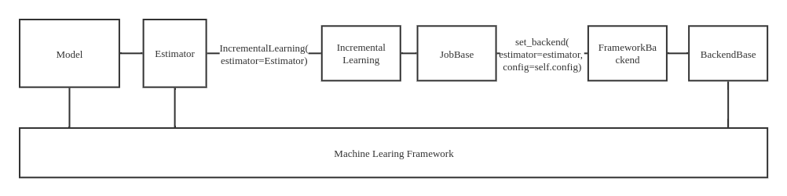
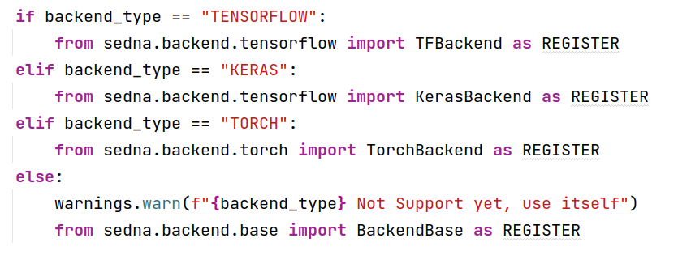

- [Implement Sedna Python SDK support TinyMS](#Implement-Sedna-Python-SDK-support-TinyMS)
  - [Motivation](#Motivation)
    - [Goals](#Goals)
- [Proposal](#Proposal)
    - [Sedna Architecture analysis](#Sedna-Architecture-Analysis)
    - [Feasibility](#Feasibility)
- [Design Details](#Design-Details)
    - [set_backend()](#set_backend())
    - [TinyMS API](#TinyMS-API)
    - [Demo Based on MSBackend](#Demo-Based-on-MSBackend)
    - [Demo Based on TinyMSBackend](#Demo-Based-on-TinyMSBackend)
- [Road Map](#Road-Map)

# Implement Sedna Python SDK support TinyMS

## Motivation

Currently, Sedna only supports sklearn's xgboost, Tensorflow, Keras, PyTorch and MindSpore, but doesn’t support MindSpore’s high-level API tool TinyMS.

This proposal aims to implement Senda Python SDK support for TinyMS based on  Sedna's lib development interface and implements an Incremental Learning demo.

### Goals

- Implement Sedna Python SDK support of TinyMS, which provides high level API to cover the entire lifecycle and workflow for AI development that ranges from data preparation to model deployment, including the following benefits:  
  - Compared with Keras, TinyMS designs a set of more abstract high level APIs and therefore is less complex than Keras. For example, one can complete dataset preprocessing with just one line of code in TinyMS.  
  - Compared with Fastai, TinyMS offers predefined MindSpore datasets which could help developers with dataset processing enormously as well as quick model deployment module.
- Write user guide document of TinyMS 

## Proposal

### Sedna Architecture Analysis



Taking the case yolo3 incremental learning in Sedna as an example, the user wraps the estimator for the specific model. when the incremental learning interface `IncrementalLearning()` is called, the following process takes place:

- IncrementalLearning instantiates its parent class JobBase.
- Call `set_backend()` in the constructor of JobBase to resolve the framework used by the model to TensorFlow and instantiate the corresponding TFBackend.

- TFBackend inherits BackendBase, which is initialized with OS-related configuration when instantiated.

- TFBackend implements the specific framework-related configuration.

### Feasibility

Sedna parses the underlying framework of the model and runs the model using a different machine learning framework through a backend pair. So we need to :

- implement Sedna's parsing of the underlying machining learning framework 



- implement TinyMSBackend

# Design Details

## set_backend()

Improve function `set_backend()` in `sedna/backend/__init__.py`

```python
if backend_type == "TINYMS":
	from sedna.backend.tinyms import TinyMSBackend as REGISTER
```

## TinyMS API

TinyMS is MindSpore's high-level API, but the TinyMS’s methods are not the same as the MindSpore framework’s , so we can not use the idea of inheritance for encapsulation.

`TinyMSBackend`class

-  `__init__(self, estimator, fine_tune=True, **kwargs) `  ：initialize

-  `train(self, train_data, valid_data=None, **kwargs)`: train the model

-  `predict(self, data, **kwargs) `: use the model to preidct result

-  `evaluate(self, data, **kwargs)`: evaluate the accuracy

-  `load_weights(self)`: load model weight

-  `get_weights(self) `：return weight

-  `set_weights(self, weights) `：set weight

```python
class TinyMSBackend(MSBackend):
    def __init__(self, estimator, fine_tune=True, **kwargs):
        ...
	
    def train(self, train_data, valid_data=None, **kwargs):
        ...
    
    def predict(self, data, **kwargs):
        ...
    
    def evaluate(self, valid_data, **kwargs):
        ...
  
    def save(self, model_path=None):
        ...
  
    def load(self, model_url=""):
        ...
  
    def load_weights(self):
	    ...
    
    def get_weights(self):
	    ...
	
    def set_weights(self, weights):
	    ...
```

## Demo Based on MSBackend

- [implement MobileNetV2 with MindSpore](https://www.mindspore.cn/tutorial/zh-CN/r0.7/advanced_use/mobilenetv2_incremental_learning.html)

- Build an estimator class based on MobileNetV2, encapsulating a series of methods such as `train(),evaluate(),predict()`, etc.
- Call incremental learning API to accomplish model training, evaluation, and inference

## Demo Based on TinyMSBackend

- [implement MobileNetV2 with TinyMS](https://tinyms.readthedocs.io/en/latest/tutorials/ipynb/TinyMS_MobileNetV2_tutorial.html)

- Build an estimator class based on MobileNetV2, encapsulating a series of methods such as `train(),evaluate(),predict()`, etc.

- Call incremental learning API to accomplish model training, evaluation and inference

# Road Map

- Implementing an incremental learning demo based on MSBackend
- [ ] week1 : implement `estimator`
- [ ] week2 : debug model

- TinyMS（08/8-09/16）

- [ ] week3 : learn `TinyMS`documentation
- [ ] week4 : implement `TinyMSBackend` class
- [ ] week5 : implement `estimator`
- [ ] week6 : debug model

- Write documentation（09/17-09/30）

- [ ] week7 : write API documentation
- [ ] week8 : write demo documentation and submit PR
