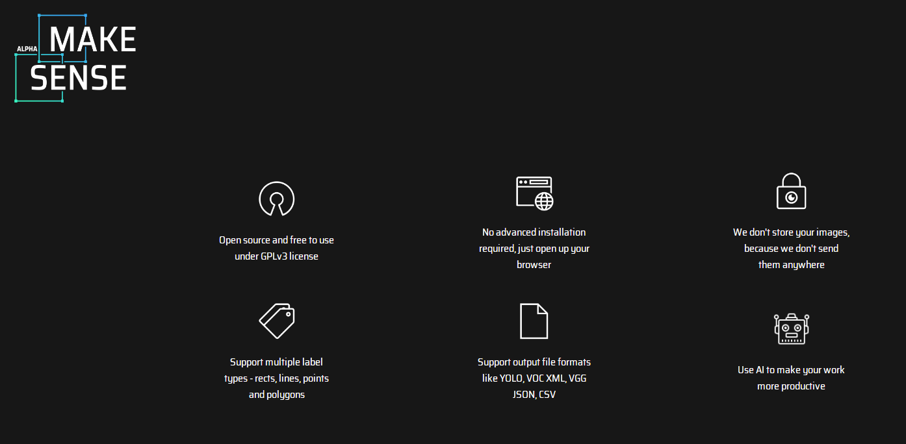
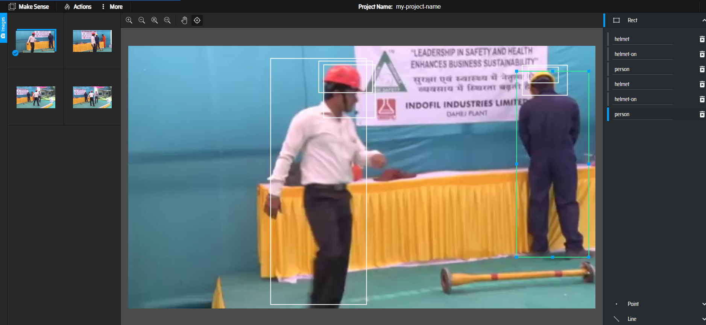
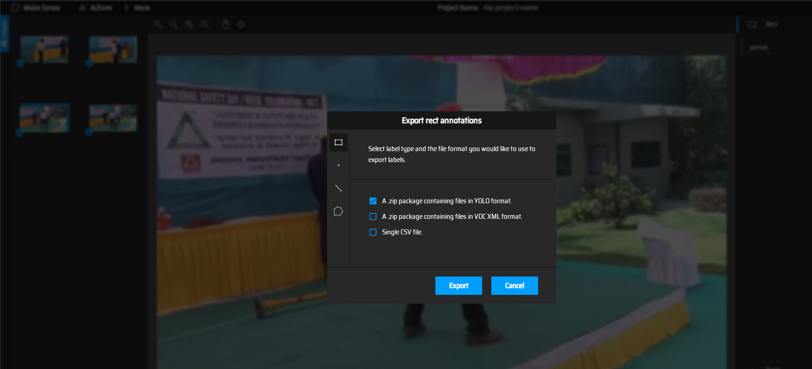
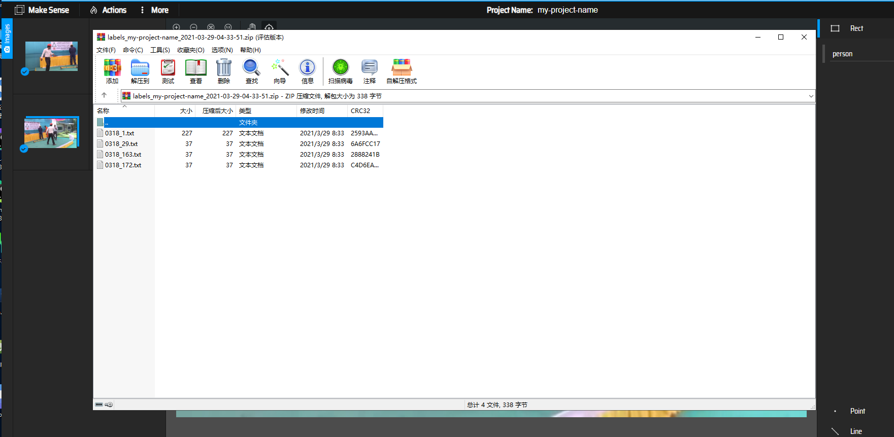
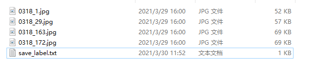
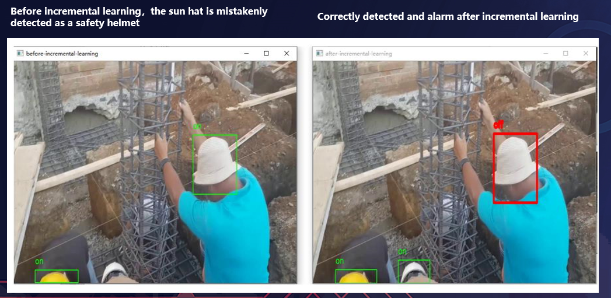

# Using Incremental Learning Job in Helmet Detection Scenario

This document introduces how to use incremental learning job in helmet detectioni scenario. 
Using the incremental learning job, our application can automatically retrains, evaluates, 
and updates models based on the data generated at the edge.

## Helmet Detection Experiment


### Install Sedna

Follow the [Sedna installation document](/docs/setup/install.md) to install Sedna.

### Prepare Model
In this example, we need to prepare base model and deploy model in advance.


download [models](https://kubeedge.obs.cn-north-1.myhuaweicloud.com/examples/helmet-detection/model.tar.gz), including base model and deploy model.
```
cd /
wget https://kubeedge.obs.cn-north-1.myhuaweicloud.com/examples/helmet-detection/models.tar.gz
tar -zxvf models.tar.gz
```
### Prepare for Inference Worker
in this example, we simulate a inference worker for helmet detection, the worker will upload hard examples to `HE_SAVED_URL`, while
it inferences data from local video. we need to make following preparations:
* make sure following localdirs exist
```
mkdir -p /incremental_learning/video/
mkdir -p /incremental_learning/he/
mkdir -p /data/helmet_detection
mkdir /output

```
* download [video](https://kubeedge.obs.cn-north-1.myhuaweicloud.com/examples/helmet-detection/video.tar.gz), unzip video.tar.gz, and put it into `/incremental_learning/video/`

```
cd /incremental_learning/video/
wget https://kubeedge.obs.cn-north-1.myhuaweicloud.com/examples/helmet-detection/video.tar.gz
tar -zxvf video.tar.gz
```
### Prepare Image
this example use the image:  
```
kubeedge/sedna-example-incremental-learning-helmet-detection:v0.1.0
```
This image is generated by the script [build_images.sh](/examples/build_image.sh), used for creating training, eval and inference worker.

### Create Incremental Job
in this example, `$WORKER_NODE` is a custom node, you can fill it which you actually run.


```
WORKER_NODE="edge-node" 
```
Create Dataset

```
kubectl create -f - <<EOF
apiVersion: sedna.io/v1alpha1
kind: Dataset
metadata:
  name: incremental-dataset
spec:
  url: "/data/helmet_detection/train_data/train_data.txt"
  format: "txt"
  nodeName: $WORKER_NODE
EOF
```

Create Initial Model to simulate the initial model in incremental learning scenario.

```
kubectl create -f - <<EOF
apiVersion: sedna.io/v1alpha1
kind: Model
metadata:
  name: initial-model
spec:
  url : "/models/base_model"
  format: "ckpt"
EOF
```

Create Deploy Model

```
kubectl create -f - <<EOF
apiVersion: sedna.io/v1alpha1
kind: Model
metadata:
  name: deploy-model
spec:
  url : "/models/deploy_model/saved_model.pb"
  format: "pb"
EOF
```

Start The Incremental Learning Job

```

kubectl create -f - <<EOF
apiVersion: sedna.io/v1alpha1
kind: IncrementalLearningJob
metadata:
  name: helmet-detection-demo
spec:
  initialModel:
    name: "initial-model"
  dataset:
    name: "incremental-dataset"
    trainProb: 0.8
  trainSpec:
    template:
      spec:
        nodeName: $WORKER_NODE
        containers:
          - image: kubeedge/sedna-example-incremental-learning-helmet-detection:v0.1.0
            name:  train-worker
            imagePullPolicy: IfNotPresent
            args: ["train.py"]
            env:
              - name: "batch_size"
                value: "32"
              - name: "epochs"
                value: "1"
              - name: "input_shape"
                value: "352,640"
              - name: "class_names"
                value: "person,helmet,helmet-on,helmet-off"
              - name: "nms_threshold"
                value: "0.4"
              - name: "obj_threshold"
                value: "0.3"
    trigger:
      checkPeriodSeconds: 60
      timer:
        start: 02:00
        end: 20:00
      condition:
        operator: ">"
        threshold: 500
        metric: num_of_samples
  evalSpec:
    template:
      spec:
        nodeName: $WORKER_NODE
        containers:
          - image: kubeedge/sedna-example-incremental-learning-helmet-detection:v0.1.0
            name:  eval-worker
            imagePullPolicy: IfNotPresent
            args: ["eval.py"]
            env:
              - name: "input_shape"
                value: "352,640"
              - name: "class_names"
                value: "person,helmet,helmet-on,helmet-off"                    
  deploySpec:
    model:
      name: "deploy-model"
    trigger:
      condition:
        operator: ">"
        threshold: 0.1
        metric: precision_delta
    hardExampleMining:
      name: "IBT"
      parameters:
        - key: "threshold_img"
          value: "0.9"
        - key: "threshold_box"
          value: "0.9"
    template:
      spec:
        nodeName: $WORKER_NODE
        containers:
        - image: kubeedge/sedna-example-incremental-learning-helmet-detection:v0.1.0
          name:  infer-worker
          imagePullPolicy: IfNotPresent
          args: ["inference.py"]
          env:
            - name: "input_shape"
              value: "352,640"
            - name: "video_url"
              value: "file://video/video.mp4"
            - name: "HE_SAVED_URL" 
              value: "/he_saved_url"
          volumeMounts:
          - name: localvideo
            mountPath: /video/
          - name: hedir
            mountPath: /he_saved_url
          resources:  # user defined resources
            limits:
              memory: 2Gi
        volumes:   # user defined volumes
          - name: localvideo
            hostPath:
              path: /incremental_learning/video/
              type: Directory
          - name: hedir
            hostPath:
              path:  /incremental_learning/he/
              type: Directory
  outputDir: "/output"
EOF
```
1. The `Dataset` describes data with labels and `HE_SAVED_URL` indicates the address of the deploy container for uploading hard examples. Users will mark label for the hard examples in the address.
2. Ensure that the path of outputDir in the YAML file exists on your node. This path will be directly mounted to the container.


### Check Incremental Learning Job
query the service status
```
kubectl get incrementallearningjob helmet-detection-demo
```
In the `IncrementalLearningJob` resource helmet-detection-demo, the following trigger is configured:
```
trigger:
  checkPeriodSeconds: 60
  timer:
    start: 02:00
    end: 20:00
  condition:
    operator: ">"
    threshold: 500
    metric: num_of_samples
```

### Hard Example Labeling
In a real word, we need to label the hard examples in `HE_SAVED_URL`  with annotation tools and then put the examples to `Dataset`'s url.  

you can use Open-Source annotation tools to label hard examples, such as [MAKE SENSE](https://www.makesense.ai), which has following main advantages:  
* Open source and free to use under GPLv3 license   
* Support outputfile formats like YOLO, VOC XML, VGG JSON, CSV
* No advanced installation required, just open up your browser
* Use AI to make your work more productive
* Offline running as a container, ensuring data security  

  

the details labeling are not described here, main steps in this demo are as follows:
* import unlabeled hard example to anonotation tools 

* label and export annotations 

  
* you will get YOLO format annotations, so you need convert them to the type which can be used by your own training code. in this example, the following scripts are
  provided for reference:  

```
import os

annotation_dir_path = "C:/Users/Administrator/Desktop/labeled_data"
save_path = "C:/Users/Administrator/Desktop/labeled_data/save_label.txt"

def convert_single_line(line):
    line_list = []
    line = line.split(" ")
    for i in range(1, len(line)):
        line[i] = float(line[i])
        line[i] = line[i] * 1000
        line_list.append(str(int(line[i])))
    line_list.append(line[0])
    return ",".join(line_list)

if __name__ == '__main__':
    results = []
    g = os.walk(annotation_dir_path)
    for path, dir_list, file_list in g:
        for file_name in file_list:
            file_path = os.path.join(path, file_name)
            file_name = file_name.split("txt")
            file_name = file_name[0] + 'jpg'
            single_label_string = file_name
            f = open(file_path)
            lines = f.readlines()
            for line in lines:
                line = line.strip('\n')
                single_label_string = single_label_string + " " + convert_single_line(line)
            results.append(single_label_string)
    save_file = open(save_path, "w")
    for result in results:
        save_file.write(result + "\n")
    save_file.close()
```
How to use:  
`annotation_dir_path`: location for labeled annotations from MAKESENSE   
`save_path`:  location for label txt which converted from annotations
* run above script, you can get a txt which includes all label information
* put the text with examples in the same dir
* you will get labeled examples which meet training requirements
    
* put these examples and annotations above to `Dataset`'s url  

Without annotation tools, we can simulate the condition of `num_of_samples` in the following ways:  
Download [dataset](https://kubeedge.obs.cn-north-1.myhuaweicloud.com/examples/helmet-detection/dataset.tar.gz) to $WORKER_NODE.
```
cd /data/helmet_detection
wget  https://kubeedge.obs.cn-north-1.myhuaweicloud.com/examples/helmet-detection/dataset.tar.gz
tar -zxvf dataset.tar.gz
```
The LocalController component will check the number of the sample, realize trigger conditions are met and notice the GlobalManager Component to start train worker.
When the train worker finish, we can view the updated model in the `/output` directory in `$WORKER_NODE` node.
Then the eval worker will start to evaluate the model that train worker generated.

If the eval result satisfy the `deploySpec`'s trigger 
```
trigger:
  condition:
    operator: ">"
    threshold: 0.1
    metric: precision_delta
```
the deploy worker will load the new model and provide service.

### Effect Display  
in this example, false and failed detections occur at stage of inference before incremental learning, after incremental learning, 
all targets are correctly detected.

 
