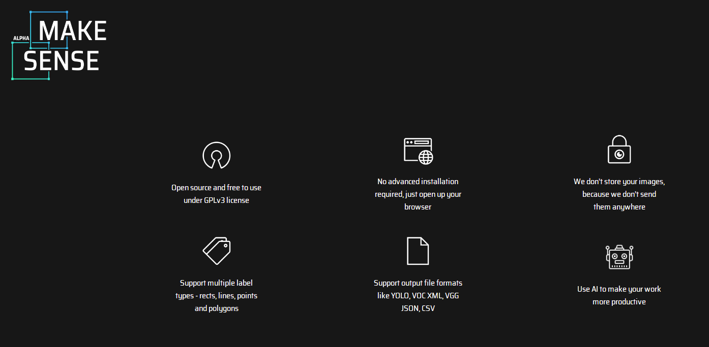
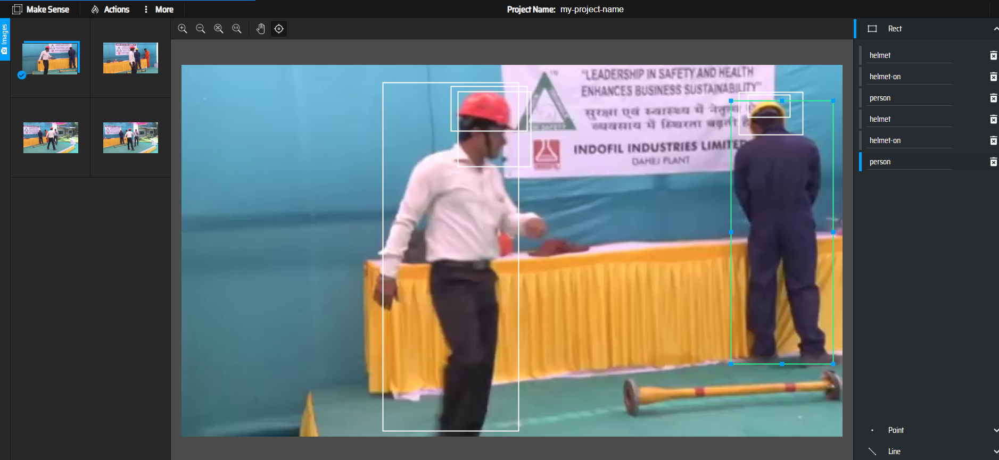
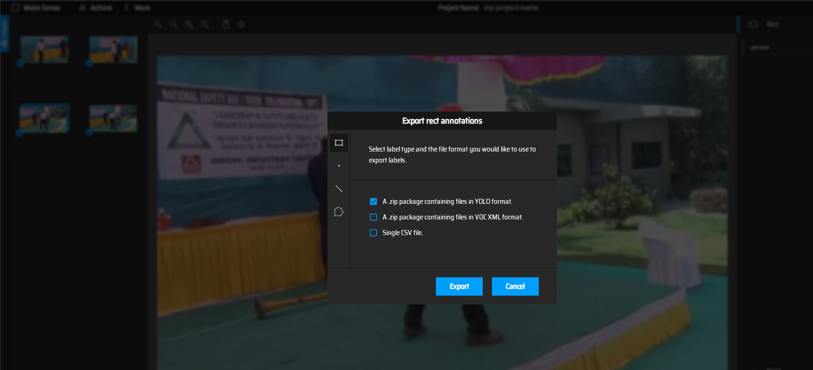
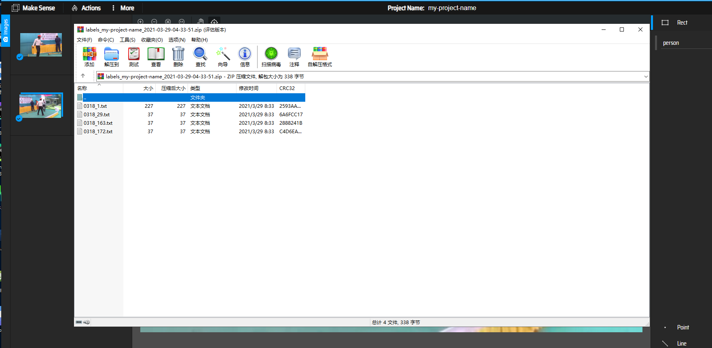

# Using Incremental Learning Job in Helmet Detection Scenario

This document introduces how to use incremental learning job in helmet detectioni scenario. 
Using the incremental learning job, our application can automatically retrains, evaluates, 
and updates models based on the data generated at the edge.

## Helmet Detection Experiment

### Prepare Worker Image
Build the worker image by referring to the [dockerfile](/build/worker/base_images/tensorflow/tensorflow-1.15.Dockerfile)
and put the image to the `gm-config.yaml`'s  `imageHub` in [Install Sedna](#install-sedna)
In this demo, we need to replace the requirement.txt to
```
flask==1.1.2
keras==2.4.3
opencv-python==4.4.0.44
websockets==8.1
Pillow==8.0.1
requests==2.24.0
tqdm==4.56.0
matplotlib==3.3.3
```
### Install Sedna

Follow the [Sedna installation document](/docs/setup/install.md) to install Sedna.

### Prepare Data
In this example, we need to prepare base model in advance.


download [base model](https://kubeedge.obs.cn-north-1.myhuaweicloud.com/examples/helmet-detection/model.tar.gz)
```
mkdir /model
cd /model
wget https://kubeedge.obs.cn-north-1.myhuaweicloud.com/examples/helmet-detection/model.tar.gz
tar -zxvf model.tar.gz
```
### Prepare Script
Download the [scripts](/examples/incremental_learning/helmet_detection_incremental_train/training) to the path `code` of your node


### Create Incremental Job


Create Dataset

```
kubectl create -f - <<EOF
apiVersion: sedna.io/v1alpha1
kind: Dataset
metadata:
  name: incremental-dataset
spec:
  url: "/data/helmet_detection/train_data/train_data.txt"
  format: "txt"
  nodeName: "cloud0"
EOF
```

Create Initial Model to simulate the initial model in incremental learning scenario.

```
kubectl create -f - <<EOF
apiVersion: sedna.io/v1alpha1
kind: Model
metadata:
  name: initial-model
spec:
  url : "/model/base_model"
  format: "ckpt"
EOF
```

Create Deploy Model

```
kubectl create -f - <<EOF
apiVersion: sedna.io/v1alpha1
kind: Model
metadata:
  name: deploy-model
  namespace: sedna-test
spec:
  url : "/model/deploy_model/saved_model.pb"
  format: "pb"
EOF
```

Start The Incremental Learning Job

```
kubectl create -f - <<EOF
apiVersion: sedna.io/v1alpha1
kind: IncrementalLearningJob
metadata:
  name: helmet-detection-demo
  namespace: sedna-test
spec:
  initialModel:
    name: "initial-model"
  dataset:
    name: "incremental-dataset"
    trainProb: 0.8
  trainSpec:
    template:
      spec:
        nodeName: "cloud0"
        containers:
          - image: kubeedge/sedna-example-incremental-learning-helmet-detection:v0.1.0
            name:  train-worker
            imagePullPolicy: IfNotPresent
            args: ["train.py"]
            env:
              - name: "batch_size"
                value: "32"
              - name: "epochs"
                value: "1"
              - name: "input_shape"
                value: "352,640"
              - name: "class_names"
                value: "person,helmet,helmet-on,helmet-off"
              - name: "nms_threshold"
                value: "0.4"
              - name: "obj_threshold"
                value: "0.3"
    trigger:
      checkPeriodSeconds: 60
      timer:
        start: 02:00
        end: 04:00
      condition:
        operator: ">"
        threshold: 500
        metric: num_of_samples
  evalSpec:
      template:
      spec:
        nodeName: "cloud0"
        containers:
          - image: kubeedge/sedna-example-incremental-learning-helmet-detection:v0.1.0
            name:  eval-worker
            imagePullPolicy: IfNotPresent
            args: ["eval.py"]
            env:
              - name: "input_shape"
                value: "352,640"
              - name: "class_names"
                value: "person,helmet,helmet-on,helmet-off"                    
  deploySpec:
    model:
      name: "deploy-model"
    trigger:
      condition:
        operator: ">"
        threshold: 0.1
        metric: precision_delta
    nodeName: "cloud0"
    hardExampleMining:
      name: "IBT"
    template:
      spec:
        nodeName: "cloud0"
        containers:
        - image: kubeedge/sedna-example-incremental-learning-helmet-detection:v0.1.0
          name:  infer-worker
          imagePullPolicy: IfNotPresent
          args: ["inference.py"]
          env:
            - name: "input_shape"
              value: "352,640"
            - name: "video_url"
              value: "rtsp://localhost/video"
            - name: "HE_SAVED_URL" 
              value: "/he_saved_url"
  nodeName: "cloud0"
  outputDir: "/output"
EOF
```
1. The `Dataset` describes data with labels and `HE_SAVED_URL` indicates the address of the deploy container for uploading hard examples. Users will mark label for the hard examples in the address.
2. Ensure that the path of outputDir in the YAML file exists on your node. This path will be directly mounted to the container.


### Mock Video Stream for Inference in Edge Side

* step 1: install the open source video streaming server [EasyDarwin](https://github.com/EasyDarwin/EasyDarwin/tree/dev).
* step 2: start EasyDarwin server.
* step 3: download [video](https://kubeedge.obs.cn-north-1.myhuaweicloud.com/examples/helmet-detection/video.tar.gz).
* step 4: push a video stream to the url (e.g., `rtsp://localhost/video`) that the inference service can connect.

```
wget https://github.com/EasyDarwin/EasyDarwin/releases/download/v8.1.0/EasyDarwin-linux-8.1.0-1901141151.tar.gz --no-check-certificate
tar -zxvf EasyDarwin-linux-8.1.0-1901141151.tar.gz
cd EasyDarwin-linux-8.1.0-1901141151
./start.sh

mkdir -p /data/video
cd /data/video
tar -zxvf video.tar.gz
ffmpeg -re -i /data/video/helmet-detection.mp4 -vcodec libx264 -f rtsp rtsp://localhost/video
```

### Check Incremental Learning Job
query the service status
```
kubectl get incrementallearningjob helmet-detection-demo -n sedna-test
```
In the `IncrementalLearningJob` resource helmet-detection-demo, the following trigger is configured:
```
trigger:
  checkPeriodSeconds: 60
  timer:
    start: 02:00
    end: 04:00
  condition:
    operator: ">"
    threshold: 500
    metric: num_of_samples
```

### Hard Example Labeling
In a real word, we need to label the hard examples in `HE_SAVED_URL`  with annotation tools and then put the examples to `Dataset`'s url.  

you can use Open-Source annotation tools to label hard examples, such as [MAKE SENSE](https://www.makesense.ai), which has following main advantages:  
* Open source and free to use under GPLv3 license   
* Support outputfile formats like YOLO, VOC XML, VGG JSON, CSV
* No advanced installation required, just open up your browser
* Use AI to make your work more productive
* Offline running as a container, ensuring data security  

  

the details labeling are not described here, main steps in this demo are as follows:
* import unlabeled hard example to anonotation tools 

* label and export annotations, and convert type of them to what you need by your self  

  
* put these labeled examples to `Dataset`'s url  

Without annotation tools, we can simulate the condition of `num_of_samples` in the following ways:  
Download [dataset](https://kubeedge.obs.cn-north-1.myhuaweicloud.com/examples/helmet-detection/dataset.tar.gz) to our cloud0 node.
```
cd /data/helmet_detection
wget  https://kubeedge.obs.cn-north-1.myhuaweicloud.com/examples/helmet-detection/dataset.tar.gz
tar -zxvf dataset.tar.gz
```
The LocalController component will check the number of the sample, realize trigger conditions are met and notice the GlobalManager Component to start train worker.
When the train worker finish, we can view the updated model in the `/output` directory in cloud0 node.
Then the eval worker will start to evaluate the model that train worker generated.

If the eval result satisfy the `deploySpec`'s trigger 
```
trigger:
  condition:
    operator: ">"
    threshold: 0.1
    metric: precision_delta
```
the deploy worker will load the new model and provide service.
