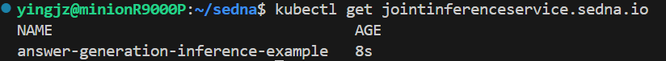

# Using Joint Inference Service in Answer Generation with LLM

## Background

KubeEdge-Sedna has traditionally excelled at edge-cloud collaborative AI for Computer Vision (CV) tasks, but the increasingly important domain of Large Language Models (LLMs) and Natural Language Processing (NLP) tasks has been underrepresented. This example addresses this gap by demonstrating how to deploy collaborative LLM inference on edge-cloud infrastructure using Sedna's joint inference capabilities.

This example is migrated from the [KubeEdge-Ianvs LLM joint inference example](https://github.com/kubeedge/ianvs/tree/main/examples/cloud-edge-collaborative-inference-for-llm) and serves as a real-world demonstration of how developers can:
- Deploy lightweight models on resource-constrained edge devices for fast, local inference
- Leverage powerful cloud-based or API-based LLMs for complex tasks requiring higher accuracy
- Intelligently route queries between edge and cloud based on complexity using custom routing algorithms
- Optimize resource usage, reduce latency, and minimize cloud API costs

For detailed design and implementation information, please refer to the [proposal document](../../../docs/proposals/joint-inference-llm.md).

## Overview

This case introduces how to use joint inference service in answer generation scenario.

In the answer generation scenario, the little model (e.g., 
Qwen2.5-0.5B-Instruct) deployed on the edge node can handle simple questions, while the big model (e.g., GPT-3.5 via API) deployed on the cloud node can tackle more complex questions. The joint inference service uses a hard example mining algorithm (e.g., BertRouter) to identify which questions should be processed by the big model in the cloud, thereby optimizing resource usage and response time.

## Answer Generation Experiment

### Install Sedna

Follow the [Sedna installation document](/docs/setup/install.md) to install Sedna.

### Prepare Images

This example uses these images:
1. little model inference worker: kubeedge/sedna-example-joint-inference-answer-generation-little:v0.8.0
2. big model inference worker: kubeedge/sedna-example-joint-inference-answer-generation-big:v0.8.0

These images are generated by the script [build_images.sh](/examples/build_image.sh).

### Create Joint Inference Service

#### Create Big Model Resource Object for Cloud

Here we use an API-based LLM model as the big model. You can replace the URL with your own model endpoint.

```
kubectl create -f - <<EOF
apiVersion: sedna.io/v1alpha1
kind: Model
metadata:
  name: answer-generation-inference-big-model
  namespace: default
spec:
  url: "/api.deepseek.com/v1"
  format: "https"
EOF
```

The original URL should be `https://api.deepseek.com/v1`, but due to the current limitation of Sedna control plane, it will automatically download the model if the url starts with `http://` or `https://`. To bypass this, we set the URL to `/api.deepseek.com/v1` and our code will add the `https://` prefix when making requests.

Another temporary solution is to create a new folder `api.deepseek.com` at the root of cloud node to bypass the mounting check. Otherwise, you may find the pod stuck in `ContainerCreating` or `Pending` status:

```
NAME                                              READY   STATUS              RESTARTS   AGE
answer-generation-inference-example-cloud-wsbfq   0/1     ContainerCreating   0          4s
answer-generation-inference-example-edge-wjlj8    0/1     Pending             0          4s
edgemesh-agent-hg9wr                              1/1     Running             0          4d8h
edgemesh-agent-hlc5v                              1/1     Running             1          4d8h
edgemesh-agent-pp4jw                              1/1     Running             0          4d8h
```

To solve this problem, you need to run the following commands on your cloud node:

```
sudo mkdir -p /api.deepseek.com
```

#### Create Little Model Resource Object for Edge

Here we use a small 
Qwen2.5-0.5B-Instruct model as the little model. You can replace the URL with your own model path.

```
kubectl create -f - <<EOF
apiVersion: sedna.io/v1alpha1
kind: Model
metadata:
  name: answer-generation-inference-little-model
  namespace: default
spec:
  url: "/Qwen/Qwen2.5-0.5B-Instruct"
  format: "hf"
EOF
```

Similar to the cloud node, you need to create an empty directory `/Qwen` at the root of the edge node to bypass the mounting check:

```
sudo mkdir -p /Qwen
```

#### Create Joint Inference Service

Note the setting of the following parameters:
- hardExampleMining: set hard example algorithm from {BertRouter, Random, EdgeOnly, CloudOnly} for inferring in edge side
- input_text: Specify the path to your input text file or directory for inference. If it is set to a directory, the program will scan all the files in that directory.
- all_examples_inference_output: set your output path for the inference results.
- hard_example_edge_inference_output: set your output path for results of inferring hard examples in edge side.
- hard_example_cloud_inference_output: set your output path for results of inferring hard examples in cloud side.
- MINING_MODE: set the mining mode from {inference-then-mining, mining-then-inference}. The former means to do inference first and then do hard example mining based on the inference results of little model. The latter means to do hard example mining first and then do inference based on the mining results.
- MODEL_LOAD_MODE: set the model loading mode from {http, https, hf, file}. http and https are used for api-based models, hf is used for huggingface models, and file is used for local models.
- API_KEY: (optional) set your api key for api-based models.
- MODEL_NAME: (optional) set your model name for api-based models.

Make preparation in edge node:

```
mkdir -p /joint_inference/input
tee > /joint_inference/input/test.txt << 'EOF'
The future of AI is
The president of the United States is
There is a single choice question about abstract_algebra. Answer the question by replying A, B, C or D.\nQuestion: Find all c in Z_3 such that Z_3[x]/(x^2 + c) is a field.\nA. 0\nB. 1\nC. 2\nD. 3\nAnswer: 
There is a single choice question about abstract_algebra. Answer the question by replying A, B, C or D.\nQuestion: Statement 1 | If aH is an element of a factor group, then |aH| divides |a|. Statement 2 | If H and K are subgroups of G then HK is a subgroup of G.\nA. True, True\nB. False, False\nC. True, False\nD. False, True\nAnswer: 
EOF
```

Then, create joint inference service:

```
CLOUD_NODE="cloud-node-name"
EDGE_NODE="edge-node-name"
API_KEY="your-api-key"


kubectl create -f - <<EOF
apiVersion: sedna.io/v1alpha1
kind: JointInferenceService
metadata:
  name: answer-generation-inference-example
  namespace: default
spec:
  edgeWorker:
    model:
      name: "answer-generation-inference-little-model"
    hardExampleMining:
      name: "BertRouter"
      parameters:
        - key: "model"
          value: "routellm/bert"
        - key: "threshold"
          value: "0.5"
    template:
      spec:
        nodeName: $EDGE_NODE
        dnsPolicy: ClusterFirstWithHostNet
        containers:
        - image: kubeedge/sedna-example-joint-inference-answer-generation-little:v0.8.0
          imagePullPolicy: IfNotPresent
          name:  little-model
          env:  # user defined environments
          - name: "BACKEND_TYPE"
            value: "TORCH"
          - name: "MINING_MODE"
            value: "mining-then-inference"
          - name: "MODEL_LOAD_MODE"
            value: "hf"
          - name: "input_text"
            value: "/data/input"
          - name: "all_examples_inference_output"
            value: "/data/output"
          - name: "hard_example_cloud_inference_output"
            value: "/data/hard_example_cloud_inference_output"
          - name: "hard_example_edge_inference_output"
            value: "/data/hard_example_edge_inference_output"
          resources:  # user defined resources
            requests:
              memory: 64M 
              cpu: 100m
            limits:
              memory: 2Gi
          volumeMounts:
            - name: outputdir
              mountPath: /data/
        volumes:   # user defined volumes
          - name: outputdir
            hostPath:
              # user must create the directory in host
              path: /joint_inference
              type: Directory

  cloudWorker:
    model:
      name: "answer-generation-inference-big-model"
    template:
      spec:
        nodeName: $CLOUD_NODE
        dnsPolicy: ClusterFirstWithHostNet
        containers:
          - image: kubeedge/sedna-example-joint-inference-answer-generation-big:v0.8.0
            name:  big-model
            imagePullPolicy: IfNotPresent
            env:
              - name: "BACKEND_TYPE"
                value: "TORCH"
              - name: "MODEL_LOAD_MODE"
                value: "https"
              - name: "API_KEY"
                value: $API_KEY
              - name: "MODEL_NAME"
                value: "deepseek-chat"
            resources:
              requests:
                memory: 2Gi
EOF
```

### Check Joint Inference Status

```
kubectl get jointinferenceservices.sedna.io
```



### Check Inference Result

You can check the inference results in the output path (e.g. `/joint_inference/output`) defined in the JointInferenceService config.

```
root@edge0:/joint_inference# ls output
0.txt  1.txt  2.txt  3.txt
root@edge0:/joint_inference# cat output/0.txt
Input: The future of AI is
Output: The future of AI is here, and it’s already starting to impact the way we live our lives. As more and more companies and individuals embrace this technology, the possibilities are endless.
However, while the potential is exciting, there are also concerns about how this technology will be
root@edge0:/joint_inference# cat output/1.txt
Input: The president of the United States is
Output: The president of the United States is a very important person. He or she is responsible for making decisions that affect everyone in America, and they are also responsible for protecting the country from danger.
As a student, you might have heard about the president's job responsibilities before. But did you
root@edge0:/joint_inference# cat output/2.txt
Input: There is a single choice question about abstract_algebra. Answer the question by replying A, B, C or D.\nQuestion: Find all c in Z_3 such that Z_3[x]/(x^2 + c) is a field.\nA. 0\nB. 1\nC. 2\nD. 3\nAnswer:
Output: There is a single choice question about abstract_algebra. Answer the question by replying A, B, C or D.\nQuestion: Find all c in Z_3 such that Z_3[x]/(x^2 + c) is a field.\nA. 0\nB. 1\nC. 2\nD. 3\nAnswer: D. 3\n
root@edge0:/joint_inference# cat output/3.txt
Input: There is a single choice question about abstract_algebra. Answer the question by replying A, B, C or D.\nQuestion: Statement 1 | If aH is an element of a factor group, then |aH| divides |a|. Statement 2 | If H and K are subgroups of G then HK is a subgroup of G.\nA. True, True\nB. False, False\nC. True, False\nD. False, True\nAnswer:
Output: {'result': ['Let’s check each statement.  \n\n**Statement 1:**  \nIf \\( aH \\) is an element of a factor group \\( G/H \\), then \\( |aH| \\) in \\( G/H \\) means the smallest positive integer \\( n \\) such that \\( (aH)^n = H \\) (the identity in \\( G/H \\)), i.e., \\( a^n H = H \\), so \\( a^n \\in H \\).  \nThe order of \\( a \\) in \\( G \\) is \\( |a| \\).  \nIn general, \\( |aH| \\) divides \\( |a| \\) if \\( |a| < \\infty \\), because \\( a^{|a|} = e \\in H \\), so \\( (aH)^{|a|} = H \\), hence \\( |aH| \\) divides \\( |a| \\).  \nBut careful: If \\( |a| \\) is infinite, \\( |aH| \\) could be finite and still divide \\( |a| \\) vacuously? No — divisibility is usually stated for finite orders. If \\( |a| \\) is infinite, the statement “\\( |aH| \\) divides \\( |a| \\)” is problematic because divisibility is not defined in the usual sense for infinite order.  \nBut in standard algebra exercises, they mean: for finite \\( |a| \\), \\( |aH| \\mid |a| \\).  \nHowever, is Statement 1 always true? Counterexample: take \\( G = S_3 \\), \\( H = \\{e, (12)\\} \\), \\( a = (123) \\).  \n\\( |a| = 3 \\), \\( aH = (123)H \\). Compute: \\( (123)H = \\{(123), (123)(12) = (13)\\} \\).  \n\\( (aH)^2 = (123)^2 H = (132)H = \\{(132), (132)(12) = (23)\\} \\).  \n\\( (aH)^3 = (123)^3 H = eH = H \\). So \\( |aH| = 3 \\), divides \\( |a| = 3 \\) — true here.  \nBut try \\( a \\) with order not shared by factor group? Actually, \\( |aH| \\) always divides \\( |a| \\) when \\( |a| \\) finite — standard theorem: order of element in quotient divides order in group.  \nSo Statement 1 is **true** (in finite case; and if \\( |a| \\) infinite, statement “divides” is weird, but likely they assume finite).  \n\n**Statement 2:**  \nIf \\( H \\) and \\( K \\) are subgroups of \\( G \\), then \\( HK \\) is a subgroup of \\( G \\) iff \\( HK = KH \\). Not always true.  \nCounterexample: \\( G = S_3 \\), \\( H = \\{e, (12)\\} \\), \\( K = \\{e, (13)\\} \\).  \n\\( HK = \\{e, (12), (13), (12)(13) = (132)\\} \\), which has size 4, not dividing 6, so cannot be a subgroup.  \nSo Statement 2 is **false**.  \n\nThus: Statement 1 true, Statement 2 false.  \n\n**Answer:** C.  \n\n\\[\n\\boxed{C}\n\\]']}
```

### Experiment with Different Thresholds

I have randomly selected 1000 questions from [this dataset](https://www.kaggle.com/datasets/kubeedgeianvs/ianvs-mmlu-5shot) and run experiments with different threshold settings for the BertRouter hard example mining algorithm. The results are as follows:

| Threshold | Easy Samples % | Hard Samples % | Easy Tokens % | Hard Tokens % |
|-----------|----------------|----------------|----------------|----------------|
| 0.43      | 0.80%          | 99.20%        | 0.48%          | 99.52%        |
| 0.44      | 10.90%         | 89.10%        | 10.12%        | 89.88%        |
| 0.45      | 40.50%         | 59.50%        | 38.09%        | 61.91%        |
| 0.46      | 65.40%         | 34.60%        | 56.76%        | 43.24%        |
| 0.47      | 94.30%         | 5.70%         | 95.54%        | 4.46%         |
| 0.48      | 99.20%         | 0.80%         | 98.98%        | 1.02%         |
| 0.49      | 100.00%        | 0.00%         | 100.00%       | 0.00%         |
| 0.50      | 100.00%        | 0.00%         | 100.00%       | 0.00%         |

As the threshold increases, the proportion of samples and tokens processed by the big model in the cloud decreases significantly. This allows for fine-tuning the balance between edge and cloud processing based on specific application requirements.

## Future Work

### Enhanced Model CRD Handling in Sedna Control Plane

**Current Limitation**: Sedna's control plane currently assumes all Model CRDs point to downloadable model weights and attempts to download and mount them into containers. This design does not support modern LLM deployment patterns such as API-based inference or Hugging Face model identifiers.

**Temporary Workarounds in This Example**:
- For API-based models (e.g., DeepSeek API), we use a non-standard URL format (`/api.deepseek.com/v1` instead of `https://api.deepseek.com/v1`) and manually add the `https://` prefix in application code
- Empty directories (e.g., `/api.deepseek.com`, `/Qwen`) must be created on nodes to bypass mounting checks
- The actual model loading logic is entirely handled at the application layer rather than by the control plane

**What's Needed**: The control plane should be extended to natively support:
1. API-based LLM inference (no download/mount required)
2. Hugging Face model identifiers (e.g., `bert-base-uncased`, `meta-llama/Llama-2-7b-hf`)
3. Backward compatibility with existing local weight scenarios

For detailed discussion and proposed solutions, please see [Issue #483](https://github.com/kubeedge/sedna/issues/483).

