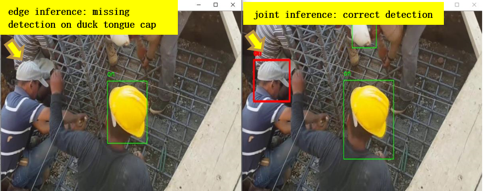

# Using Joint Inference Service in Helmet Detection Scenario 

This case introduces how to use joint inference service in helmet detection scenario. 
In the safety helmet detection scenario, the helmet detection shows lower performance due to limited resources in edge. 
However, the joint inference service can improve overall performance, which uploads hard examples that identified by the hard example mining algorithm to the cloud and infers them.
The data used in the experiment is a video of workers wearing safety helmets. 
The joint inference service requires to detect the wearing of safety helmets in the video. 

## Helmet Detection Experiment

### Install Sedna

Follow the [Sedna installation document](/docs/setup/install.md) to install Sedna.
 
### Prepare Data and Model

* step1: download [little model](https://kubeedge.obs.cn-north-1.myhuaweicloud.com/examples/helmet-detection-inference/little-model.tar.gz) to your edge node.

```
mkdir -p /data/little-model
cd /data/little-model
wget https://kubeedge.obs.cn-north-1.myhuaweicloud.com/examples/helmet-detection-inference/little-model.tar.gz
tar -zxvf little-model.tar.gz
```

* step2: download [big model](https://kubeedge.obs.cn-north-1.myhuaweicloud.com/examples/helmet-detection-inference/big-model.tar.gz) to your cloud node.

```
mkdir -p /data/big-model
cd /data/big-model
wget https://kubeedge.obs.cn-north-1.myhuaweicloud.com/examples/helmet-detection-inference/big-model.tar.gz
tar -zxvf big-model.tar.gz
```

### Prepare Images
This example uses these images:
1. little model inference worker: ```kubeedge/sedna-example-joint-inference-helmet-detection-little:v0.3.0```
2. big model inference worker: ```kubeedge/sedna-example-joint-inference-helmet-detection-big:v0.3.0```

These images are generated by the script [build_images.sh](/examples/build_image.sh).

### Create Joint Inference Service 

#### Create Big Model Resource Object for Cloud

```
kubectl create -f - <<EOF
apiVersion: sedna.io/v1alpha1
kind:  Model
metadata:
  name: helmet-detection-inference-big-model
  namespace: default
spec:
  url: "/data/big-model/yolov3_darknet.pb"
  format: "pb"
EOF
```

#### Create Little Model Resource Object for Edge

```
kubectl create -f - <<EOF
apiVersion: sedna.io/v1alpha1
kind: Model
metadata:
  name: helmet-detection-inference-little-model
  namespace: default
spec:
  url: "/data/little-model/yolov3_resnet18.pb"
  format: "pb"
EOF
```

#### Create JointInferenceService 

Note the setting of the following parameters, which have to same as the script [little_model.py](/examples/joint_inference/helmet_detection_inference/little_model/little_model.py):
- hardExampleMining: set hard example algorithm from {IBT, CrossEntropy} for inferring in edge side.
- video_url: set the url for video streaming. 
- all_examples_inference_output: set your output path for the inference results.
- hard_example_edge_inference_output: set your output path for results of inferring hard examples in edge side.
- hard_example_cloud_inference_output: set your output path for results of inferring hard examples in cloud side.

Make preparation in edge node
```
mkdir -p /joint_inference/output
```

Create joint inference service
```
CLOUD_NODE="cloud-node-name"
EDGE_NODE="edge-node-name"


kubectl create -f - <<EOF
apiVersion: sedna.io/v1alpha1
kind: JointInferenceService
metadata:
  name: helmet-detection-inference-example
  namespace: default
spec:
  edgeWorker:
    model:
      name: "helmet-detection-inference-little-model"
    hardExampleMining:
      name: "IBT"
      parameters:
        - key: "threshold_img"
          value: "0.9"
        - key: "threshold_box"
          value: "0.9"
    template:
      spec:
        nodeName: $EDGE_NODE
        containers:
        - image: kubeedge/sedna-example-joint-inference-helmet-detection-little:v0.3.0
          imagePullPolicy: IfNotPresent
          name:  little-model
          env:  # user defined environments
          - name: input_shape
            value: "416,736"
          - name: "video_url"
            value: "rtsp://localhost/video"
          - name: "all_examples_inference_output"
            value: "/data/output"
          - name: "hard_example_cloud_inference_output"
            value: "/data/hard_example_cloud_inference_output"
          - name: "hard_example_edge_inference_output"
            value: "/data/hard_example_edge_inference_output"
          resources:  # user defined resources
            requests:
              memory: 64M
              cpu: 100m
            limits:
              memory: 2Gi
          volumeMounts:
            - name: outputdir
              mountPath: /data/
        volumes:   # user defined volumes
          - name: outputdir
            hostPath:
              # user must create the directory in host
              path: /joint_inference/output
              type: Directory

  cloudWorker:
    model:
      name: "helmet-detection-inference-big-model"
    template:
      spec:
        nodeName: $CLOUD_NODE
        containers:
          - image: kubeedge/sedna-example-joint-inference-helmet-detection-big:v0.3.0
            name:  big-model
            imagePullPolicy: IfNotPresent
            env:  # user defined environments
              - name: "input_shape"
                value: "544,544"
            resources:  # user defined resources
              requests:
                memory: 2Gi
EOF
```

### Check Joint Inference Status

```
kubectl get jointinferenceservices.sedna.io
```

### Mock Video Stream for Inference in Edge Side

* step1: install the open source video streaming server [EasyDarwin](https://github.com/EasyDarwin/EasyDarwin/tree/dev).
* step2: start EasyDarwin server.
* step3: download [video](https://kubeedge.obs.cn-north-1.myhuaweicloud.com/examples/helmet-detection-inference/video.tar.gz).
* step4: push a video stream to the url (e.g., `rtsp://localhost/video`) that the inference service can connect.

```
wget https://github.com/EasyDarwin/EasyDarwin/releases/download/v8.1.0/EasyDarwin-linux-8.1.0-1901141151.tar.gz
tar -zxvf EasyDarwin-linux-8.1.0-1901141151.tar.gz
cd EasyDarwin-linux-8.1.0-1901141151
./start.sh

mkdir -p /data/video
cd /data/video
wget https://kubeedge.obs.cn-north-1.myhuaweicloud.com/examples/helmet-detection-inference/video.tar.gz
tar -zxvf video.tar.gz

ffmpeg -re -i /data/video/video.mp4 -vcodec libx264 -f rtsp rtsp://localhost/video
```

### Check Inference Result

You can check the inference results in the output path (e.g. `/joint_inference/output`) defined in the JointInferenceService config.
* the result of edge inference vs the result of joint inference

