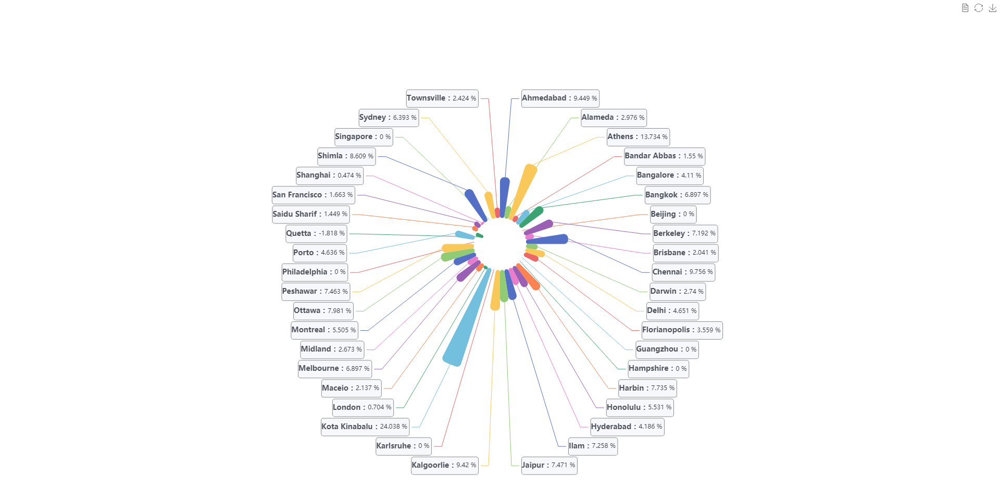

# Using Lifelong Learning Job in Thermal Comfort Prediction Scenario

This document introduces how to use lifelong learning job in thermal comfort prediction scenario. 
Using the lifelong learning job, our application can automatically retrains, evaluates, 
and updates models based on the data generated at the edge.

##  Thermal Comfort Prediction Experiment


### Install Sedna

Follow the [Sedna installation document](/docs/setup/install.md) to install Sedna.

### Prepare Dataset
In this example, you can download ASHRAE Global Thermal Comfort Database II to initial lifelong learning Knowledgebase .


download [datasets](https://kubeedge.obs.cn-north-1.myhuaweicloud.com/examples/atcii-classifier/dataset.tar.gz), including train、evaluation and test dataset.
```
cd /
wget https://kubeedge.obs.cn-north-1.myhuaweicloud.com/examples/atcii-classifier/dataset.tar.gz
tar -zxvf dataset.tar.gz
```
### Prepare for Knowledgebase Server
in this example, we create a knowledgebase restful server with sqlite3, the database will storage to `LIFELONG_KB_URL`, and
run at `GM Node`. 
### Prepare Image
this example use the image:  
```
swr.cn-southwest-2.myhuaweicloud.com/sedna-test/sedna/kb:v0.0.1
```

### Create KB Deployment

```
kubectl create -f scripts/knowledge-server/kb.yaml
```

### Create Lifelong Job
in this example, `$WORKER_NODE` is a custom node, you can fill it which you actually run.


```
WORKER_NODE="edge-node" 
```
Create Dataset

```
kubectl create -f - <<EOF
apiVersion: sedna.io/v1alpha1
kind: Dataset
metadata:
  name: lifelong-dataset
spec:
  url: "/data/lifelong_learning/trainData.csv"
  format: "csv"
  nodeName: $WORKER_NODE
EOF
```

Start The Incremental Learning Job

```

kubectl create -f - <<EOF
apiVersion: sedna.io/v1alpha1
kind: LifelongLearningJob
metadata:
  name: atcii-classifier-demo
spec:
  dataset:
    name: "lifelong-dataset"
    trainProb: 0.8
  trainSpec:
    template:
      spec:
        nodeName: "edge-node"
        containers:
          - image: kubeedge/sedna-example-lifelong-learning-atcii-classifier:v0.1.0
            name:  train-worker
            imagePullPolicy: IfNotPresent
            args: ["train.py"]
            env:
              - name: "early_stopping_rounds"
                value: "100"
              - name: "metric_name"
                value: "mlogloss"
    trigger:
      checkPeriodSeconds: 60
      timer:
        start: 02:00
        end: 24:00
      condition:
        operator: ">"
        threshold: 500
        metric: num_of_samples
  evalSpec:
    template:
      spec:
        nodeName: "edge-node"
        containers:
          - image: kubeedge/sedna-example-lifelong-learning-atcii-classifier:v0.1.0
            name:  eval-worker
            imagePullPolicy: IfNotPresent
            args: ["eval.py"]
            env:
              - name: "metrics"
                value: "precision_score"
              - name: "metric_param"
                value: "{'average': 'micro'}"
              - name: "model_threshold"
                value: "0.5"
  deploySpec:
    template:
      spec:
        nodeName: "edge-node"
        containers:
        - image: kubeedge/sedna-example-lifelong-learning-atcii-classifier:v0.1.0
          name:  infer-worker
          imagePullPolicy: IfNotPresent
          args: ["inference.py"]
          env:
          - name: "UT_SAVED_URL"
            value: "/ut_saved_url"
          - name: "infer_dataset_url"
            value: "/data/infer_data.csv"
          volumeMounts:
          - name: utdir
            mountPath: /ut_saved_url
          - name: inferdata
            mountPath: /data/
          resources:  # user defined resources
            limits:
              memory: 2Gi
        volumes:   # user defined volumes
          - name: utdir
            hostPath:
              path: /lifelong/unseen_task/
              type: DirectoryOrCreate
          - name: inferdata
            hostPath:
              path:  /lifelong/data/
              type: DirectoryOrCreate
  outputDir: "/output"
EOF
```

### Check Lifelong Learning Job
query the service status
```
kubectl get lifelonglearningjob atcii-classifier-demo
```
In the `lifelonglearningjob` resource atcii-classifier-demo, the following trigger is configured:
```
trigger:
  checkPeriodSeconds: 60
  timer:
    start: 02:00
    end: 20:00
  condition:
    operator: ">"
    threshold: 500
    metric: num_of_samples
```

### Unseen Tasks samples Labeling
In a real word, we need to label the hard examples in our unseen tasks which storage in `UT_SAVED_URL`  with annotation tools and then put the examples to `Dataset`'s url.  


### Effect Display  
in this example, false and failed detections occur at stage of inference before lifelong learning, after lifelong learning, 
Greatly improve the precision and accuracy of the dataset.

 
