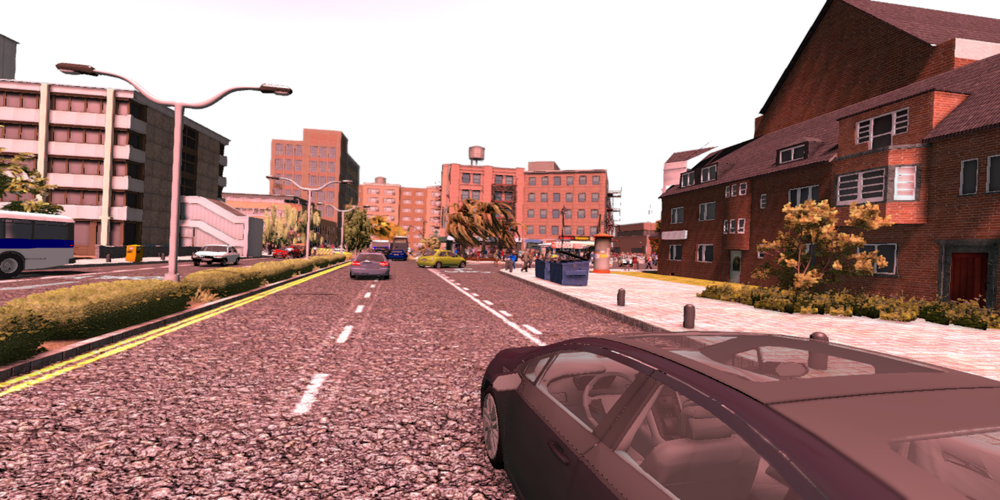
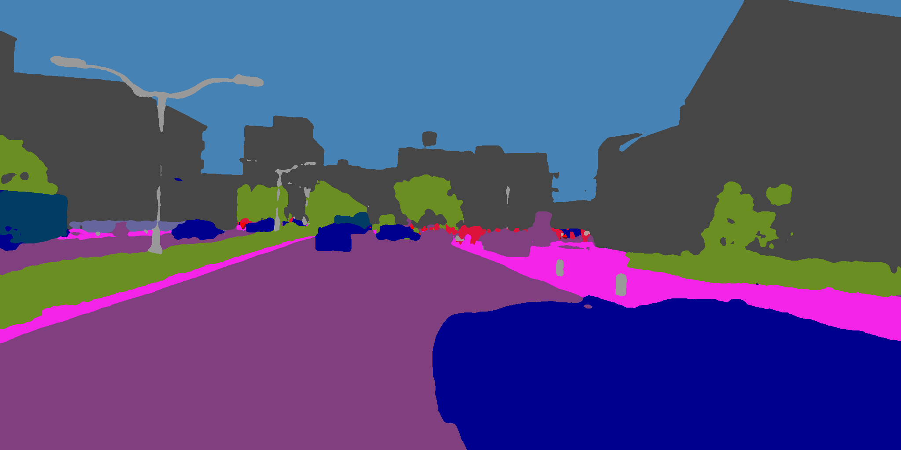
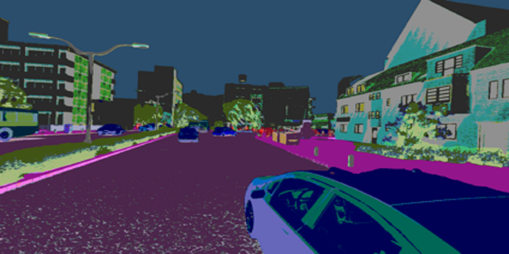

# Using Lifelong Learning in Campus Robot Delivery Scenario

## Introduction
This example introduces how to use Sedna lifelong learning to implement the lifelong learning delivery task of the robot in a campus. Based on open source project [RFNet](https://github.com/AHupuJR/RFNet) as base model, we realize intelligent perception of environment with Sedna lifelong learning in this example. 

The demo mainly shows:
1. Lifelong learning unseen task recognition algorithm (prediction) can identify and collect unseen task samples.
2. Lifelong learning unseen task recognition algorithm (detection) can trigger alarms to remind robot admin that emergency response is required.
3. Lifelong learning unseen task training algorithm improves the inference accuracy of known categories and the ability to identify new categories.

### Install Sedna
Follow the [Sedna installation document](/docs/setup/install.md) to install Sedna.

### Configurations

#### Prepare Images
This example uses the following images:
- Training worker: docker.io/luosiqi/sedna-robo:v0.1.2
- Evaluation worker: docker.io/luosiqi/sedna-robo:v0.1.2
- Inference worker: docker.io/luosiqi/sedna-robo:v0.1.2

These images are generated by the script [build_images.sh](/examples/build_image.sh).

Users can also generate customized images for different workers and config them in yaml which will be presented in the following steps.

#### Configure user nodes.
```
WORKER_NODE=sedna-mini-control-plane

DATA_NODE=$WORKER_NODE 
TRAIN_NODE=$WORKER_NODE 
EVAL_NODE=$WORKER_NODE 
INFER_NODE=$WORKER_NODE 
```

Particularly, data node, train node, eval node and infer node are custom codes which can be specified by users for actual running. Here, for simplicity, we use the same node to demonstrate.

#### Prepare Dataset 

Step 1: Users can use semantic segmentation datasets from [CITYSCAPES](https://www.cityscapes-dataset.com/). While we also provide a re-organized [dataset segmentation_data.zip](https://kubeedge.obs.cn-north-1.myhuaweicloud.com/examples/robo_dog_delivery/segmentation_data.zip) of CITYSCAPES as an example for training and evaluation. 

Download and unzip segmentation_data.zip. Put it into /data of ```$DATA_NODE```. Or you can use ```docker exec``` to get into ```$DATA_NODE``` and then execute the following commands. 
```
mkdir /data
cd /data
wget https://kubeedge.obs.cn-north-1.myhuaweicloud.com/examples/robo_dog_delivery/segmentation_data.zip
unzip segmentation_data.zip
```

Step 2: download [test data](https://kubeedge.obs.cn-north-1.myhuaweicloud.com/examples/robo_dog_delivery/test_data.zip) which is for demonstration at the inference stage, unzip test_data.zip and put it into /data of ```$INFER_NODE```. Or you can use ```docker exec``` to get into ```$INFER_NODE``` and then execute the following commands.
```
mkdir /data
cd /data
wget https://kubeedge.obs.cn-north-1.myhuaweicloud.com/examples/robo_dog_delivery/test_data.zip
unzip test_data.zip
```

After finishing the above preparations, execute the following commands to config.
```
local_prefix=/data
cloud_image=docker.io/luosiqi/sedna-robo:v0.1.2
edge_image=docker.io/luosiqi/sedna-robo:v0.1.2
data_url=$local_prefix/segmentation_data/data.txt
OUTPUT=$local_prefix/lifelonglearningjob/output
job_name=robo-demo
```

### Create Lifelong Learning Job

#### Create Initial Dataset Resource 
```
kubectl create -f - <<EOF
apiVersion: sedna.io/v1alpha1
kind: Dataset
metadata:
  name: lifelong-robo-dataset
spec:
  url: "$data_url"
  format: "txt"
  nodeName: "$DATA_NODE"
EOF
```

#### Create Robot Dog Delivery Lifelong Learning Job
```
kubectl create -f - <<EOF
apiVersion: sedna.io/v1alpha1
kind: LifelongLearningJob
metadata:
  name: $job_name
spec:
  dataset:
    name: "lifelong-robo-dataset"
    trainProb: 0.8
  trainSpec:
    template:
      spec:
        nodeName: $TRAIN_NODE
        dnsPolicy: ClusterFirstWithHostNet
        containers:
          - image: $cloud_image
            name:  train-worker
            imagePullPolicy: IfNotPresent       
            args: ["train.py"]
            env:
              - name: "num_class"
                value: "24"
              - name: "epoches"
                value: "1"
              - name: "attribute"
                value: "real, sim"
              - name: "city"
                value: "bremen"
              - name: "BACKEND_TYPE"
                value: "PYTORCH"
            resources:
              limits:
                cpu: 6
                memory: 12Gi
              requests:
                cpu: 4
                memory: 12Gi
            volumeMounts:
            - mountPath: /dev/shm
              name: cache-volume
        volumes:
        - emptyDir:
            medium: Memory
            sizeLimit: 256Mi
          name: cache-volume
    trigger:
      checkPeriodSeconds: 30
      timer:
        start: 00:00
        end: 24:00
      condition:
        operator: ">"
        threshold: 100
        metric: num_of_samples
  evalSpec:
    template:
      spec:
        nodeName: $EVAL_NODE
        dnsPolicy: ClusterFirstWithHostNet
        containers:
          - image: $cloud_image
            name:  eval-worker
            imagePullPolicy: IfNotPresent
            args: ["evaluate.py"]
            env:
              - name: "operator"
                value: "<"
              - name: "model_threshold"
                value: "0"
              - name: "num_class"
                value: "24"
              - name: "BACKEND_TYPE"
                value: "PYTORCH"
            resources:
              limits:
                cpu: 6
                memory: 12Gi
              requests:
                cpu: 4
                memory: 12Gi
  deploySpec:
    template:
      spec:
        nodeName: $INFER_NODE
        dnsPolicy: ClusterFirstWithHostNet
        hostNetwork: true
        containers:
        - image: $edge_image
          name:  infer-worker
          imagePullPolicy: IfNotPresent
          args: ["predict.py"]
          env:
            - name: "test_data"
              value: "/data/test_data"
            - name: "num_class"
              value: "24"
            - name: "unseen_save_url"
              value: "/data/unseen_samples"
            - name: "INFERENCE_RESULT_DIR"
              value: "/data/infer_results"
            - name: "BACKEND_TYPE"
              value: "PYTORCH"
          volumeMounts:
          - name: unseenurl
            mountPath: /data/unseen_samples
          - name: inferdata
            mountPath: /data/infer_results
          - name: testdata
            mountPath: /data/test_data
          resources:
            limits:
              cpu: 6
              memory: 12Gi
            requests:
              cpu: 4
              memory: 12Gi
        volumes:
          - name: unseenurl
            hostPath:
              path: /data/unseen_samples
              type: DirectoryOrCreate
          - name: inferdata
            hostPath:
              path: /data/infer_results
              type: DirectoryOrCreate
          - name: testdata
            hostPath:
              path: /data/test_data
              type: DirectoryOrCreate
  outputDir: $OUTPUT/$job_name
EOF
```

### Check Lifelong Learning Status

```
kubectl get lifelonglearningjob
```

### Effect Display

#### Evaluation results of two round lifelong learning

<table class="tg">
<thead>
  <tr>
    <th class="tg-lboi" rowspan="2">Rounds</th>
    <th class="tg-c3ow" colspan="3">Metrics</th>
  </tr>
  <tr>
    <th class="tg-0pky">Pixel Accuracy Class (CPA)</th>
    <th class="tg-0pky">Mean Intersection over Union (mIoU)</th>
    <th class="tg-0pky">Frequency Weighted Intersection over Union (FWIoU)</th>
  </tr>
</thead>
<tbody>
  <tr>
    <td class="tg-0pky">Round 1</td>
    <td class="tg-0pky">0.385</td>
    <td class="tg-0pky">0.319</td>
    <td class="tg-0pky">0.648</td>
  </tr>
  <tr>
    <td class="tg-0pky">Round 2</td>
    <td class="tg-0pky">0.402</td>
    <td class="tg-0pky">0.339</td>
    <td class="tg-0pky">0.659</td>
  </tr>
</tbody>
</table>

#### Segmentation inference display
 | |
---|---|---


 